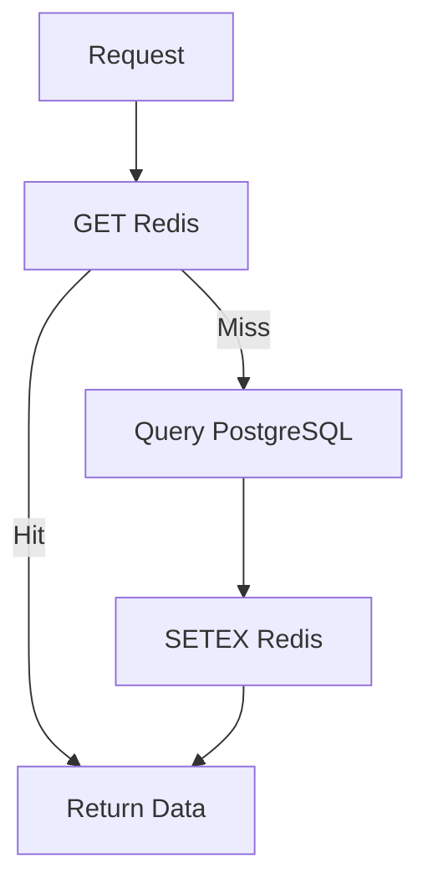
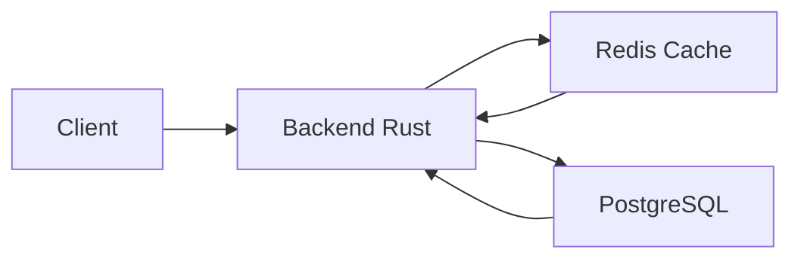

## Manual Completo de Redis (Instalación → Uso Avanzado)

Redis es una base de datos en memoria orientada a estructuras de datos. Se utiliza principalmente para caché, colas, sesiones y sistemas de alta velocidad.

---

# 1. ¿Qué es Redis?

Redis (Remote Dictionary Server) es:

* Base de datos en memoria (RAM)
* Modelo key-value
* No relacional
* Extremadamente rápida (latencias en microsegundos)
* Soporta múltiples estructuras de datos

Casos de uso:

* Caché
* Sesiones de usuario
* Rate limiting
* Sistemas de colas
* Leaderboards

---

# 2. Instalación

## Linux (Ubuntu/Debian)

```bash
sudo apt update
sudo apt install redis-server -y
```

Verificar instalación:

```bash
redis-server --version
redis-cli ping
```

Respuesta esperada:

```bash
PONG
```

---

## macOS

```bash
brew install redis
brew services start redis
```

---

## Windows

Opciones:

* WSL (recomendado)
* Docker:

```bash
docker run -d -p 6379:6379 redis
```

---

## Cloud (Railway u otros)

* Crear instancia Redis
* Conectarse vía:

```bash
redis-cli -u <URL>
```

---

# 3. Uso básico con redis-cli

Abrir consola:

```bash
redis-cli
```

Ejemplo:

```bash
SET nombre "Orlando"
GET nombre
```

---

# 4. Tipos de datos

## Strings

```bash
SET user:1 "Orlando"
GET user:1
```

Con expiración:

```bash
SETEX user:1 60 "Orlando"
```

---

## Lists

```bash
LPUSH tareas "task1"
LPUSH tareas "task2"
LRANGE tareas 0 -1
```

---

## Hashes

```bash
HSET user:1 nombre "Orlando" edad 25
HGETALL user:1
```

---

## Sets

```bash
SADD tags "rust"
SADD tags "redis"
SMEMBERS tags
```

---

## Sorted Sets

```bash
ZADD ranking 100 "user1"
ZADD ranking 200 "user2"
ZRANGE ranking 0 -1 WITHSCORES
```

---

# 5. Comandos esenciales

## Exploración

```bash
KEYS *
EXISTS key
TYPE key
TTL key
```

Nota: evitar `KEYS *` en producción.

---

## Alternativa: SCAN

```bash
SCAN 0 MATCH projects:* COUNT 10
```

---

## Lectura y escritura

```bash
SET key value
GET key
DEL key
```

---

## Expiración (TTL)

```bash
EXPIRE key 60
TTL key
```

Estados:

* > 0: segundos restantes
* -1: sin expiración
* -2: no existe

---

## Borrado masivo

```bash
FLUSHALL
```

---

# 6. Monitoreo

```bash
MONITOR
```

Muestra todos los comandos en tiempo real.

---

# 7. Patrón Cache-Aside



Flujo:

1. Construcción de clave
2. Consulta en Redis
3. Si no existe, consulta a base de datos
4. Guarda en Redis
5. Devuelve resultado

---

# 8. Ejemplo de clave

```bash
projects:user:1:page:1
```

Buenas prácticas:

* Usar nombres jerárquicos
* Evitar claves largas
* Mantener consistencia

---

# 9. Invalidación de caché

```bash
DEL projects:user:1:page:1
```

Para múltiples claves:

```bash
SCAN 0 MATCH projects:user:1:* 
```

---

# 10. Integración con Rust

Redis no entiende structs, se debe serializar:

```rust
let json = serde_json::to_string(&data)?;
redis.set_ex(key, json, 60)?;
```

---

# 11. Persistencia

## RDB

* Snapshots periódicos
* Bajo consumo

## AOF

* Log de operaciones
* Mayor seguridad

Configuración en:

```bash
redis.conf
```

---

# 12. Configuración importante

Ejemplos:

```bash
maxmemory 256mb
maxmemory-policy allkeys-lru
```

Políticas comunes:

* noeviction
* allkeys-lru
* volatile-lru

---

# 13. Performance

Buenas prácticas:

* Usar TTL en caché
* Evitar objetos grandes
* Reducir serialización pesada
* Evitar KEYS en producción
* Usar SCAN

---

# 14. Errores comunes

* Usar Redis como base principal sin persistencia
* No invalidar caché
* Claves mal diseñadas
* Uso excesivo de memoria

---

# 15. Comandos avanzados

```bash
INCR contador
DECR contador
MGET key1 key2
MSET k1 v1 k2 v2
APPEND key "texto"
```

---

# 16. Ejemplo completo

```bash
GET projects:user:1:page:1
# nil

SETEX projects:user:1:page:1 60 "{json}"

GET projects:user:1:page:1
# hit

TTL projects:user:1:page:1

DEL projects:user:1:page:1
```

---

# 17. Arquitectura típica



---

# 18. Cuándo usar Redis

Usar:

* Caché
* Sesiones
* Datos temporales
* Sistemas de alta velocidad

No usar:

* Relaciones complejas
* Datos críticos sin persistencia

---


# 19. Conceptos Fundamentales

* **Key-Value Store:** Redis guarda datos como un diccionario. A una **Llave** única le corresponde un **Valor**.
* **TTL (Time To Live):** Es el tiempo de vida de un dato. Cuando el contador llega a cero, Redis elimina el dato automáticamente.
* **In-Memory:** Los datos viven en la RAM. Si el servidor de Redis se reinicia sin persistencia configurada, los datos desaparecen (por eso solo lo usamos para caché y no como base de datos principal).

---

# 20. Comandos Esenciales (CLI)

Para ejecutar estos comandos, abre tu terminal y escribe `redis-cli`. Si estás en Railway, usa la pestaña **CLI** en tu servicio de Redis.

#### A. Exploración

| Comando | Descripción | Ejemplo |
| --- | --- | --- |
| `KEYS *` | Lista todas las llaves activas. | `KEYS "projects:*"` |
| `EXISTS [key]` | Verifica si una llave existe (1 = sí, 0 = no). | `EXISTS projects:user:1` |
| `TTL [key]` | Consulta cuánto tiempo le queda a la llave. | `TTL projects:user:1` |
| `TYPE [key]` | Te dice qué tipo de dato es (string, list, hash). | `TYPE projects:user:1` |

#### B. Gestión de Datos

| Comando | Descripción | Ejemplo |
| --- | --- | --- |
| `GET [key]` | Obtiene el valor (el JSON) de la llave. | `GET projects:user:1:page:1` |
| `SET [key] [val]` | Guarda un valor sin tiempo de expiración. | `SET nombre "Orlando"` |
| `SETEX [key] [s] [val]` | Guarda un valor con TTL en segundos. | `SETEX temp 60 "dato"` |
| `DEL [key]` | Borra una llave manualmente. | `DEL projects:user:1` |
| `FLUSHALL` | **¡Peligro!** Borra absolutamente todo. | `FLUSHALL` |

#### C. Monitoreo en Tiempo Real

Si quieres ver qué está haciendo tu código de Rust en vivo, ejecuta:

```bash
MONITOR

```

*Cada vez que refresques tu página de proyectos, verás los comandos `GET` y `SET` pasar por la pantalla.*

---

### 3. El Ciclo de Vida en tu App (Workflow)

Tu implementación sigue el patrón **Cache-Aside**. Así es como se mueven los datos:

1. **Construcción de Key:** Creas un identificador único basado en variables: `projects:user:{user_id}:page:{page}`.
2. **Consulta:** `GET key`. Si Redis responde, saltas directamente al final.
3. **Fallback:** Si Redis no tiene el dato, haces `SELECT` en PostgreSQL.
4. **Hidratación:** Guardas el resultado en Redis con `SETEX` para que la próxima vez sea rápido.
5. **Invalidación:** Cuando haces un `UPDATE` o `DELETE` de un proyecto, usas `DEL` o `KEYS + DEL` para borrar el caché viejo y evitar que el usuario vea datos desactualizados.

---

### 4. Tips para Producción 

* **Evita `KEYS *` en producción:** Si tienes miles de usuarios, este comando puede bloquear Redis por unos milisegundos. Es mejor usar `SCAN` si necesitas listar llaves en apps muy grandes.
* **El tamaño de la llave importa:** Intenta que tus llaves sean descriptivas pero no excesivamente largas para ahorrar unos bytes de RAM.
* **Serialización:** Recuerda que Redis no entiende tus "Structs" de Rust. Siempre debes convertir a JSON (como ya haces con `serde_json`) antes de guardar.

---

### 5. Resumen de Estados del TTL

Cuando consultes el TTL de una llave (`TTL llave`), recibirás estos códigos:

* **Número positivo:** Segundos restantes.
* **-1:** La llave existe pero no tiene tiempo de expiración (es eterna).
* **-2:** La llave no existe (ya expiró o nunca se creó).

# 21. Resumen

Redis es una herramienta clave para mejorar rendimiento:

* Acceso en memoria
* Soporte de múltiples estructuras
* Integración simple con backend
* Ideal como capa de caché
