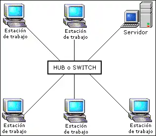
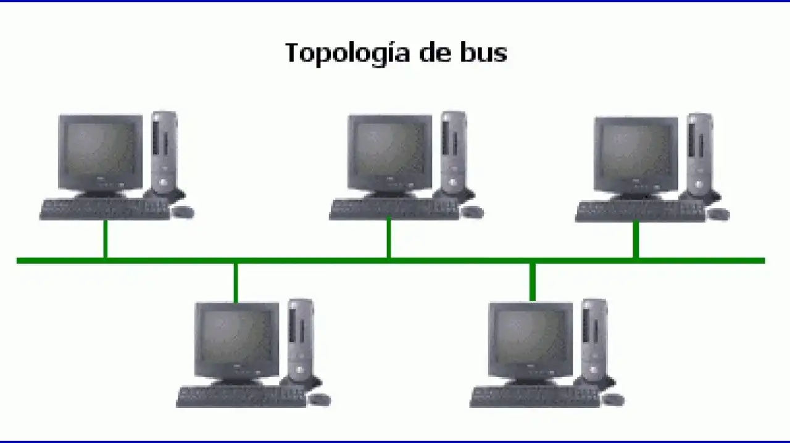
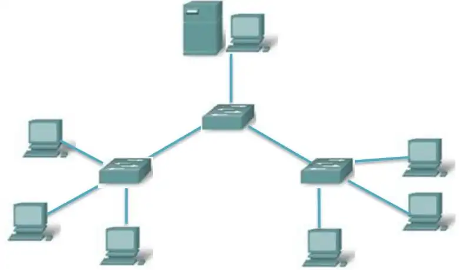
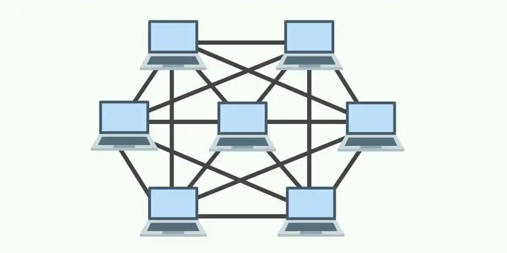
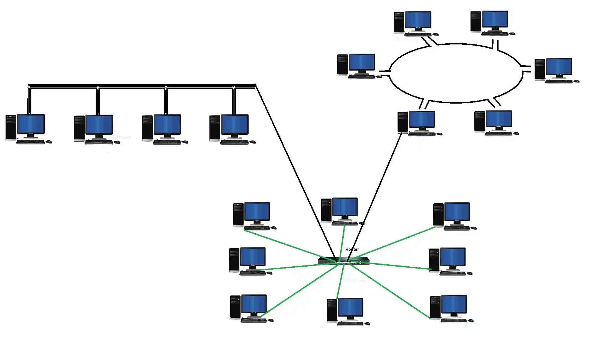

# 16. Introducción a las Redes

---

## ¿Qué es una Red?

Una **red** es una conexión entre al menos dos dispositivos informáticos. Esta conexión puede tener diferentes estructuras (cableado o inalámbrico) y cubrir diferentes rangos.

El objetivo es permitir el **intercambio de datos, comunicación y uso compartido** de recursos como:
- Espacio de almacenamiento
- Programas o aplicaciones
- Datos

Se accede a estos recursos a través de un sistema operativo compatible con la red. Detrás de cada interacción digital hay una red: desde leer este documento, editar un documento con colegas, hasta conectar tu teléfono a dispositivos Bluetooth.

---

## Ventajas de las Redes

| Ventaja | Descripción |
|---------|-------------|
| **Acceso compartido a los datos** | Todos los usuarios autorizados trabajan con la misma información actualizada |
| **Uso compartido de dispositivos y software** | No es necesario duplicar impresoras, almacenamiento ni programas |
| **Mayor rendimiento** | La potencia informática y el almacenamiento se utilizan de forma flexible y ampliada |
| **Gestión centralizada** | Los programas, datos y configuraciones se controlan desde una única ubicación |
| **Derechos de acceso claros** | Cada usuario recibe exactamente los permisos que necesita |
| **Mayor seguridad de los datos** | Las normas de protección, copia de seguridad y seguridad se implementan de forma centralizada |
| **Fácil expandibilidad** | Se pueden integrar fácilmente nuevos dispositivos o usuarios en la red |

---

## Preguntas Clave Antes de Crear una Red

Antes de profundizar en la tecnología de redes, debes responder:

1. ¿Qué requisitos tengo para la red?
2. ¿Lo necesito localmente o con mayor alcance?
3. ¿A cuántos participantes me dirijo y qué utilización de la capacidad implica esto?
4. ¿La red debe ser privada, pública o ambas?
5. ¿Qué tan alta debe ser la seguridad de la red?
6. ¿Qué hardware necesito?
7. ¿Puedo configurar la red yo mismo o necesito un experto?

> **Nota:** Una infraestructura de red estable constituye la base para sistemas de TI confiables en las empresas. Debe diseñarse para adaptarse fácilmente a futuras expansiones.

---

## Administración de Red

La administración de red es **esencial para la seguridad y el funcionamiento ininterrumpido**. Incluye tareas como:

- **Monitoreo** continuo del estado de la red
- **Actualizaciones** de software y firmware
- **Gestión de usuarios** y permisos
- **Mantenimiento** preventivo

Las modernas herramientas de gestión de redes facilitan la monitorización y el control de estructuras de TI complejas.

---

## Tipos de Tecnología de Red

Las redes varían enormemente en escala: una conexión en un hogar privado de dos personas es completamente diferente de una red que conecta a miles de empleados en distintos países.

### Redes de Área Local (LAN)

| Tipo | Ventaja | Uso |
|------|---------|-----|
| **PAN** (Personal Area Network) | Configuración muy rápida; energéticamente eficiente | Relojes inteligentes, rastreadores de actividad, auriculares inalámbricos, conexiones para smartphones |
| **LAN/WLAN** (Local/Wireless LAN) | Transferencia rápida de datos dentro de un edificio; fácil conexión en red de empleados | Redes de oficinas, redes domésticas, pequeñas empresas |

> **Nota:** Al configurar LAN y WLAN, es importante utilizar los enrutadores y conmutadores adecuados.

### Redes de Área Extendida

| Tipo | Ventaja | Uso |
|------|---------|-----|
| **CAN** (Campus Area Network) | Red segura para múltiples edificios en un campus | Universidades, instituciones de investigación, campus corporativos |
| **MAN** (Metropolitan Area Network) | Redes a nivel de ciudad, de largo alcance | Wi-Fi urbano, sistemas de gestión del tráfico, autoridades municipales |
| **WAN** (Wide Area Network) | Redes mundiales y almacenamiento centralizado de datos | Grandes empresas, sucursales internacionales, acceso a la nube |
| **GAN** (Global Area Network) | Acceso a recursos globales y alcance universal | Internet (World Wide Web), redes de comunicación globales |

### Redes Privadas Virtuales (VPN)

Las VPN ocultan tanto la dirección IP como la ubicación. Pueden asignarse a uno de los tipos de red mencionados y, por tanto, pueden verse como un **tipo de complemento**.

> **Nota:** Las redes LAN y WAN suelen estar conectadas. Existen tecnologías y protocolos que se utilizan en ambas, por lo que no siempre es posible una separación clara.

---

## Modelos de Conexión

### Red Peer-to-Peer (P2P)

Aquí hay ordenadores con **iguales derechos**, cada uno de los cuales puede ser a la vez servidor y cliente. No existe una jerarquía central.

### Red Cliente-Servidor

Una computadora de servicio adicional (a menudo un servidor de red) forma el **centro de control** desde el cual todos los dispositivos conectados recuperan los datos. Ideal para empresas de todos los tamaños.

---

## Topologías de Red

La **topología de red** es cómo se organizan los elementos de una red de comunicaciones. La estructura topológica se puede representar de forma **física** o **lógica**:

- **Topología lógica:** Los dispositivos de comunicación se modelan como nodos y las conexiones entre dispositivos se modelan como enlaces o líneas entre nodos.
- **Topología física:** Describe la verdadera apariencia o diseño de la red. Las distancias entre nodos, interconexiones físicas, velocidades de transmisión o tipos de señales pueden diferir.

### Tipos de Topologías

#### Topología en Estrella

La red está organizada de modo que los nodos estén conectados a un **dispositivo central (HUB)**, que actúa como servidor. El HUB gestiona la transmisión de datos a través de la red. Cualquier dato enviado viaja a través del dispositivo central antes de llegar a su destino.

**Ventajas:**
- ✅ Gestión conveniente desde una ubicación central
- ✅ Si un nodo falla, la red aún funciona
- ✅ Los dispositivos se pueden agregar o quitar sin interrumpir la red
- ✅ Más fácil de identificar y aislar los problemas de rendimiento

**Desventajas:**
- ❌ Si el dispositivo central falla, toda la red dejará de funcionar
- ❌ El rendimiento y el ancho de banda están limitados por el nodo central
- ❌ Puede ser costoso de operar

---

#### Topología en Bus

También llamada topología de **red troncal, bus o línea**. Guía los dispositivos a lo largo de un **single cable** que se extiende desde un extremo de la red hasta el otro. Los datos fluirán a lo largo del cable a medida que viajan a su destino.

**Ventajas:**
- ✅ Económico para redes más pequeñas
- ✅ Diseño simple; todos los dispositivos conectados a través de un cable
- ✅ Se pueden agregar más nodos alargando la línea

**Desventajas:**
- ❌ La red es vulnerable a fallas de cables
- ❌ Cada nodo agregado disminuye la velocidad de transmisión
- ❌ Los datos solo se pueden enviar en una dirección a la vez

---

#### Topología en Anillo

Los nodos se configuran en un **patrón circular**. Los datos viajan a través de cada dispositivo a medida que atraviesan el anillo. En redes grandes, pueden necesitarse repetidores para evitar la pérdida de paquetes.

Las topologías de anillo pueden configurarse como:
- **Anillo simple (half-dúplex):** Tráfico en una sola dirección
- **Anillo doble (full-dúplex):** Tráfico en ambas direcciones simultáneamente

**Ventajas:**
- ✅ Costo efectivo
- ✅ Barato de instalar
- ✅ Problemas de rendimiento fáciles de identificar

**Desventajas:**
- ❌ Si un nodo cae, puede afectar varios nodos con él
- ❌ Todos los dispositivos comparten ancho de banda, limitando el rendimiento
- ❌ Agregar o eliminar nodos significa tiempo de inactividad para toda la red

---

#### Topología en Árbol

Un **nodo central conecta los hubs secundarios**. Estos hubs tienen una relación de **padres-hijos** con los dispositivos. El eje central es como el tronco del árbol, y las ramas son los concentradores secundarios o nodos de control.

**Ventajas:**
- ✅ Extremadamente flexible y escalable
- ✅ Facilidad para identificar errores (cada branch puede diagnosticarse individualmente)

**Desventajas:**
- ❌ Si falla un hub central, los nodos se desconectarán (aunque las ramas pueden funcionar independientemente)
- ❌ La estructura puede ser difícil de gestionar de forma eficaz
- ❌ Utiliza mucho más cableado que otros métodos

---

#### Topología de Malla (Mesh)

Los nodos están **interconectados**.
- **Full-mesh:** Conecta todos los dispositivos directamente entre sí
- **Partial-mesh:** La mayoría de los dispositivos se conectan directamente, proporcionando múltiples rutas para la entrega de datos

Los datos se envían por la distancia más corta disponible.

**Ventajas:**
- ✅ Confiable y estable
- ✅ Ningún fallo de un solo nodo desconecta la red

**Desventajas:**
- ❌ Grado complejo de interconectividad entre nodos
- ❌ Mano de obra intensiva para instalar
- ❌ Utiliza mucho cableado para conectar todos los dispositivos

---

#### Topología Híbrida

Utiliza **varias estructuras de topología**. Es más común en organizaciones grandes donde cada departamento puede tener un tipo de topología diferente (estrella o línea), conectándose a un hub central.

**Ventajas:**
- ✅ Flexibilidad
- ✅ Puede personalizarse según las necesidades del cliente

**Desventajas:**
- ❌ La complejidad aumenta
- ❌ Se requiere experiencia en múltiples topologías
- ❌ Puede ser más difícil determinar los problemas de rendimiento

---

## ¿Qué Topología es Mejor?

No existe una respuesta correcta o incorrecta. La elección dependerá de:

- **Nivel de comodidad** y cantidad de redundancia necesaria
- **Presupuesto:** Cuantos más cables y más compleja la topología, más costosa
- **Necesidades comerciales** que cambian y evolucionan

 muchas organizaciones eligen topologías en estrella porque es fácil realizar cambios sin interrupciones significativas.

---

## Mapeo de la Topología

La gestión eficaz de la topología requiere un **mapeo visual**. Se necesita un mapa de red preciso que incluya:

- Dispositivos
- Interconexiones
- Posibles cuellos de botella

A medida que las redes se vuelven más complejas, los mapas de topología se convierten en la columna vertebral de la continuidad empresarial. Existen herramientas de descubrimiento y mapeo que pueden generar automáticamente topologías de capa 2 y 3.

---

## Importancia de la Topología de Red

La topología desempeña un papel crucial en la **funcionalidad y eficiencia** de la red.

### Impacto en el Rendimiento

La elección de topología afecta significativamente las velocidades de transferencia, el ancho de banda y la latencia:
- **Estrella:** Transmisión más rápida para redes con pocos nodos
- **Malla:** Mejor rendimiento para redes grandes y complejas

### Fiabilidad y Tolerancia a Fallos

| Topología | Redundancia |
|-----------|-------------|
| Malla | Alta (múltiples rutas de datos) |
| Bus/Estrella | Vulnerable a puntos únicos de fallo |

### Escalabilidad

- **Estrella y Árbol:** Adición más sencilla de nuevos nodos
- **Malla y Estrella:** Más adecuadas para grandes volúmenes de tráfico

### Consideraciones de Coste

- **Bus:** Costes iniciales más bajos
- **Malla:** Requiere más cableado y equipo

Debe considerarse el **TCO** (Total Cost of Ownership): inversión inicial, gastos operativos y costes del tiempo de inactividad.

### Implicaciones de Seguridad

- **Centralizadas (estrella):** Aplicación más sencilla de protocolos de seguridad y control de acceso
- **Descentralizadas (mesh):** Beneficios de seguridad inherentes gracias a la diversidad de rutas

Los firewalls se utilizan a menudo para proteger contra amenazas externas. Una topología segura ayuda a cumplir normativas como **RGPD** e **HIPAA**.

### Facilidad de Gestión

- **Estrella:** Problemas suelen aislarse en nodos específicos o en el hub central
- **Anillo:** Puede requerir más esfuerzo para localizar y resolver problemas

---

## Componentes de la Capa Física

### Elementos Clave

| Componente | Descripción |
|------------|-------------|
| **Nodos** | Dispositivos como computadoras, servidores, impresoras, enrutadores y conmutadores |
| **Enlaces** | Conexiones físicas o inalámbricas entre nodos |
| **NIC** (Tarjeta de Interfaz de Red) | Hardware que permite conectar un dispositivo a la red |
| **Conmutadores (Switches)** | Conectan múltiples nodos en una LAN y facilitan el reenvío de datos |
| **Enrutadores (Routers)** | Conectan múltiples redes y permiten el enrutamiento entre ellas |
| **Cables y medios de transmisión** | Medio físico para transportar señales (cables de par trenzado, fibra óptica) |
| **Protocolos** | Reglas y convenciones que rigen la transmisión de datos |

---

## Componentes de Red para Redes Locales

Para crear una red, se deben conectar al menos dos computadoras u otros dispositivos finales. Los datos pueden transmitirse a través de:

- **Cobre** (cableado tradicional)
- **Fibra óptica**
- **WLAN/WiFi**
- **Combinación de estos**

### Dispositivos de Red

| Dispositivo | Función |
|-------------|---------|
| **HUB** | Reúnen dispositivos en una LAN. No diferencian participantes individuales. Siempre envía paquetes a todos los usuarios. |
| **Switch** | Identifica participantes por su **dirección MAC**. Solo envía datos al destinatario deseado. |
| **Router** | Lee y asigna **direcciones IP**. Permite comunicación fuera de la LAN y uso de Internet. |
| **Switch de Capa 3** | Combinación de router y switch. Útil en redes grandes por su mayor velocidad. |

---

> **Fuente:** The Network Monitor, CCNadesdecero.es
