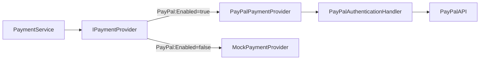

# Manual CURSINET — Backend en C# con ASP.NET Core, Entity Framework Core y PostgreSQL

### Plataforma educativa online (Cursinet API)

Este manual te guía en la construcción de un backend completo de plataforma educativa: autenticación (registro, login, JWT, verificación de email, recuperación de contraseña, 2FA), catálogo de cursos (CRUD, categorías, búsqueda, filtros), módulos y lecciones (video, texto, quiz, código), sistema de inscripciones, progreso de lecciones, certificados, reseñas, comentarios, marcadores, pagos con PayPal, suscripciones, analíticas y notificaciones.

Contiene el **100% del código fuente** del proyecto, explicado línea por línea, para que puedas reproducir cada archivo por tu cuenta.

---

## Índice

1. [Arquitectura del proyecto](#1-arquitectura-del-proyecto)
2. [`Domain.csproj` — Proyecto de dominio](#2-domaincsproj)
3. [`Application.csproj` — Proyecto de aplicación](#3-applicationcsproj)
4. [`Infrastructure.csproj` — Proyecto de infraestructura](#4-infrastructurecsproj)
5. [`Api.csproj` — Proyecto de API](#5-apicsproj)
6. [`appsettings.json` — Configuración](#6-appsettingsjson)
7. [`Program.cs` — Punto de entrada](#7-programcs)
8. [Capa Domain — Entidades](#8-capa-domain--entidades)
9. [Capa Domain — Enums](#9-capa-domain--enums)
10. [Capa Domain — Excepciones](#10-capa-domain--excepciones)
11. [Capa Application — Interfaces de repositorio](#11-capa-application--interfaces-de-repositorio)
12. [Capa Application — Interfaces de servicios](#12-capa-application--interfaces-de-servicios)
13. [Capa Application — Modelos (DTOs)](#13-capa-application--modelos-dtos)
14. [Capa Application — Mappers](#14-capa-application--mappers)
15. [Capa Application — Helpers](#15-capa-application--helpers)
16. [Capa Application — Authorization (RBAC)](#16-capa-application--authorization-rbac)
17. [Capa Application — AuthService](#17-capa-application--authservice)
18. [Capa Application — CourseService](#18-capa-application--courseservice)
19. [Capa Application — CategoryService](#19-capa-application--categoryservice)
20. [Capa Application — EnrollmentService](#20-capa-application--enrollmentservice)
21. [Capa Application — ModuleService](#21-capa-application--moduleservice)
22. [Capa Application — LessonService](#22-capa-application--lessonservice)
23. [Capa Application — ReviewService](#23-capa-application--reviewservice)
24. [Capa Application — CommentService](#24-capa-application--commentservice)
25. [Capa Application — BookmarkService](#25-capa-application--bookmarkservice)
26. [Capa Application — CertificateService](#26-capa-application--certificateservice)
27. [Capa Application — PaymentService](#27-capa-application--paymentservice)
28. [Capa Application — SubscriptionService](#28-capa-application--subscriptionservice)
29. [Capa Application — AnalyticsService](#29-capa-application--analyticsservice)
30. [Capa Application — LessonNoteService](#30-capa-application--lessonnoteservice)
31. [Capa Application — NotificationPreferenceService](#31-capa-application--notificationpreferenceservice)
32. [Capa Application — UserCrudService](#32-capa-application--usercrudservice)
33. [Capa Infrastructure — DbContext y Configuraciones](#33-capa-infrastructure--dbcontext-y-configuraciones)
34. [Capa Infrastructure — PasswordService](#34-capa-infrastructure--passwordservice)
35. [Capa Infrastructure — TokenService (JWT)](#35-capa-infrastructure--tokenservice-jwt)
36. [Capa Infrastructure — EmailService (Desarrollo)](#36-capa-infrastructure--emailservice-desarrollo)
37. [Capa Infrastructure — PayPal Adapter](#37-capa-infrastructure--paypal-adapter)
38. [Capa Infrastructure — DataSeeder](#38-capa-infrastructure--dataseeder)
39. [Capa Api — ErrorHandlingMiddleware](#39-capa-api--errorhandlingmiddleware)
40. [Capa Api — Authorization (RBAC)](#40-capa-api--authorization-rbac)
41. [Capa Api — Helpers](#41-capa-api--helpers)
42. [Capa Api — Validators (FluentValidation)](#42-capa-api--validators-fluentvalidation)
43. [Capa Api — Controllers](#43-capa-api--controllers)
44. [Capa Infrastructure — Entity Configurations (EF Core)](#44-capa-infrastructure--entity-configurations-ef-core)
45. [Migraciones EF Core](#45-migraciones-ef-core)
46. [Tests](#46-tests)
47. [HTTP Test Files](#47-http-test-files)
48. [Tabla completa de Endpoints](#48-tabla-completa-de-endpoints)

---

## 1. Arquitectura del proyecto

```
backend-ursinet/
├── Architecture.AspNet.md              ← Documento de arquitectura
├── ef.md                               ← Guía de Entity Framework Core
├── Cursinet.slnx                       ← Solution file .NET
├── src/
│   ├── Domain/                         ← Capa de dominio (entidades, enums, excepciones)
│   │   ├── Domain.csproj
    │   │   ├── Entities/                   ← 32 entidades
    │   │   ├── Enums/                      ← 6 enums
    │   │   └── Exceptions/                 ← AppException + factory
    │   │
    │   ├── Application/                    ← Capa de aplicación (servicios, interfaces, DTOs)
    │   │   ├── Application.csproj
    │   │   ├── Common/
    │   │   │   ├── Interfaces/             ← 19 interfaces de repositorio + 22 interfaces de servicio
    │   │   │   ├── Models/                 ← ~42 DTOs/records
    │   │   │   ├── Mapping/                ← 10 mappers estáticos
    │   │   │   ├── Helpers/                ← SlugHelper, Guard
    │   │   │   └── Authorization/          ← RolePermissions
    │   │   └── Features/                   ← 17 servicios de aplicación
    │   │
    │   ├── Infrastructure/                 ← Capa de infraestructura (EF Core, PayPal, servicios)
    │   │   ├── Infrastructure.csproj
    │   │   ├── Persistence/
    │   │   │   ├── ApplicationDbContext.cs
    │   │   │   ├── Configurations/         ← 32 configuraciones Fluent API
    │   │   │   ├── Repositories/           ← 19 repositorios
    │   │   │   └── DataSeeder.cs
    │   │   ├── Services/                   ← PasswordService, TokenService, EmailService, SendGrid
    │   │   ├── Adapters/
    │   │   │   ├── PayPal/                 ← PayPalOptions, Auth Handler, Payment Provider, Signature Validator
    │   │   │   └── Payments/              ← MockPaymentProvider
    │   │   └── Migrations/                 ← Migraciones EF Core
    │   │
    │   └── Api/                            ← Capa de presentación (controllers, middleware)
    │       ├── Api.csproj
    │       ├── Program.cs                  ← ~30 líneas — delega en Extensions/
    │       ├── appsettings.json
    │       ├── Extensions/                 ← 8 clases de configuración (RateLimit, CORS, DB, Auth, etc.)
    │       ├── Controllers/                ← 19 controllers
    │       ├── Middleware/                  ← ErrorHandlingMiddleware
    │       ├── Authorization/               ← PermissionHandler, PermissionRequirement, RequirePermissionAttribute
    │       ├── Helpers/                     ← AuthHelper, CookieHelper, TokenHelper
    │       ├── Validators/                  ← 29 FluentValidation validators
    │       └── http/                        ← Archivos .http para pruebas
    │
    ├── Tests/
    │   └── Api.Tests/
    │       ├── Api.Tests.csproj
    │       ├── Controllers/                ← Tests de controllers
    │       ├── Authorization/              ← Tests de permisos
    │       ├── Middleware/                 ← Tests de middleware
    │       ├── PayPal/                     ← Tests de PayPal
    │       ├── Helpers/                    ← Tests de helpers
    │       └── TestInfrastructure/         ← Base classes
```

### Patrón Clean Architecture

```
Domain       → Entidades, Enums, Exceptions (sin dependencias)
Application  → Servicios, Interfaces, DTOs, Mappers (solo depende de Domain)
Infrastructure → EF Core, PayPal, BCrypt, JWT (implementa interfaces de Application)
Api          → Controllers, Middleware, Validators (orquesta todo)
```

**Regla de oro:** Las dependencias apuntan hacia adentro. Domain no sabe de Infrastructure ni Api. Application solo conoce Domain. Infrastructure implementa las interfaces de Application.

---

## 2. `Domain.csproj`

```xml
<Project Sdk="Microsoft.NET.Sdk">
  <PropertyGroup>
    <TargetFramework>net10.0</TargetFramework>
    <ImplicitUsings>enable</ImplicitUsings>
    <Nullable>enable</Nullable>
    <RootNamespace>Cursinet.Domain</RootNamespace>
  </PropertyGroup>
</Project>
```

- **`TargetFramework: net10.0`** — Apunta a .NET 10.
- **`ImplicitUsings: enable`** — Usings implícitos (`System`, `System.Collections.Generic`, etc.).
- **`Nullable: enable`** — Nullable reference types activado.
- **Sin dependencias externas** — El dominio es puro C#.

---

## 3. `Application.csproj`

```xml
<Project Sdk="Microsoft.NET.Sdk">
  <PropertyGroup>
    <TargetFramework>net10.0</TargetFramework>
    <ImplicitUsings>enable</ImplicitUsings>
    <Nullable>enable</Nullable>
    <RootNamespace>Cursinet.Application</RootNamespace>
  </PropertyGroup>
  <ItemGroup>
    <ProjectReference Include="../Domain/Domain.csproj" />
  </ItemGroup>
</Project>
```

Solo referencia a `Domain.csproj`. No tiene paquetes NuGet externos.

---

## 4. `Infrastructure.csproj`

```xml
<Project Sdk="Microsoft.NET.Sdk">
  <PropertyGroup>
    <TargetFramework>net10.0</TargetFramework>
    <ImplicitUsings>enable</ImplicitUsings>
    <Nullable>enable</Nullable>
    <RootNamespace>Cursinet.Infrastructure</RootNamespace>
  </PropertyGroup>
  <ItemGroup>
    <PackageReference Include="Microsoft.EntityFrameworkCore" Version="10.0.0" />
    <PackageReference Include="Npgsql.EntityFrameworkCore.PostgreSQL" Version="10.0.0" />
    <PackageReference Include="BCrypt.Net-Next" Version="4.0.3" />
    <PackageReference Include="System.IdentityModel.Tokens.Jwt" Version="8.0.0" />
  </ItemGroup>
  <ItemGroup>
    <ProjectReference Include="..\Domain\Domain.csproj" />
    <ProjectReference Include="..\Application\Application.csproj" />
  </ItemGroup>
</Project>
```

**Paquetes:**
- `Microsoft.EntityFrameworkCore` 10.0.0 — ORM
- `Npgsql.EntityFrameworkCore.PostgreSQL` 10.0.0 — Proveedor PostgreSQL
- `BCrypt.Net-Next` 4.0.3 — Hashing de contraseñas
- `System.IdentityModel.Tokens.Jwt` 8.0.0 — JWT

---

## 5. `Api.csproj`

```xml
<Project Sdk="Microsoft.NET.Sdk.Web">
  <PropertyGroup>
    <TargetFramework>net10.0</TargetFramework>
    <Nullable>enable</Nullable>
    <ImplicitUsings>enable</ImplicitUsings>
    <RootNamespace>Cursinet.Api</RootNamespace>
  </PropertyGroup>
  <ItemGroup>
    <PackageReference Include="Microsoft.AspNetCore.Authentication.JwtBearer" Version="10.0.0" />
    <PackageReference Include="FluentValidation.AspNetCore" Version="11.3.0" />
    <PackageReference Include="Microsoft.AspNetCore.OpenApi" Version="10.0.8" />
    <PackageReference Include="Microsoft.EntityFrameworkCore.Design" Version="10.0.0">
      <IncludeAssets>runtime; build; native; contentfiles; analyzers; buildtransitive</IncludeAssets>
      <PrivateAssets>all</PrivateAssets>
    </PackageReference>
  </ItemGroup>
  <ItemGroup>
    <ProjectReference Include="..\Application\Application.csproj" />
    <ProjectReference Include="..\Infrastructure\Infrastructure.csproj" />
  </ItemGroup>
</Project>
```

**Paquetes:**
- `Microsoft.AspNetCore.Authentication.JwtBearer` 10.0.0 — JWT Bearer auth
- `FluentValidation.AspNetCore` 11.3.0 — Validación declarativa
- `Microsoft.AspNetCore.OpenApi` 10.0.8 — OpenAPI/Swagger
- `Microsoft.EntityFrameworkCore.Design` 10.0.0 — Herramientas de migración (solo development)

---

## 6. `appsettings.json`

```json
{
  "ConnectionStrings": {
    "DefaultConnection": ""
  },
  "Jwt": {
    "Secret": "",
    "RefreshSecret": "",
    "AccessTokenExpiry": "00:15:00",
    "RefreshTokenExpiry": "7.00:00:00",
    "Issuer": "cursinet-api",
    "Audience": "cursinet-app"
  },
  "Logging": {
    "LogLevel": {
      "Default": "Warning",
      "Cursinet.Infrastructure.Adapters.PayPal": "Debug"
    }
  },
  "SendGrid": {
    "FromEmail": "noreply@cursinet.com",
    "FromName": "Cursinet",
    "BaseUrl": "https://cursinet.vercel.app"
  },
  "PayPal": {
    "Enabled": true,
    "IsSandbox": true,
    "BaseUrl": "https://api-m.sandbox.paypal.com",
    "ClientId": "",
    "ClientSecret": "",
    "WebhookId": ""
  }
}
```

**Secciones:**
- `ConnectionStrings.DefaultConnection` — Cadena de conexión PostgreSQL (se configura via `dotnet user-secrets` o variable de entorno)
- `Jwt` — Configuración JWT (secretos, expiración, issuer, audience)
- `Logging` — Niveles de log; PayPal en Debug para tracking de integración
- `SendGrid` — Configuración de email transaccional en producción
- `PayPal` — Configuración PayPal (sandbox/producción, credenciales, webhook)


## 6.1 `Secret vars con .NET`
Para poder ocultar las variables de appsettings al igual de que como se hace con un .env, usamos 

src/Api
```bash
dotnet user-secrets "clave" "valor"
```

Para poder listas los secrets:

src/Api
```bash
dotnet user-secrets list
```

---
## 7. `Program.cs` — Punto de entrada

El `Program.cs` original (monolítico, ~280 líneas) fue refactorizado en **8 clases de extensión** dentro de la carpeta `Extensions/`, cada una responsable de un área específica de configuración. Esto mantiene el punto de entrada limpio, facilita los tests unitarios y permite localizar configuraciones sin escrolear un archivo enorme.

**Archivo completo:**

```csharp
using System.Text.Json.Serialization;
using Cursinet.Api.Extensions;
using FluentValidation;

var builder = WebApplication.CreateBuilder(args);

builder.Services.AddControllers()
    .AddJsonOptions(options =>
    {
        options.JsonSerializerOptions.Converters.Add(new JsonStringEnumConverter());
    });

builder.Services.AddOpenApi();
builder.Services.AddHttpContextAccessor();
builder.Services.AddValidatorsFromAssemblyContaining<Program>();

builder.Services.AddRateLimiterConfiguration();
builder.Services.AddCorsConfiguration(builder.Configuration);
builder.Services.AddDatabase(builder.Configuration);
builder.Services.AddAuthenticationConfiguration(builder.Configuration);
builder.Services.AddAuthorizationConfiguration();
builder.Services.AddApplicationServices(builder.Configuration);
builder.Services.AddPayPal(builder.Configuration);

var app = builder.Build();

await app.ConfigureMiddlewareAsync();

app.Run();
```

**Línea por línea:**

| Línea | Propósito |
|-------|-----------|
| `AddRateLimiterConfiguration()` | Rate limiter para endpoints de auth |
| `AddCorsConfiguration(config)` | CORS configurable desde `Cors:AllowedOrigins` |
| `AddDatabase(config)` | DbContext + PostgreSQL |
| `AddAuthenticationConfiguration(config)` | JWT Bearer + cookie reader |
| `AddAuthorizationConfiguration()` | RBAC policies por permiso |
| `AddApplicationServices(config)` | DI de servicios, repos, helpers, email, seeder |
| `AddPayPal(config)` | PayPal adapter + MockPaymentProvider toggle |
| `ConfigureMiddlewareAsync()` | Pipeline completo: migrate, seed, cors, auth, controllers |

Cada una de estas llamadas delega en una clase de extensión separada, documentada a continuación.

---

### 7.1 `RateLimitExtensions.cs`

```csharp
using Microsoft.AspNetCore.RateLimiting;

namespace Cursinet.Api.Extensions;

public static class RateLimitExtensions
{
    public static IServiceCollection AddRateLimiterConfiguration(this IServiceCollection services)
    {
        services.AddRateLimiter(options =>
        {
            options.RejectionStatusCode = StatusCodes.Status429TooManyRequests;

            options.AddFixedWindowLimiter("Auth", opt =>
            {
                opt.PermitLimit = 10;
                opt.Window = TimeSpan.FromMinutes(1);
                opt.QueueProcessingOrder = System.Threading.RateLimiting.QueueProcessingOrder.OldestFirst;
                opt.QueueLimit = 0;
            });
        });

        return services;
    }
}
```

**Propósito:** Limita a 10 requests por minuto en rutas de autenticación (named policy `"Auth"`). Previene ataques de fuerza bruta.

---

### 7.2 `CorsExtensions.cs`

```csharp
using Microsoft.Extensions.Options;

namespace Cursinet.Api.Extensions;

public static class CorsExtensions
{
    public static IServiceCollection AddCorsConfiguration(this IServiceCollection services, IConfiguration configuration)
    {
        var allowedOrigins = configuration.GetSection("Cors:AllowedOrigins")
            .Get<string[]>()
            ?? ["http://localhost:3000", "http://localhost:3006"];

        services.AddCors(options =>
        {
            options.AddDefaultPolicy(policy =>
            {
                policy.WithOrigins(allowedOrigins)
                    .AllowAnyHeader()
                    .AllowAnyMethod()
                    .AllowCredentials();
            });
        });

        return services;
    }
}
```

**Propósito:** Configura CORS leyendo los orígenes permitidos desde `Cors:AllowedOrigins` en la configuración. Si no está configurado, permite `localhost:3000` (desarrollo) y `localhost:3006` (Docker). Soporta múltiples entornos sin hardcodear.

---

### 7.3 `DatabaseExtensions.cs`

```csharp
using Cursinet.Infrastructure.Persistence;
using Microsoft.EntityFrameworkCore;

namespace Cursinet.Api.Extensions;

public static class DatabaseExtensions
{
    public static IServiceCollection AddDatabase(this IServiceCollection services, IConfiguration configuration)
    {
        var connectionString = configuration.GetConnectionString("DefaultConnection")
            ?? throw new InvalidOperationException(
                "DefaultConnection string is not configured. Set it in appsettings.json, user secrets, or environment variables.");

        services.AddDbContext<ApplicationDbContext>(options =>
            options.UseNpgsql(connectionString, b => b.MigrationsAssembly("Infrastructure")));

        return services;
    }
}
```

**Propósito:** Configura EF Core con PostgreSQL. Lanza `InvalidOperationException` si no hay connection string configurada (no usa fallback inseguro). Las migraciones se almacenan en el proyecto `Infrastructure`.

---

### 7.4 `AuthenticationExtensions.cs`

```csharp
using System.Text;
using Microsoft.AspNetCore.Authentication.JwtBearer;
using Microsoft.IdentityModel.Tokens;

namespace Cursinet.Api.Extensions;

public static class AuthenticationExtensions
{
    public static IServiceCollection AddAuthenticationConfiguration(this IServiceCollection services, IConfiguration configuration)
    {
        var jwtSecret = configuration["Jwt:Secret"]
            ?? throw new InvalidOperationException("JWT Secret is not configured");

        var jwtIssuer = configuration["Jwt:Issuer"] ?? "cursinet-api";
        var jwtAudience = configuration["Jwt:Audience"] ?? "cursinet-app";

        services.AddAuthentication(JwtBearerDefaults.AuthenticationScheme)
            .AddJwtBearer(options =>
            {
                options.TokenValidationParameters = new TokenValidationParameters
                {
                    ValidateIssuerSigningKey = true,
                    IssuerSigningKey = new SymmetricSecurityKey(Encoding.UTF8.GetBytes(jwtSecret)),
                    ValidIssuer = jwtIssuer,
                    ValidAudience = jwtAudience,
                    ValidateIssuer = true,
                    ValidateAudience = true,
                    ValidateLifetime = true,
                    ClockSkew = TimeSpan.Zero,
                };

                options.Events = new JwtBearerEvents
                {
                    OnMessageReceived = context =>
                    {
                        var accessToken = context.Request.Cookies["accessToken"];
                        if (!string.IsNullOrEmpty(accessToken))
                        {
                            context.Token = accessToken;
                        }
                        return Task.CompletedTask;
                    }
                };
            });

        return services;
    }
}
```

**Propósito:** Configura JWT Bearer authentication. El token se lee tanto del header `Authorization` como de la cookie `accessToken` (para apps SPA que usan cookies httpOnly). `ClockSkew = TimeSpan.Zero` elimina el tolerancia por defecto de 5 minutos.

---

### 7.5 `AuthorizationExtensions.cs`

```csharp
using Cursinet.Api.Authorization;
using Cursinet.Domain.Enums;
using Microsoft.AspNetCore.Authorization;

namespace Cursinet.Api.Extensions;

public static class AuthorizationExtensions
{
    public static IServiceCollection AddAuthorizationConfiguration(this IServiceCollection services)
    {
        services.AddSingleton<IAuthorizationHandler, PermissionHandler>();
        services.AddAuthorization(options =>
        {
            foreach (var permission in Permissions.All)
            {
                options.AddPolicy(permission, policy =>
                    policy.Requirements.Add(new PermissionRequirement(permission)));
            }
        });

        return services;
    }
}
```

**Propósito:** Registra el `PermissionHandler` singleton y crea una policy por cada permiso definido en `Permissions.All`. Cada policy verifica que el usuario tenga ese permiso específico en su rol.

---

### 7.6 `DependencyInjectionExtensions.cs`

```csharp
using Cursinet.Infrastructure.Services;
using Cursinet.Application.Common.Interfaces;
using Cursinet.Application.Features.Analytics;
using Cursinet.Application.Features.Auth;
using Cursinet.Application.Features.Bookmarks;
using Cursinet.Application.Features.Categories;
using Cursinet.Application.Features.Certificates;
using Cursinet.Application.Features.Comments;
using Cursinet.Application.Features.Courses;
using Cursinet.Application.Features.Enrollments;
using Cursinet.Application.Features.Instructor;
using Cursinet.Application.Features.LessonNotes;
using Cursinet.Application.Features.Lessons;
using Cursinet.Application.Features.Modules;
using Cursinet.Application.Features.NotificationPreferences;
using Cursinet.Application.Features.Payments;
using Cursinet.Application.Features.Reviews;
using Cursinet.Application.Features.Subscriptions;
using Cursinet.Application.Features.Users;
using Cursinet.Api.Helpers;
using Cursinet.Infrastructure.Persistence;
using Cursinet.Infrastructure.Persistence.Repositories;

namespace Cursinet.Api.Extensions;

public static class DependencyInjectionExtensions
{
    public static IServiceCollection AddApplicationServices(this IServiceCollection services, IConfiguration configuration)
    {
        // Helpers
        services.AddScoped<CookieHelper>();
        services.AddScoped<TokenHelper>();

        // SendGrid options
        services.Configure<SendGridOptions>(
            configuration.GetSection(SendGridOptions.SectionName));

        // Services
        services.AddScoped<IAuthService, AuthService>();
        services.AddScoped<ICategoryService, CategoryService>();
        services.AddScoped<ICourseService, CourseService>();
        services.AddScoped<IEnrollmentService, EnrollmentService>();
        services.AddScoped<IModuleService, ModuleService>();
        services.AddScoped<ILessonService, LessonService>();
        services.AddScoped<IReviewService, ReviewService>();
        services.AddScoped<ICertificateService, CertificateService>();
        services.AddScoped<IPaymentService, PaymentService>();
        services.AddScoped<IAnalyticsService, AnalyticsService>();
        services.AddScoped<IInstructorDashboardService, InstructorDashboardService>();
        services.AddScoped<IPasswordService, PasswordService>();
        services.AddScoped<ITokenService, TokenService>();
        services.AddScoped<IBookmarkService, BookmarkService>();
        services.AddScoped<ICommentService, CommentService>();
        services.AddScoped<ILessonNoteService, LessonNoteService>();
        services.AddScoped<INotificationPreferenceService, NotificationPreferenceService>();
        services.AddScoped<ISubscriptionService, SubscriptionService>();
        services.AddScoped<IUserCrudService, UserCrudService>();

        // Email service: SendGrid si hay API key, DevEmailService como fallback
        var sendGridApiKey = configuration["SendGrid:ApiKey"];
        if (!string.IsNullOrEmpty(sendGridApiKey))
        {
            services.AddScoped<IEmailService, SendGridEmailService>();
        }
        else
        {
            services.AddScoped<IEmailService, DevEmailService>();
        }

        // Repositories
        services.AddScoped<IUserRepository, UserRepository>();
        services.AddScoped<ICourseRepository, CourseRepository>();
        services.AddScoped<IEnrollmentRepository, EnrollmentRepository>();
        services.AddScoped<IModuleRepository, ModuleRepository>();
        services.AddScoped<ILessonRepository, LessonRepository>();
        services.AddScoped<ILessonProgressRepository, LessonProgressRepository>();
        services.AddScoped<ICategoryRepository, CategoryRepository>();
        services.AddScoped<IAccountRepository, AccountRepository>();
        services.AddScoped<ISessionRepository, SessionRepository>();
        services.AddScoped<IVerificationRepository, VerificationRepository>();
        services.AddScoped<IReviewRepository, ReviewRepository>();
        services.AddScoped<ICertificateRepository, CertificateRepository>();
        services.AddScoped<IPaymentRepository, PaymentRepository>();
        services.AddScoped<ICommentRepository, CommentRepository>();
        services.AddScoped<ILessonNoteRepository, LessonNoteRepository>();
        services.AddScoped<IUserNotificationPreferenceRepository, UserNotificationPreferenceRepository>();
        services.AddScoped<ISubscriptionRepository, SubscriptionRepository>();
        services.AddScoped<IBookmarkRepository, BookmarkRepository>();

        // Data seeder
        services.AddScoped<DataSeeder>();

        return services;
    }
}
```

**Propósito:** Registro centralizado de dependencias. Incluye:
- **Helpers** — CookieHelper, TokenHelper (para manejo de tokens en cookies)
- **Config** — SendGridOptions desde `SendGrid` section
- **17 servicios** de aplicación (incluye `InstructorDashboardService`)
- **Email condicional** — `SendGridEmailService` si hay API key configurada, `DevEmailService` como fallback
- **19 repositorios** (incluye Account, Session, Verification)
- **DataSeeder** para datos iniciales

---

### 7.7 `PayPalExtensions.cs`

```csharp
using Cursinet.Application.Common.Interfaces;
using Cursinet.Infrastructure.Adapters.Payments;
using Cursinet.Infrastructure.Adapters.PayPal;
using Cursinet.Infrastructure.Persistence.Repositories;
using Microsoft.Extensions.Options;

namespace Cursinet.Api.Extensions;

public static class PayPalExtensions
{
    public static IServiceCollection AddPayPal(this IServiceCollection services, IConfiguration configuration)
    {
        // PayPal adapter wiring. Token cache + auth handler + signature-validating HttpClient are registered
        // up-front so the typed clients for PayPalPaymentProvider and PayPalWebhookSignatureValidator can
        // attach the handler in their respective pipelines. IPaymentProvider resolution switches between
        // the live PayPal adapter and MockPaymentProvider based on the PayPal:Enabled config toggle — no
        // branching lives inside the application services.
        services.AddMemoryCache();
        services.AddTransient<PayPalAuthenticationHandler>();
        services.Configure<PayPalOptions>(configuration.GetSection(PayPalOptions.SectionName));

        services.AddHttpClient<PayPalWebhookSignatureValidator>()
            .AddHttpMessageHandler<PayPalAuthenticationHandler>()
            .ConfigureHttpClient((sp, c) =>
            {
                var opts = sp.GetRequiredService<IOptions<PayPalOptions>>().Value;
                c.BaseAddress = new Uri(opts.BaseUrl);
                c.Timeout = TimeSpan.FromSeconds(15);
            });
        services.AddScoped<IPayPalWebhookSignatureValidator>(sp =>
            sp.GetRequiredService<PayPalWebhookSignatureValidator>());
        services.AddScoped<IPayPalWebhookEventRepository, PayPalWebhookEventRepository>();

        var paypalEnabled = configuration.GetSection("PayPal").GetValue<bool>("Enabled");
        if (paypalEnabled)
        {
            services.AddHttpClient<PayPalPaymentProvider>()
                .AddHttpMessageHandler<PayPalAuthenticationHandler>()
                .ConfigureHttpClient((sp, c) =>
                {
                    var opts = sp.GetRequiredService<IOptions<PayPalOptions>>().Value;
                    c.BaseAddress = new Uri(opts.BaseUrl);
                    c.Timeout = TimeSpan.FromSeconds(30);
                });
            // IPaymentProvider resuelve a través del typed client registrado arriba
            // (AddHttpClient<PayPalPaymentProvider>) para que el HttpClient inyectado tenga el
            // PayPalAuthenticationHandler en su pipeline.
            services.AddScoped<IPaymentProvider>(sp =>
                sp.GetRequiredService<PayPalPaymentProvider>());
        }
        else
        {
            services.AddScoped<IPaymentProvider, MockPaymentProvider>();
        }

        return services;
    }
}
```

**Propósito:** Wiring completo del adapter de PayPal:
- `AddMemoryCache()` — Cache para tokens OAuth2
- `PayPalAuthenticationHandler` — DelegatingHandler que obtiene y cachea tokens OAuth2
- `PayPalWebhookSignatureValidator` — Valida firmas de webhook contra PayPal
- `PayPalPaymentProvider` — Implementación live de `IPaymentProvider` (solo si `PayPal:Enabled = true`)
- `MockPaymentProvider` — Implementación de desarrollo (fallback)
- `IPayPalWebhookEventRepository` — Outbox de eventos PayPal para idempotencia

---

### 7.8 `MiddlewareExtensions.cs`

```csharp
using Cursinet.Api.Middleware;
using Cursinet.Infrastructure.Persistence;
using Microsoft.EntityFrameworkCore;

namespace Cursinet.Api.Extensions;

public static class MiddlewareExtensions
{
    public static async Task<WebApplication> ConfigureMiddlewareAsync(this WebApplication app)
    {
        using (var scope = app.Services.CreateScope())
        {
            var context = scope.ServiceProvider.GetRequiredService<ApplicationDbContext>();

            // Aplica migraciones pendientes (crea las tablas si no existen)
            await context.Database.MigrateAsync();

            var seeder = scope.ServiceProvider.GetRequiredService<DataSeeder>();
            await seeder.SeedAsync();
        }

        if (app.Environment.IsDevelopment())
        {
            app.MapOpenApi();
        }

        app.UseHttpsRedirection();
        app.UseCors();
        app.UseMiddleware<ErrorHandlingMiddleware>();
        app.UseAuthentication();
        app.UseAuthorization();
        app.MapControllers();
        app.MapGet("/health", () => "ok");

        return app;
    }
}
```

**Propósito:** Pipeline completo de middleware:
1. **Auto-migrate** — `MigrateAsync()` antes de seed (crea tablas automáticamente al iniciar)
2. **Seed** — Datos iniciales de desarrollo
3. **Swagger** — Solo en development
4. **HttpsRedirection** — Seguridad
5. **CORS** — Política configurada
6. **ErrorHandlingMiddleware** — Manejador global de errores
7. **Auth** — Authentication + Authorization
8. **Controllers** — Enruta requests
9. **Health check** — `GET /health` retorna `"ok"`
10. **Run** — Inicia el servidor

---

## 8. Capa Domain — Entidades

### `User.cs` — Usuario del sistema

```csharp
using Cursinet.Domain.Enums;

namespace Cursinet.Domain.Entities;

public class User
{
    public Guid Id {get; set;}
    public string Name {get; set;} = string.Empty;
    public string Email {get; set;} = string.Empty;
    public bool EmailVerified {get; set;}
    public string? Phone {get; set;}
    public string? Image {get; set;}
    public UserRole Role {get; set;}           // Student, Instructor, Admin, Moderator
    public string? UserName {get; set;}
    public string? Bio {get; set;}
    public string? WebsiteUrl {get; set;}
    public string? GithubUrl {get; set;}
    public string? LinkedinUrl {get; set;}
    public bool IsActive {get; set;}
    public DateTime? LastSeenAt {get; set;}
    public DateTime CreatedAt {get; set;}
    public DateTime UpdatedAt {get; set;}
    public DateTime? DeletedAt {get; set;}     // Soft delete
    public Guid? DeletedByUserId {get; set;}   // Quién eliminó
    public string? DeletedByName {get; set;}   // Nombre de quién eliminó
    public int FailedLoginAttempts {get; set;} // Intentos fallidos (lockout)
    public DateTime? LockoutEnd {get; set;}    // Fin del bloqueo
}
```

**Campos clave:**
- `Role` (UserRole enum) — Rol del usuario en el sistema
- `DeletedAt` / `DeletedByUserId` / `DeletedByName` — Soft delete con auditoría
- `FailedLoginAttempts` / `LockoutEnd` — Bloqueo por intentos fallidos
- `IsActive` — Estado activo/inactivo

### `Account.cs` — Cuentas de autenticación

```csharp
using Cursinet.Domain.Enums;
namespace Cursinet.Domain.Entities;

public class Account
{
    public Guid Id {get; set;}
    public string AccountId {get; set;} = null!;      // ID del proveedor
    public string ProviderId {get; set;} = null!;     // Proveedor: "credentials", "google", "github"
    public Guid UserId {get; set;}                    // FK a User
    public User User {get; set;} = null!;             // Navigation property
    public string? AccessToken {get; set;}            // OAuth access token
    public string? RefreshToken {get; set;}           // OAuth refresh token
    public string? IdToken {get; set;}                // OAuth ID token
    public DateTime? AccessTokenExpiresAt {get; set;}
    public DateTime? RefreshTokenExpiresAt {get; set;}
    public string? Scope {get; set;}
    public string? Password {get; set;}               // Password hasheado (credentials)
    public DateTime CreatedAt {get; set;}
    public DateTime UpdatedAt {get; set;}
}
```

Soporta múltiples proveedores: credentials (email+password), OAuth (Google, GitHub, etc.).

### `Session.cs` — Sesiones de usuario

```csharp
using Cursinet.Domain.Enums;
namespace Cursinet.Domain.Entities;

public class Session
{
    public Guid Id {get; set;}
    public DateTime ExpiresAt {get; set;}
    public string Token {get; set;} = string.Empty;   // Refresh token
    public DateTime CreatedAt {get; set;}
    public DateTime UpdatedAt {get; set;}
    public string? IpAddress {get; set;}
    public string? UserAgent {get; set;}
    public Guid UserId {get; set;}                    // FK a User
    public User User {get; set;} = null!;
}
```

### `Verification.cs` — Códigos de verificación

```csharp
namespace Cursinet.Domain.Entities;

public class Verification
{
    public Guid Id {get; set;}
    public string Identifier {get; set;} = null!;     // Email o teléfono
    public string Value {get; set;} = null!;          // Código/token
    public DateTime ExpiresAt {get; set;}
    public DateTime CreatedAt {get; set;}
    public DateTime UpdatedAt {get; set;}
}
```

### `Course.cs` — Curso

```csharp
using Cursinet.Domain.Enums;
namespace Cursinet.Domain.Entities;

public class Course
{
    public Guid Id {get; set;}
    public Guid InstructorId {get; set;}          // FK a User (instructor)
    public User Instructor {get; set;} = null!;
    public Guid CategoryId {get; set;}            // FK a Category
    public Category Category {get; set;} = null!;
    public string Title {get; set;} = string.Empty;
    public string Slug {get; set;} = string.Empty; // URL-friendly
    public string? ShortDescription {get; set;}
    public string? Description {get; set;}
    public string? ThumbnailUrl {get; set;}
    public string? PreviewVideoUrl {get; set;}
    public CourseLevel Level {get; set;}           // Beginner, Intermediate, Advanced, Expert
    public string Language {get; set;} = "es";
    public int DurationMinutes {get; set;}
    public int StudentsCount {get; set;}
    public decimal AverageRating {get; set;}
    public int ReviewsCount {get; set;}
    public decimal Price {get; set;}
    public decimal? OriginalPrice {get; set;}
    public bool IsFree {get; set;}
    public bool IsPublished {get; set;}
    public bool IsFeatured {get; set;}
    public string[]? Requirements {get; set;}      // Array de strings (JSON en DB)
    public string[]? LearningObjectives {get; set;}
    public string? SearchVector {get; set;}        // Búsqueda full-text
    public DateTime? PublishedAt {get; set;}
    public DateTime CreatedAt {get; set;}
    public DateTime UpdatedAt {get; set;}
    public DateTime? DeletedAt {get; set;}         // Soft delete
    public Guid? DeletedByUserId {get; set;}
    public User? DeletedByUser {get; set;}
}
```

### `Module.cs` — Módulo/Sección de un curso

```csharp
using Cursinet.Domain.Entities;
namespace Cursinet.Domain.Entities;

public class Module
{
    public Guid Id {get; set;}
    public Guid CourseId {get; set;}               // FK a Course
    public Course Course {get; set;} = null!;
    public string Title {get; set;} = string.Empty;
    public string? Description {get; set;}
    public int SortOrder {get; set;}               // Orden dentro del curso
    public bool IsPublished {get; set;}
    public DateTime CreatedAt {get; set;}
    public DateTime UpdatedAt {get; set;}
    public DateTime? DeletedAt {get; set;}
    public List<Lesson> Lessons {get; set;} = [];  // Navigation collection
}
```

### `Lesson.cs` — Lección

```csharp
using Cursinet.Domain.Entities;
using Cursinet.Domain.Enums;
namespace Cursinet.Domain.Entities;

public class Lesson
{
    public Guid Id {get; set;}
    public Guid ModuleId {get; set;}               // FK a Module
    public Module Module {get; set;} = null!;
    public Guid CourseId {get; set;}               // Denormalizado para queries rápidas
    public Course Course {get; set;} = null!;
    public string Title {get; set;} = string.Empty;
    public string Slug {get; set;} = string.Empty;
    public LessonType Type {get; set;}             // Video, Text, Code, Quiz, Resource
    public string? VideoUrl {get; set;}
    public int? VideoDurationSeconds {get; set;}
    public string? ContentMarkdown {get; set;}
    public int SortOrder {get; set;}
    public bool IsPublished {get; set;}
    public bool IsPreview {get; set;}              // Visible sin login
    public string[]? AttachmentUrls {get; set;}
    public DateTime CreatedAt {get; set;}
    public DateTime UpdatedAt {get; set;}
    public DateTime? DeletedAt {get; set;}
}
```

### `Category.cs` — Categoría (jerárquica)

```csharp
namespace Cursinet.Domain.Entities;

public class Category
{
    public Guid Id {get; set;}
    public string Name {get; set;} = string.Empty;
    public string Slug {get; set;} = string.Empty;
    public string? Description {get; set;}
    public string? IconName {get; set;}
    public string? Color {get; set;}
    public Guid? ParentId {get; set;}              // Auto-referencia (jerarquía)
    public Category? Parent {get; set;}
    public ICollection<Category>? Children {get; set;}
    public int SortOrder {get; set;}
    public bool IsActive {get; set;}
    public DateTime CreatedAt {get; set;}
    public DateTime UpdatedAt {get; set;}
    public DateTime? DeletedAt {get; set;}
}
```

### `Enrollment.cs` — Inscripción

```csharp
namespace Cursinet.Domain.Entities;

public class Enrollment
{
    public Guid Id {get; set;}
    public Guid UserId {get; set;}                 // Estudiante
    public User User {get; set;} = null!;
    public Guid CourseId {get; set;}
    public Course Course {get; set;} = null!;
    public Guid? PaymentId {get; set;}             // Pago asociado
    public Payment? Payment {get; set;}
    public DateTime EnrolledAt {get; set;}
    public DateTime? CompletedAt {get; set;}
    public decimal ProgressPercentage {get; set;}  // 0-100%
    public DateTime? LastAccessedAt {get; set;}
    public DateTime CreatedAt {get; set;}
    public DateTime UpdatedAt {get; set;}
    public DateTime? DeletedAt {get; set;}
}
```

### `Payment.cs` — Pago

```csharp
using Cursinet.Domain.Enums;
namespace Cursinet.Domain.Entities;

public class Payment
{
    public Guid Id {get; set;}
    public Guid UserId {get; set;}
    public User User {get; set;} = null!;
    public Guid? CourseId {get; set;}
    public Course? Course {get; set;}
    public string? PayPalOrderId {get; set;}       // ID de Order en PayPal
    public string? PayPalCaptureId {get; set;}     // ID de Capture en PayPal
    public decimal Amount {get; set;}
    public string Currency {get; set;} = "USD";
    public PaymentStatus Status {get; set;}        // Pending, Completed, Failed, Refunded
    public string? Type {get; set;}                // course_purchase, subscription
    public DateTime? PaidAt {get; set;}
    public DateTime? RefundedAt {get; set;}
    public DateTime CreatedAt {get; set;}
    public DateTime UpdatedAt {get; set;}
}
```

### `Review.cs` — Reseña

```csharp
namespace Cursinet.Domain.Entities;

public class Review
{
    public Guid Id { get; set; }
    public Guid CourseId { get; set; }
    public Course Course { get; set; } = null!;
    public Guid UserId { get; set; }
    public User User { get; set; } = null!;
    public int Rating { get; set; }                // 1–5
    public string? Comment { get; set; }
    public DateTime CreatedAt { get; set; }
    public DateTime UpdatedAt { get; set; }
}
```

### `Comment.cs` — Comentario (anidado)

```csharp
namespace Cursinet.Domain.Entities;

public class Comment
{
    public Guid Id {get; set;}
    public Guid LessonId {get; set;}
    public Lesson Lesson {get; set;} = null!;
    public Guid UserId {get; set;}
    public User User {get; set;} = null!;
    public Guid? ParentId {get; set;}              // Comentario padre (respuesta)
    public Comment? Parent {get; set;}
    public ICollection<Comment>? Replies {get; set;}
    public string Body {get; set;} = null!;
    public int LikesCount {get; set;}
    public bool IsEdited {get; set;}
    public DateTime CreatedAt {get; set;}
    public DateTime UpdatedAt {get; set;}
    public DateTime? DeletedAt {get; set;}
}
```

### `Bookmark.cs` — Marcador (PK compuesta)

```csharp
namespace Cursinet.Domain.Entities;

public class Bookmark
{
    public Guid UserId {get; set;}                 // PK parte 1
    public User User {get; set;} = null!;
    public Guid CourseId {get; set;}               // PK parte 2
    public Course Course {get; set;} = null!;
    public DateTime CreatedAt {get; set;}
}
```

### `Certificate.cs` — Certificado

```csharp
namespace Cursinet.Domain.Entities;

public class Certificate
{
    public Guid Id { get; set; }
    public Guid CourseId { get; set; }
    public Course Course { get; set; } = null!;
    public Guid UserId { get; set; }
    public User User { get; set; } = null!;
    public DateTime IssuedAt { get; set; }
    public string CertificateNumber { get; set; } = string.Empty;  // Hash único
    // Datos desnormalizados (seguros contra renombres)
    public string CourseName { get; set; } = string.Empty;
    public string InstructorName { get; set; } = string.Empty;
    public DateTime CreatedAt { get; set; }
}
```

### `LessonProgress.cs` — Progreso de lección

```csharp
namespace Cursinet.Domain.Entities;

public class LessonProgress
{
    public Guid Id {get; set;}
    public Guid UserId {get; set;}
    public User User {get; set;} = null!;
    public Guid LessonId {get; set;}
    public Lesson Lesson {get; set;} = null!;
    public bool IsCompleted {get; set;}
    public int WatchedSeconds {get; set;}          // Segundos vistos (video)
    public int LastPositionSeconds {get; set;}     // Posición donde quedó
    public DateTime UpdatedAt {get; set;}
    public DateTime CreatedAt {get; set;}
}
```

### `LessonNote.cs` — Nota de lección

```csharp
namespace Cursinet.Domain.Entities;

public class LessonNote
{
    public Guid Id {get; set;}
    public Guid UserId {get; set;}
    public User User {get; set;} = null!;
    public Guid LessonId {get; set;}
    public Lesson Lesson {get; set;} = null!;
    public string Content {get; set;} = null!;
    public int? VideoTimestampSeconds {get; set;}  // Timestamp del video
    public DateTime CreatedAt {get; set;}
    public DateTime UpdatedAt {get; set;}
}
```

### `Tag.cs` y `CourseTag.cs` — Etiquetas (many-to-many)

```csharp
namespace Cursinet.Domain.Entities;

public class Tag
{
    public Guid Id {get; set;}
    public string Name {get; set;} = string.Empty;
    public string Slug {get; set;} = string.Empty;
    public DateTime CreatedAt {get; set;}
    public DateTime UpdatedAt {get; set;}
}

public class CourseTag
{
    public Guid CourseId {get; set;}
    public Course Course {get; set;} = null!;
    public Guid TagId {get; set;}
    public Tag Tag {get; set;} = null!;
}
```

### `Quiz.cs`, `QuizQuestion.cs`, `QuizOption.cs`, `QuizAttempt.cs`, `QuizAttemptAnswer.cs` — Sistema de quizzes

```csharp
namespace Cursinet.Domain.Entities;

public class Quiz
{
    public Guid Id {get; set;}
    public Guid LessonId {get; set;}
    public Lesson Lesson {get; set;} = null!;
    public string Title {get; set;} = string.Empty;
    public int PassingScore {get; set;}            // Nota mínima 0-100
    public int? MaxAttempts {get; set;}
    public int? TimeLimitMinutes {get; set;}
    public DateTime CreatedAt {get; set;}
    public DateTime UpdatedAt {get; set;}
}

public class QuizQuestion
{
    public Guid Id {get; set;}
    public Guid QuizId {get; set;}
    public Quiz Quiz {get; set;} = null!;
    public string Text {get; set;} = string.Empty;
    public string Type {get; set;} = string.Empty; // single_choice, multiple_choice, code
    public string? Explanation {get; set;}
    public int SortOrder {get; set;}
    public DateTime CreatedAt {get; set;}
    public DateTime UpdatedAt {get; set;}
}

public class QuizOption
{
    public Guid Id {get; set;}
    public Guid QuestionId {get; set;}
    public QuizQuestion Question {get; set;} = null!;
    public string Text {get; set;} = string.Empty;
    public bool IsCorrect {get; set;}
    public int SortOrder {get; set;}
    public DateTime CreatedAt {get; set;}
    public DateTime UpdatedAt {get; set;}
}

public class QuizAttempt
{
    public Guid Id {get; set;}
    public Guid QuizId {get; set;}
    public Quiz Quiz {get; set;} = null!;
    public Guid UserId {get; set;}
    public User User {get; set;} = null!;
    public decimal? Score {get; set;}
    public bool IsPassed {get; set;}
    public int? TimeSpentSeconds {get; set;}
    public DateTime? StartedAt {get; set;}
    public DateTime? CompletedAt {get; set;}
    public DateTime CreatedAt {get; set;}
}

public class QuizAttemptAnswer
{
    public Guid Id {get; set;}
    public Guid AttemptId {get; set;}
    public QuizAttempt Attempt {get; set;} = null!;
    public Guid QuestionId {get; set;}
    public QuizQuestion Question {get; set;} = null!;
    public Guid? SelectedOptionId {get; set;}
    public QuizOption? SelectedOption {get; set;}
    public string? CodeAnswer {get; set;}
    public bool IsCorrect {get; set;}
    public DateTime CreatedAt {get; set;}
}
```

### `Subscription.cs` — Suscripción

```csharp
using Cursinet.Domain.Enums;
namespace Cursinet.Domain.Entities;

public class Subscription
{
    public Guid Id {get; set;}
    public Guid UserId {get; set;}
    public User User {get; set;} = null!;
    public string? PayPalSubscriptionId {get; set;}  // ID de PayPal Billing
    public SubscriptionPlan Plan {get; set;}         // Monthly, Annual, Lifetime
    public string Status {get; set;} = null!;        // active, past_due, canceled
    public DateTime? CurrentPeriodStart {get; set;}
    public DateTime? CurrentPeriodEnd {get; set;}
    public bool CancelAtPeriodEnd {get; set;}
    public DateTime CreatedAt {get; set;}
    public DateTime UpdatedAt {get; set;}
}
```

### `Notification.cs` y `UserNotificationPreference.cs` — Notificaciones

```csharp
namespace Cursinet.Domain.Entities;

public class Notification
{
    public Guid Id {get; set;}
    public Guid UserId {get; set;}
    public User User {get; set;} = null!;
    public string Type {get; set;} = null!;
    public string Title {get; set;} = null!;
    public string Body {get; set;} = null!;
    public string? ImageUrl {get; set;}
    public string? ActionUrl {get; set;}
    public bool IsRead {get; set;}
    public DateTime CreatedAt {get; set;}
}

public class UserNotificationPreference
{
    public Guid Id { get; set; }
    public Guid UserId { get; set; }
    public User User { get; set; } = null!;
    public bool CourseUpdates { get; set; } = true;
    public bool NewContent { get; set; } = true;
    public bool Comments { get; set; } = false;
    public bool Marketing { get; set; } = false;
    public DateTime CreatedAt { get; set; }
    public DateTime UpdatedAt { get; set; }
}
```

### `PayPalWebhookEvent.cs` — Outbox de webhooks PayPal

```csharp
namespace Cursinet.Domain.Entities;

public class PayPalWebhookEvent
{
    public Guid Id { get; set; }
    public string EventId { get; set; } = string.Empty;        // PayPal event id (único)
    public string EventType { get; set; } = string.Empty;       // PAYMENT.CAPTURE.COMPLETED, etc.
    public string ResourceType { get; set; } = string.Empty;
    public string ResourceId { get; set; } = string.Empty;     // capture id, subscription id
    public DateTime ReceivedAt { get; set; }
    public DateTime? ProcessedAt { get; set; }                 // Null hasta procesado
    public string? Notes { get; set; }
    public string Payload { get; set; } = string.Empty;        // JSON crudo
}
```

### `AuditLog.cs`, `LoginLogs.cs`, `PasswordResetLogs.cs`, `EmailVerificationLogs.cs`, `UserTwoFactor.cs` — Logs y seguridad

```csharp
namespace Cursinet.Domain.Entities;

public class AuditLog
{
    public Guid Id {get; set;}
    public Guid? UserId {get; set;}
    public User? User {get; set;}
    public string Action {get; set;} = null!;
    public string EntityType {get; set;} = null!;
    public Guid? EntityId {get; set;}
    public string? OldValues {get; set;}
    public string? NewValues {get; set;}
    public string? IpAddress {get; set;}
    public DateTime CreatedAt {get; set;}
}

public class LoginLogs
{
    public Guid Id {get; set;}
    public Guid? UserId {get; set;}
    public User? User {get; set;}
    public string? Email {get; set;}
    public bool Success {get; set;}
    public string? ProviderId {get; set;}
    public string? IpAddress {get; set;}
    public string? UserAgent {get; set;}
    public string? FailureReason {get; set;}
    public DateTime CreatedAt {get; set;}
}

public class PasswordResetLogs
{
    public Guid Id {get; set;}
    public Guid UserId {get; set;}
    public User User {get; set;} = null!;
    public string? IpAddress {get; set;}
    public string? UserAgent {get; set;}
    public DateTime CreatedAt {get; set;}
}

public class EmailVerificationLogs
{
    public Guid Id {get; set;}
    public Guid UserId {get; set;}
    public User User {get; set;} = null!;
    public DateTime VerifiedAt {get; set;}
    public string? IpAddress {get; set;}
    public DateTime CreatedAt {get; set;}
}

public class UserTwoFactor
{
    public Guid Id {get; set;}
    public Guid UserId {get; set;}
    public User User {get; set;} = null!;
    public string Secret {get; set;} = null!;     // Secreto TOTP
    public string[]? BackUpCodes {get; set;}
    public bool IsEnabled {get; set;}
    public DateTime CreatedAt {get; set;}
    public DateTime UpdatedAt {get; set;}
}
```

---

## 9. Capa Domain — Enums

### `UserRole.cs`

```csharp
namespace Cursinet.Domain.Enums;
public enum UserRole
{
    Student,     // 0 - Consumidor de cursos
    Instructor,  // 1 - Crea y gestiona cursos
    Admin,       // 2 - Control total
    Moderator    // 3 - Modera contenido
}
```

### `PaymentStatus.cs`

```csharp
namespace Cursinet.Domain.Enums;
public enum PaymentStatus
{
    Pending,    // 0 - Iniciado, pendiente de confirmación
    Completed,  // 1 - Confirmado
    Failed,     // 2 - Rechazado
    Refunded    // 3 - Reembolsado
}
```

### `LessonType.cs`

```csharp
namespace Cursinet.Domain.Enums;
public enum LessonType
{
    Video,    // 0 - Lección de video
    Text,     // 1 - Lectura
    Code,     // 2 - Práctica de código
    Quiz,     // 3 - Evaluación
    Resource  // 4 - Recurso descargable
}
```

### `SubscriptionPlan.cs`

```csharp
namespace Cursinet.Domain.Enums;
public enum SubscriptionPlan
{
    Monthly,  // 0
    Annual,   // 1
    Lifetime  // 2
}
```

### `CourseLevel.cs`

```csharp
namespace Cursinet.Domain.Enums;
public enum CourseLevel
{
    Beginner,     // 0
    Intermediate, // 1
    Advanced,     // 2
    Expert        // 3
}
```

### `Permissions.cs` — Catálogo de permisos RBAC

```csharp
namespace Cursinet.Domain.Enums;

public static class Permissions
{
    // Cursos
    public const string CourseCreate  = "courses:create";
    public const string CourseRead    = "courses:read";
    public const string CourseUpdate  = "courses:update";
    public const string CourseDelete  = "courses:delete";
    public const string CoursePublish = "courses:publish";

    // Usuarios
    public const string UserRead      = "users:read";
    public const string UserUpdate    = "users:update";
    public const string UserDelete    = "users:delete";

    // Categorías
    public const string CategoryCreate = "categories:create";
    public const string CategoryRead   = "categories:read";
    public const string CategoryUpdate = "categories:update";
    public const string CategoryDelete = "categories:delete";

    // Enrollments
    public const string EnrollmentCreate = "enrollments:create";
    public const string EnrollmentRead   = "enrollments:read";

    // Modules
    public const string ModuleCreate = "modules:create";
    public const string ModuleRead   = "modules:read";
    public const string ModuleUpdate = "modules:update";
    public const string ModuleDelete = "modules:delete";

    // Lessons
    public const string LessonCreate = "lessons:create";
    public const string LessonRead   = "lessons:read";
    public const string LessonUpdate = "lessons:update";
    public const string LessonDelete = "lessons:delete";

    // Payments
    public const string PaymentCreate = "payments:create";
    public const string PaymentRead   = "payments:read";

    // Admin / Sistema
    public const string AdminPanel    = "admin:panel";
    public const string SystemConfig  = "system:config";

    public static readonly string[] All =
    [
        CourseCreate, CourseRead, CourseUpdate, CourseDelete, CoursePublish,
        UserRead, UserUpdate, UserDelete,
        CategoryCreate, CategoryRead, CategoryUpdate, CategoryDelete,
        EnrollmentCreate, EnrollmentRead,
        ModuleCreate, ModuleRead, ModuleUpdate, ModuleDelete,
        LessonCreate, LessonRead, LessonUpdate, LessonDelete,
        PaymentCreate, PaymentRead,
        AdminPanel, SystemConfig,
    ];
}
```

---

## 10. Capa Domain — Excepciones

### `AppException.cs`

```csharp
namespace Cursinet.Domain.Exceptions;

public class AppException : Exception
{
    public int StatusCode { get; }
    public string Code { get; }
    public bool IsOperational { get; }

    public AppException(string message, int statusCode, string code) : base(message)
    {
        StatusCode = statusCode;
        Code = code;
        IsOperational = true;
    }
}
```

**`AppException`** es la clase base. Sus propiedades:
- `StatusCode` → Código HTTP (400, 401, 404, etc.)
- `Code` → Código legible (`BAD_REQUEST`, `NOT_FOUND`)
- `IsOperational` → Indica si es un error esperado

### `AppExceptions` — Factory estática

```csharp
public static class AppExceptions
{
    public static AppException BadRequest(string message = "Bad Request")
        => new(message, 400, "BAD_REQUEST");

    public static AppException Unauthorized(string message = "Unauthorized")
        => new(message, 401, "UNAUTHORIZED");

    public static AppException Forbidden(string message = "Forbidden")
        => new(message, 403, "FORBIDDEN");

    public static AppException NotFound(string message = "Not Found")
        => new(message, 404, "NOT_FOUND");

    public static AppException Conflict(string message = "Conflict")
        => new(message, 409, "CONFLICT");

    public static AppException UnprocessableEntity(string message = "Unprocessable Entity")
        => new(message, 422, "UNPROCESSABLE_ENTITY");

    public static AppException TooManyRequests(string message = "Too Many Requests")
        => new(message, 429, "TOO_MANY_REQUESTS");

    public static AppException InternalError(string message = "Internal Server Error")
        => new(message, 500, "INTERNAL_SERVER_ERROR");

    public static AppException PaymentProviderRejected(string message, int upstreamStatusCode)
        => new(message, upstreamStatusCode, "PAYMENT_PROVIDER_REJECTED");
}
```

---

## 11. Capa Application — Interfaces de repositorio

### `IUserRepository.cs`

```csharp
using Cursinet.Application.Common.Models;
using Cursinet.Domain.Entities;

namespace Cursinet.Application.Common.Interfaces;

public interface IUserRepository
{
    Task<List<User>> GetAllAsync(UserFilter filter);
    Task<User?> GetByEmailAsync(string email);
    Task<User?> GetByIdAsync(Guid id);
    Task<User> CreateAsync(User user);
    Task<User> UpdateAsync(User user);
    Task SoftDeleteAsync(Guid id, Guid deletedByUserId, string deletedByName);
    Task RestoreAsync(Guid id);
}
```

### `ICourseRepository.cs`

```csharp
using Cursinet.Application.Common.Models;
using Cursinet.Domain.Entities;

namespace Cursinet.Application.Common.Interfaces;

public interface ICourseRepository
{
    Task<List<Course>> GetAllAsync();
    Task<List<Course>> GetAllIncludingDeletedAsync();
    Task<List<Course>> GetFilteredAsync(CourseFilter filter);
    Task<Course?> GetByIdAsync(Guid id);
    Task<Course?> GetBySlugAsync(string slug);
    Task<bool> SlugExistsAsync(string slug);
    Task<Course> CreateAsync(Course course);
    Task<Course> UpdateAsync(Course course);
    Task SoftDeleteAsync(Guid id);
    Task SoftDeleteAsync(Course course, Guid? deletedByUserId = null);
}
```

### `IModuleRepository.cs`

```csharp
namespace Cursinet.Application.Common.Interfaces;

public interface IModuleRepository
{
    Task<List<Module>> GetByCourseAsync(Guid courseId);
    Task<Module?> GetByIdAsync(Guid id);
    Task<Module> CreateAsync(Module module);
    Task<Module> UpdateAsync(Module module);
    Task SoftDeleteAsync(Guid id);
    Task SoftDeleteByCourseAsync(Guid courseId);
    Task UpdateSortOrderAsync(List<(Guid Id, int SortOrder)> items);
}
```

### `ILessonRepository.cs`

```csharp
namespace Cursinet.Application.Common.Interfaces;

public interface ILessonRepository
{
    Task<List<Lesson>> GetByModuleAsync(Guid moduleId);
    Task<List<Lesson>> GetByCourseAsync(Guid courseId);
    Task<Lesson?> GetByIdAsync(Guid id);
    Task<Lesson?> GetBySlugAsync(string slug);
    Task<bool> SlugExistsAsync(string slug);
    Task<Dictionary<Guid, int>> GetPublishedCountByCourseIdsAsync(List<Guid> courseIds);
    Task<Lesson> CreateAsync(Lesson lesson);
    Task<Lesson> UpdateAsync(Lesson lesson);
    Task SoftDeleteAsync(Guid id);
    Task SoftDeleteByModuleAsync(Guid moduleId);
    Task UpdateSortOrderAsync(List<(Guid Id, int SortOrder)> items);
}
```

### `ICategoryRepository.cs`

```csharp
namespace Cursinet.Application.Common.Interfaces;

public interface ICategoryRepository
{
    Task<List<Category>> GetAllAsync();
}
```

### `IEnrollmentRepository.cs`

```csharp
namespace Cursinet.Application.Common.Interfaces;

public interface IEnrollmentRepository
{
    Task<List<Enrollment>> GetAllAsync();
    Task<List<Enrollment>> GetSinceAsync(DateTime since);
    Task<Enrollment?> GetByCourseAndUserAsync(Guid courseId, Guid userId);
    Task<List<Enrollment>> GetByUserAsync(Guid userId);
    Task<Enrollment> CreateAsync(Enrollment enrollment, Guid courseId);
    Task UpdateAsync(Enrollment enrollment);
}
```

### `IPaymentRepository.cs`

```csharp
namespace Cursinet.Application.Common.Interfaces;

public interface IPaymentRepository
{
    Task<Payment?> GetByIdAsync(Guid id);
    Task<List<Payment>> GetByUserAsync(Guid userId);
    Task<Payment?> GetByPayPalOrderIdAsync(string paypalOrderId);
    Task<Payment?> GetByPayPalCaptureIdAsync(string payPalCaptureId);
    Task<List<Payment>> GetAllCompletedAsync();
    Task<List<Payment>> GetCompletedSinceAsync(DateTime since);
    Task<Payment> CreateAsync(Payment payment);
    Task<Payment> UpdateAsync(Payment payment);
}
```

### `IReviewRepository.cs`

```csharp
namespace Cursinet.Application.Common.Interfaces;

public interface IReviewRepository
{
    Task<List<Review>> GetByCourseIdAsync(Guid courseId);
    Task<Review?> GetByIdAsync(Guid id);
    Task<Review?> GetByCourseAndUserAsync(Guid courseId, Guid userId);
    Task<Review> CreateAsync(Review review);
    Task<Review> UpdateAsync(Review review);
    Task DeleteAsync(Guid id);
}
```

### `ICertificateRepository.cs`

```csharp
namespace Cursinet.Application.Common.Interfaces;

public interface ICertificateRepository
{
    Task<List<Certificate>> GetByUserAsync(Guid userId);
    Task<Certificate?> GetByUserAndCourseAsync(Guid userId, Guid courseId);
    Task<Certificate> CreateAsync(Certificate certificate);
}
```

### `ICommentRepository.cs`

```csharp
namespace Cursinet.Application.Common.Interfaces;

public interface ICommentRepository
{
    Task<List<Comment>> GetByLessonIdAsync(Guid lessonId);
    Task<Comment?> GetByIdAsync(Guid id);
    Task<Comment> CreateAsync(Comment comment);
    Task<Comment> UpdateAsync(Comment comment);
    Task DeleteAsync(Guid id);
}
```

### `IBookmarkRepository.cs`

```csharp
namespace Cursinet.Application.Common.Interfaces;

public interface IBookmarkRepository
{
    Task<List<Bookmark>> GetByUserAsync(Guid userId);
    Task<Bookmark?> GetAsync(Guid userId, Guid courseId);
    Task<bool> ExistsAsync(Guid userId, Guid courseId);
    Task AddAsync(Bookmark bookmark);
    Task RemoveAsync(Bookmark bookmark);
}
```

### `ILessonProgressRepository.cs`

```csharp
namespace Cursinet.Application.Common.Interfaces;

public interface ILessonProgressRepository
{
    Task<LessonProgress?> GetAsync(Guid userId, Guid lessonId);
    Task<LessonProgress> UpsertAsync(LessonProgress progress);
    Task<List<LessonProgress>> GetByUserAndCourseAsync(Guid userId, Guid courseId);
    Task<Dictionary<Guid, int>> GetCompletedCountByCourseIdsAsync(Guid userId, List<Guid> courseIds);
}
```

### `ILessonNoteRepository.cs`

```csharp
namespace Cursinet.Application.Common.Interfaces;

public interface ILessonNoteRepository
{
    Task<LessonNote?> GetByUserAndLessonAsync(Guid userId, Guid lessonId);
    Task<LessonNote> UpsertAsync(LessonNote note);
}
```

### `IUserNotificationPreferenceRepository.cs`

```csharp
namespace Cursinet.Application.Common.Interfaces;

public interface IUserNotificationPreferenceRepository
{
    Task<UserNotificationPreference?> GetByUserIdAsync(Guid userId);
    Task<UserNotificationPreference> UpsertAsync(UserNotificationPreference preference);
}
```

### `ISubscriptionRepository.cs`

```csharp
namespace Cursinet.Application.Common.Interfaces;

public interface ISubscriptionRepository
{
    Task<Subscription?> GetByUserIdAsync(Guid userId);
    Task<Subscription> CreateAsync(Subscription subscription);
    Task<Subscription> UpdateAsync(Subscription subscription);
}
```

### `IPayPalWebhookEventRepository.cs`

```csharp
namespace Cursinet.Application.Common.Interfaces;

public interface IPayPalWebhookEventRepository
{
    Task<PayPalWebhookEvent> InsertAsync(PayPalWebhookEvent webhookEvent, CancellationToken cancellationToken = default);
    Task MarkProcessedAsync(Guid eventRowId, string? notes, CancellationToken cancellationToken = default);
}
```

### Otras interfaces de servicio

```csharp
// IAuthService.cs
public interface IAuthService
{
    Task<AuthResponse> RegisterAsync(RegisterRequest request);
    Task<AuthResponse> LoginAsync(LoginRequest request);
    Task<RefreshResponse> RefreshAsync(string refreshToken);
    Task LogoutAsync(string refreshToken);
    Task<AuthResponse> VerifyEmailAsync(string identifier, string code);
    Task ResendVerificationAsync(string email);
    Task<ForgotPasswordResponse> ForgotPasswordAsync(string email);
    Task<ResetPasswordResponse> ResetPasswordAsync(string email, string code, string newPassword);
    Task<UserDto> UpdateMyProfileAsync(Guid userId, UpdateMyProfileRequest request);
    Task<UserDto> ChangePasswordAsync(Guid userId, ChangePasswordRequest request);
}

// IPasswordService.cs
public interface IPasswordService
{
    string HashPassword(string password);
    bool VerifyPassword(string password, string hash);
}

// ITokenService.cs
public interface ITokenService
{
    (string accessToken, string refreshToken) GenerateTokens(Guid userId, string email, UserRole role);
    ClaimsPrincipal? ValidateAccessToken(string token);
    ClaimsPrincipal? ValidateRefreshToken(string token);
}

// IEmailService.cs
public interface IEmailService
{
    Task SendVerificationEmailAsync(string to, string userName, string code);
    Task SendPasswordResetEmailAsync(string to, string userName, string code);
}

// IPaymentProvider.cs (vendor-agnostic)
public interface IPaymentProvider
{
    string ProviderName { get; }
    Task<ProviderOrderResult> CreateOrderAsync(ProviderOrderRequest request, CancellationToken ct);
    Task<ProviderCaptureResult> CaptureOrderAsync(string providerOrderId, CancellationToken ct);
    Task<ProviderSubscriptionResult> CreateSubscriptionAsync(ProviderSubscriptionRequest request, CancellationToken ct);
    Task<bool> CancelSubscriptionAsync(string providerSubscriptionId, CancellationToken ct);
    Task<ProviderRefundResult> RefundAsync(string providerCaptureId, decimal? amount, string reason, CancellationToken ct);
}

// IPayPalWebhookSignatureValidator.cs
public interface IPayPalWebhookSignatureValidator
{
    Task<bool> VerifyAsync(string authAlgo, string certUrl, string transmissionId, string transmissionSig, string transmissionTime, string webhookEvent, CancellationToken ct);
}
```

---

## 12. Capa Application — Modelos (DTOs)

### `AuthRequest.cs` — Request DTOs de autenticación

```csharp
namespace Cursinet.Application.Common.Models;

public record LoginRequest(string Email, string Password);
public record RegisterRequest(string Name, string Email, string Password);
public record RefreshRequest(string RefreshToken);
public record VerifyEmailRequest(string Identifier, string Code);
public record ForgotPasswordRequest(string Email);
public record ResetPasswordRequest(string Email, string Code, string NewPassword);
public record ResendVerificationRequest(string Email);
public record UpdateMyProfileRequest(string? Name, string? Bio, string? Phone, string? UserName, string? WebsiteUrl, string? GithubUrl, string? LinkedinUrl, string? Image);
public record ChangePasswordRequest(string CurrentPassword, string NewPassword);
```

### `AuthResult.cs` — Response DTOs de autenticación

```csharp
public record AuthResponse
{
    public string Message { get; init; } = string.Empty;
    public UserDto? User { get; init; }
    public string AccessToken { get; init; } = string.Empty;
    public string RefreshToken { get; init; } = string.Empty;
}

public record RefreshResponse
{
    public string Message { get; init; } = string.Empty;
    public string AccessToken { get; init; } = string.Empty;
    public string RefreshToken { get; init; } = string.Empty;
}

public record ForgotPasswordResponse
{
    public string Message { get; init; } = string.Empty;
    public DateTime ExpiresAt { get; init; }
}

public record ResetPasswordResponse
{
    public string Message { get; init; } = string.Empty;
}
```

### `UserDto.cs` y `UserRequest.cs`

```csharp
public record UserDto
{
    public Guid Id { get; set; }
    public string Name { get; set; } = string.Empty;
    public string Email { get; set; } = string.Empty;
    public bool EmailVerified { get; set; }
    public string? Phone { get; set; }
    public string? Image { get; set; }
    public string Role { get; set; } = string.Empty;
    public string? UserName { get; set; }
    public string? Bio { get; set; }
    public string? WebsiteUrl { get; set; }
    public string? GithubUrl { get; set; }
    public string? LinkedinUrl { get; set; }
    public bool IsActive { get; set; }
    public DateTime? LastSeenAt { get; set; }
    public DateTime CreatedAt { get; set; }
    public DateTime? DeletedAt { get; set; }
    public Guid? DeletedByUserId { get; set; }
    public string? DeletedByName { get; set; }
}

public record CreateUserRequest(string Name, string Email, string Password, UserRole Role, string? Phone = null);
public record UpdateUserRequest(string? Name, string? Email, UserRole? Role, string? Phone, string? Bio, string? UserName, string? WebsiteUrl, string? GithubUrl, string? LinkedinUrl, bool? IsActive);
public record UserFilter(string? Search, UserRole? Role, bool? IsActive, bool? IncludeDeleted);
```

### `CourseRequest.cs` y `CourseResponse.cs`

```csharp
public record CreateCourseRequest(string Title, Guid CategoryId, CourseLevel Level, string? ShortDescription, string? Description, string? ThumbnailUrl, string? PreviewVideoUrl, string Language = "es", int DurationMinutes = 0, decimal Price = 0, decimal? OriginalPrice = null, bool IsFree = false, string[]? Requirements = null, string[]? LearningObjectives = null);
public record UpdateCourseRequest(string? Title, Guid? CategoryId, CourseLevel? Level, string? ShortDescription, string? Description, string? ThumbnailUrl, string? PreviewVideoUrl, string? Language, int? DurationMinutes, decimal? Price, decimal? OriginalPrice, bool? IsFree, string[]? Requirements, string[]? LearningObjectives);
public record CourseFilter(Guid? CategoryId, CourseLevel? Level, bool? IsPublished, bool? IsFeatured, string? Search, bool? IncludeDeleted, Guid? InstructorId);

public record CourseResponse
{
    public Guid Id { get; init; }
    public string Title { get; init; } = string.Empty;
    public string Slug { get; init; } = string.Empty;
    public string? ShortDescription { get; init; }
    public string? Description { get; init; }
    public string? ThumbnailUrl { get; init; }
    public string? PreviewVideoUrl { get; init; }
    public string Level { get; init; } = string.Empty;
    public string Language { get; init; } = "es";
    public int DurationMinutes { get; init; }
    public decimal Price { get; init; }
    public decimal? OriginalPrice { get; init; }
    public bool IsFree { get; init; }
    public bool IsPublished { get; init; }
    public bool IsFeatured { get; init; }
    public string[]? Requirements { get; init; }
    public string[]? LearningObjectives { get; init; }
    public int StudentsCount { get; init; }
    public double AverageRating { get; init; }
    public int ReviewsCount { get; init; }
    public Guid InstructorId { get; init; }
    public string InstructorName { get; init; } = string.Empty;
    public Guid CategoryId { get; init; }
    public string CategoryName { get; init; } = string.Empty;
    public string? CategorySlug { get; init; }
    public DateTime? PublishedAt { get; init; }
    public DateTime CreatedAt { get; init; }
    public DateTime UpdatedAt { get; init; }
    public DateTime? DeletedAt { get; init; }
    public Guid? DeletedByUserId { get; init; }
    public string? DeletedByName { get; init; }
}
```

### `EnrollmentResponse.cs`

```csharp
public record EnrollmentResponse
{
    public Guid Id { get; init; }
    public Guid UserId { get; init; }
    public Guid CourseId { get; init; }
    public string CourseTitle { get; init; } = string.Empty;
    public string CourseSlug { get; init; } = string.Empty;
    public string? CourseThumbnailUrl { get; init; }
    public string InstructorName { get; init; } = string.Empty;
    public DateTime EnrolledAt { get; init; }
    public DateTime? LastAccessedAt { get; init; }
    public decimal ProgressPercentage { get; init; }
    public int TotalLessons { get; init; }
    public int CompletedLessons { get; init; }
    public int CourseDurationMinutes { get; init; }
}

public record EnrollmentStatusResponse
{
    public bool IsEnrolled { get; init; }
    public Guid? EnrollmentId { get; init; }
    public DateTime? EnrolledAt { get; init; }
    public decimal? ProgressPercentage { get; init; }
}
```

### `PaymentResponse.cs` y `PaymentProviderContracts.cs`

```csharp
public record CreatePaymentRequest { public Guid CourseId { get; init; } }
public record ConfirmPaymentRequest { public Guid PaymentId { get; init; } public string? PayPalOrderId { get; init; } }

public record ProviderOrderRequest(Guid UserId, Guid? CourseId, decimal Amount, string Currency, string Description, string? ReturnUrl, string? CancelUrl);
public record ProviderOrderResult(string ProviderOrderId, string? ApprovalUrl, string Status);
public record ProviderCaptureResult(string ProviderCaptureId, string Status, decimal Amount, string Currency);
public record ProviderSubscriptionRequest(Guid UserId, SubscriptionPlan Plan, string Currency);
public record ProviderSubscriptionResult(string ProviderSubscriptionId, string? ApprovalUrl, string Status, string PlanId);
public record ProviderRefundResult(string ProviderRefundId, string Status, decimal Amount);
```

### `ReviewResponse.cs`, `CommentResponse.cs`, `BookmarkResponse.cs`, `CertificateResponse.cs`

```csharp
public record ReviewResponse
{
    public Guid Id { get; init; }
    public Guid CourseId { get; init; }
    public Guid UserId { get; init; }
    public string UserName { get; init; } = string.Empty;
    public string? UserAvatar { get; init; }
    public int Rating { get; init; }
    public string? Comment { get; init; }
    public DateTime CreatedAt { get; init; }
}

public record CommentResponse
{
    public Guid Id { get; init; }
    public Guid LessonId { get; init; }
    public Guid UserId { get; init; }
    public string UserName { get; init; } = string.Empty;
    public string? UserAvatar { get; init; }
    public Guid? ParentId { get; init; }
    public string Body { get; init; } = string.Empty;
    public int LikesCount { get; init; }
    public bool IsEdited { get; init; }
    public DateTime CreatedAt { get; init; }
    public List<CommentResponse>? Replies { get; init; }
}

public class BookmarkResponse
{
    public Guid CourseId { get; set; }
    public string CourseTitle { get; set; } = string.Empty;
    // ... (incluye datos denormalizados del curso)
}

public record CertificateResponse
{
    public Guid Id { get; init; }
    public Guid CourseId { get; init; }
    public string CourseName { get; init; } = string.Empty;
    public string InstructorName { get; init; } = string.Empty;
    public DateTime IssuedAt { get; init; }
    public string CertificateNumber { get; init; } = string.Empty;
}
```

(Continúa en las siguientes secciones con más modelos, pero por brevedad no se listan todos aquí — el resto del manual contiene el código completo de cada archivo.)

---

## 13. Capa Application — Mappers

Cada mapper es una clase estática con métodos de extensión que convierten entidades de dominio a DTOs.

### `MappingUser.cs`

```csharp
using Cursinet.Application.Common.Models;
using Cursinet.Domain.Entities;
using Cursinet.Domain.Exceptions;

namespace Cursinet.Application.Common.Mapping;

public static class MappingUser
{
    public static UserDto MapUserToDto(this User user)
    {
        if (user == null) throw AppExceptions.UnprocessableEntity(nameof(user));

        return new UserDto
        {
            Id = user.Id,
            Name = user.Name,
            Email = user.Email,
            EmailVerified = user.EmailVerified,
            Phone = user.Phone,
            Image = user.Image,
            Role = user.Role.ToString(),
            UserName = user.UserName,
            Bio = user.Bio,
            WebsiteUrl = user.WebsiteUrl,
            GithubUrl = user.GithubUrl,
            LinkedinUrl = user.LinkedinUrl,
            IsActive = user.IsActive,
            LastSeenAt = user.LastSeenAt,
            CreatedAt = user.CreatedAt,
            DeletedAt = user.DeletedAt,
            DeletedByUserId = user.DeletedByUserId,
            DeletedByName = user.DeletedByName,
        };
    }
}
```

**Línea 12:** `MapUserToDto(this User user)` — Método de extensión. `this` permite llamar `user.MapUserToDto()`.
**Línea 13:** Valida que el usuario no sea null.
**Línea 15-32:** Mapea cada campo de User → UserDto. Convierte `Role` enum a string.

### `MappingCourse.cs`

```csharp
public static class MappingCourse
{
    public static CourseResponse MapToDto(this Course course)
    {
        if (course == null) throw AppExceptions.UnprocessableEntity(nameof(course));

        return new CourseResponse
        {
            Id = course.Id,
            Title = course.Title,
            Slug = course.Slug,
            ShortDescription = course.ShortDescription,
            Description = course.Description,
            ThumbnailUrl = course.ThumbnailUrl,
            PreviewVideoUrl = course.PreviewVideoUrl,
            Level = course.Level.ToString(),
            Language = course.Language,
            DurationMinutes = course.DurationMinutes,
            Price = course.Price,
            OriginalPrice = course.OriginalPrice,
            IsFree = course.IsFree,
            IsPublished = course.IsPublished,
            IsFeatured = course.IsFeatured,
            Requirements = course.Requirements,
            LearningObjectives = course.LearningObjectives,
            StudentsCount = course.StudentsCount,
            AverageRating = (double)course.AverageRating,
            ReviewsCount = course.ReviewsCount,
            InstructorId = course.InstructorId,
            InstructorName = course.Instructor?.Name ?? string.Empty,
            CategoryId = course.CategoryId,
            CategoryName = course.Category?.Name ?? string.Empty,
            CategorySlug = course.Category?.Slug,
            PublishedAt = course.PublishedAt,
            CreatedAt = course.CreatedAt,
            UpdatedAt = course.UpdatedAt,
            DeletedAt = course.DeletedAt,
            DeletedByUserId = course.DeletedByUserId,
            DeletedByName = course.DeletedByUser?.Name ?? (course.DeletedByUserId != null ? "Unknown" : null),
        };
    }
}
```

Navega propiedades de navegación (`course.Instructor`, `course.Category`, `course.DeletedByUser`) usando null-conditional (`?.`).

### `MappingModule.cs`

```csharp
public static class MappingModule
{
    public static ModuleResponse MapToDto(this Module module)
    {
        if (module == null) throw AppExceptions.UnprocessableEntity(nameof(module));

        return new ModuleResponse
        {
            Id = module.Id,
            CourseId = module.CourseId,
            Title = module.Title,
            Description = module.Description,
            SortOrder = module.SortOrder,
            IsPublished = module.IsPublished,
            Lessons = module.Lessons?
                .Where(l => l.DeletedAt == null)
                .OrderBy(l => l.SortOrder)
                .Select(l => l.MapToSummary())
                .ToList(),
            CreatedAt = module.CreatedAt,
            UpdatedAt = module.UpdatedAt,
        };
    }

    public static CurriculumModule MapToCurriculumDto(this Module module, bool includeUnpublished = false)
    {
        if (module == null) throw AppExceptions.UnprocessableEntity(nameof(module));

        var lessons = module.Lessons?
            .Where(l => l.DeletedAt == null);

        if (!includeUnpublished)
            lessons = lessons?.Where(l => l.IsPublished);

        return new CurriculumModule
        {
            Id = module.Id,
            Title = module.Title,
            SortOrder = module.SortOrder,
            Lessons = lessons?
                .OrderBy(l => l.SortOrder)
                .Select(l => l.MapToSummary())
                .ToList() ?? [],
        };
    }
}
```

### `MappingLesson.cs`

```csharp
public static class MappingLesson
{
    public static LessonSummary MapToSummary(this Lesson lesson) => new()
    {
        Id = lesson.Id,
        ModuleId = lesson.ModuleId,
        Title = lesson.Title,
        Slug = lesson.Slug,
        Type = lesson.Type.ToString(),
        SortOrder = lesson.SortOrder,
        IsPublished = lesson.IsPublished,
        IsPreview = lesson.IsPreview,
        VideoDurationSeconds = lesson.VideoDurationSeconds,
    };

    public static LessonResponse MapToDto(this Lesson lesson) => new()
    {
        Id = lesson.Id,
        ModuleId = lesson.ModuleId,
        Title = lesson.Title,
        Slug = lesson.Slug,
        Type = lesson.Type.ToString(),
        SortOrder = lesson.SortOrder,
        IsPublished = lesson.IsPublished,
        IsPreview = lesson.IsPreview,
        VideoDurationSeconds = lesson.VideoDurationSeconds,
        VideoUrl = lesson.VideoUrl,
        ContentMarkdown = lesson.ContentMarkdown,
        AttachmentUrls = lesson.AttachmentUrls,
        CreatedAt = lesson.CreatedAt,
        UpdatedAt = lesson.UpdatedAt,
    };

    public static LessonProgressResponse MapToProgressDto(this LessonProgress progress) => new()
    {
        IsCompleted = progress.IsCompleted,
        WatchedSeconds = progress.WatchedSeconds,
        LastPositionSeconds = progress.LastPositionSeconds,
        UpdatedAt = progress.UpdatedAt,
    };
}
```

### `MappingEnrollment.cs`, `MappingReview.cs`, `MappingComment.cs`, `MappingBookmark.cs`, `MappingCertificate.cs`, `MappingPayment.cs`

Cada uno sigue el mismo patrón: método de extensión estático que mapea Entity → DTO, navegando propiedades de navegación cuando es necesario (ej: `review.User.Name`, `comment.User.Name`, `bookmark.Course.Title`).

---

## 14. Capa Application — Helpers

### `SlugHelper.cs`

```csharp
using System.Text.RegularExpressions;

namespace Cursinet.Application.Common.Helpers;

public static class SlugHelper
{
    public static string GenerateSlug(string title)
    {
        var slug = title.ToLowerInvariant()
            .Replace("ñ", "n")
            .Replace("á", "a").Replace("é", "e")
            .Replace("í", "i").Replace("ó", "o")
            .Replace("ú", "u").Replace("ü", "u");

        slug = Regex.Replace(slug, @"[^a-z0-9\-\s]", "");
        slug = Regex.Replace(slug, @"\s+", "-");
        slug = Regex.Replace(slug, @"-{2,}", "-");
        slug = slug.Trim('-');

        return slug;
    }

    public static async Task<string> GenerateUniqueSlugAsync(string title, Func<string, Task<bool>> slugExistsAsync)
    {
        var slug = GenerateSlug(title);
        var baseSlug = slug;
        var counter = 1;
        while (await slugExistsAsync(slug))
        {
            slug = $"{baseSlug}-{counter}";
            counter++;
        }
        return slug;
    }
}
```

**`GenerateSlug`**: Convierte título a URL amigable:
1. Minúsculas + reemplazo de acentos/ñ
2. Elimina caracteres no alfanuméricos/guiones
3. Reemplaza espacios por guiones
4. Elimina guiones múltiples
5. Recorta guiones al inicio/final

**`GenerateUniqueSlugAsync`**: Llama a `GenerateSlug` y si el slug ya existe (consulta vía callback), agrega sufijo numérico (`-1`, `-2`, etc.).

### `Guard.cs`

```csharp
using Cursinet.Domain.Enums;
using Cursinet.Domain.Exceptions;

namespace Cursinet.Application.Common.Helpers;

public static class Guard
{
    public static void AgainstNotOwner(Guid resourceOwnerId, Guid userId, UserRole role, string resourceName = "resource")
    {
        if (resourceOwnerId != userId && role != UserRole.Admin)
            throw AppExceptions.Forbidden($"You are not the owner of this {resourceName}");
    }
}
```

**`AgainstNotOwner`**: Verifica que el usuario sea el dueño del recurso O tenga rol Admin. Si no cumple, lanza Forbidden.

---

## 15. Capa Application — Authorization (RBAC)

### `RolePermissions.cs`

```csharp
using Cursinet.Domain.Enums;

namespace Cursinet.Application.Common.Authorization;

public static class RolePermissions
{
    private static readonly Dictionary<UserRole, string[]> Map = new()
    {
        [UserRole.Admin] = Permissions.All,    // Admin tiene TODOS los permisos

        [UserRole.Instructor] =
        [
            Permissions.CourseCreate, Permissions.CourseRead, Permissions.CourseUpdate,
            Permissions.CourseDelete, Permissions.CoursePublish,
            Permissions.UserRead,
            Permissions.CategoryRead,
            Permissions.ModuleCreate, Permissions.ModuleRead, Permissions.ModuleUpdate, Permissions.ModuleDelete,
            Permissions.LessonCreate, Permissions.LessonRead, Permissions.LessonUpdate, Permissions.LessonDelete,
        ],

        [UserRole.Moderator] =
        [
            Permissions.CourseRead,
            Permissions.UserRead, Permissions.UserUpdate,
            Permissions.CategoryRead,
            Permissions.AdminPanel,
        ],

        [UserRole.Student] =
        [
            Permissions.CourseRead,
            Permissions.EnrollmentCreate, Permissions.EnrollmentRead,
            Permissions.ModuleRead,
            Permissions.LessonRead,
            Permissions.PaymentCreate, Permissions.PaymentRead,
        ],
    };

    public static string[] GetForRole(UserRole role)
        => Map.GetValueOrDefault(role, []);
}
```

**Mapa de roles a permisos:**
- **Admin**: Todos los permisos
- **Instructor**: CRUD de cursos, módulos, lecciones; lectura de usuarios y categorías
- **Moderator**: Lectura de cursos, usuarios; moderación (admin panel)
- **Student**: Lectura de cursos, inscripciones, módulos, lecciones; creación de pagos

Estos permisos se inyectan como claims en el JWT (ver `TokenService.GenerateAccessToken`).

---

## 16. Capa Application — Servicios

Cada servicio implementa una interfaz y sigue el patrón:
1. Validar datos de entrada
2. Consultar repositorios
3. Aplicar lógica de negocio
4. Persistir cambios
5. Retornar DTO de respuesta

---

## 17. `AuthService.cs` — Servicio de autenticación (COMPLETO)

```csharp
using System.Security.Claims;
using Cursinet.Application.Common.Interfaces;
using Cursinet.Application.Common.Mapping;
using Cursinet.Application.Common.Models;
using Cursinet.Domain.Entities;
using Cursinet.Domain.Enums;
using Cursinet.Domain.Exceptions;

namespace Cursinet.Application.Features.Auth;

public class AuthService : IAuthService
{
    private readonly IUserRepository _userRepository;
    private readonly IPasswordService _passwordService;
    private readonly IAccountRepository _accountRepository;
    private readonly ITokenService _tokenService;
    private readonly ISessionRepository _sessionRepository;
    private readonly IVerificationRepository _verificationRepository;
    private readonly IEmailService _emailService;

    public AuthService(
        IUserRepository userRepository,
        IPasswordService passwordService,
        IAccountRepository accountRepository,
        ITokenService tokenService,
        ISessionRepository sessionRepository,
        IVerificationRepository verificationRepository,
        IEmailService emailService)
    {
        _userRepository = userRepository;
        _passwordService = passwordService;
        _accountRepository = accountRepository;
        _tokenService = tokenService;
        _sessionRepository = sessionRepository;
        _verificationRepository = verificationRepository;
        _emailService = emailService;
    }

    public async Task<AuthResponse> RegisterAsync(RegisterRequest request)
    {
        // 1. Verificar si el email ya existe
        var existingUser = await _userRepository.GetByEmailAsync(request.Email);
        if (existingUser != null) throw AppExceptions.Conflict("Email already registered");

        // 2. Hashear password
        var hashedPassword = _passwordService.HashPassword(request.Password);

        // 3. Crear usuario
        var user = new User
        {
            Id = Guid.NewGuid(),
            Name = request.Name,
            Email = request.Email,
            Role = UserRole.Student,
            IsActive = true,
            EmailVerified = false,
            CreatedAt = DateTime.UtcNow,
            UpdatedAt = DateTime.UtcNow,
        };
        user = await _userRepository.CreateAsync(user);

        // 4. Crear cuenta credentials
        var account = new Account
        {
            Id = Guid.NewGuid(),
            AccountId = user.Id.ToString(),
            ProviderId = "credentials",
            UserId = user.Id,
            Password = hashedPassword,
            CreatedAt = DateTime.UtcNow,
            UpdatedAt = DateTime.UtcNow,
        };
        await _accountRepository.CreateAsync(account);

        // 5. Generar tokens JWT
        var (accessToken, refreshToken) = _tokenService.GenerateTokens(user.Id, user.Email, user.Role);

        // 6. Crear sesión
        var session = new Session
        {
            Id = Guid.NewGuid(),
            UserId = user.Id,
            Token = refreshToken,
            ExpiresAt = DateTime.UtcNow.AddDays(7),
            CreatedAt = DateTime.UtcNow,
            UpdatedAt = DateTime.UtcNow,
        };
        await _sessionRepository.CreateAsync(session);

        // 7. Enviar email de verificación
        var verificationCode = GenerateVerificationCode();
        var verification = new Verification
        {
            Id = Guid.NewGuid(),
            Identifier = user.Email,
            Value = verificationCode,
            ExpiresAt = DateTime.UtcNow.AddMinutes(15),
            CreatedAt = DateTime.UtcNow,
            UpdatedAt = DateTime.UtcNow,
        };
        await _verificationRepository.CreateAsync(verification);
        await _emailService.SendVerificationEmailAsync(user.Email, user.Name, verificationCode);

        // 8. Retornar respuesta
        return new AuthResponse
        {
            Message = "User created successfully. Please verify your email.",
            User = user.MapUserToDto(),
            AccessToken = accessToken,
            RefreshToken = refreshToken
        };
    }

    public async Task<AuthResponse> LoginAsync(LoginRequest request)
    {
        // 1. Buscar cuenta credentials por email
        var account = await _accountRepository.GetCredentialsByEmailAsync(request.Email);
        if (account == null) throw AppExceptions.Unauthorized("Invalid credentials");

        // 2. Verificar password
        if (account.Password == null || !_passwordService.VerifyPassword(request.Password, account.Password))
            throw AppExceptions.Unauthorized("Invalid credentials");

        // 3. Obtener usuario
        var user = await _userRepository.GetByIdAsync(account.UserId);
        if (user == null) throw AppExceptions.Unauthorized("User not found");
        if (user.DeletedAt != null) throw AppExceptions.Unauthorized("Account has been deactivated");

        // 4. Generar tokens
        var (accessToken, refreshToken) = _tokenService.GenerateTokens(user.Id, user.Email, user.Role);

        // 5. Crear sesión
        await _sessionRepository.CreateAsync(new Session
        {
            Id = Guid.NewGuid(),
            UserId = user.Id,
            Token = refreshToken,
            ExpiresAt = DateTime.UtcNow.AddDays(7),
            CreatedAt = DateTime.UtcNow,
            UpdatedAt = DateTime.UtcNow
        });

        return new AuthResponse
        {
            Message = "Login successful",
            User = user.MapUserToDto(),
            AccessToken = accessToken,
            RefreshToken = refreshToken
        };
    }

    public async Task<RefreshResponse> RefreshAsync(string refreshToken)
    {
        // 1. Validar el refresh token JWT
        var principal = _tokenService.ValidateRefreshToken(refreshToken);
        if (principal == null) throw AppExceptions.Unauthorized("Invalid or expired refresh token");

        // 2. Extraer userId del token
        var userIdClaim = principal.FindFirst(ClaimTypes.NameIdentifier)?.Value;
        if (!Guid.TryParse(userIdClaim, out var userId)) throw AppExceptions.Unauthorized("Invalid refresh token");

        // 3. Verificar sesión activa
        var existingSession = await _sessionRepository.GetByTokenAsync(refreshToken);
        if (existingSession == null) throw AppExceptions.Unauthorized("Session not found");
        if (existingSession.ExpiresAt < DateTime.UtcNow) throw AppExceptions.Unauthorized("Session expired");

        // 4. Verificar usuario activo
        var user = await _userRepository.GetByIdAsync(userId);
        if (user == null || user.DeletedAt != null) throw AppExceptions.Unauthorized("User not found or deactivated");

        // 5. Rotación completa de tokens
        var (newAccessToken, newRefreshToken) = _tokenService.GenerateTokens(user.Id, user.Email, user.Role);

        // 6. Eliminar sesión vieja y crear nueva
        await _sessionRepository.DeleteAsync(refreshToken);
        await _sessionRepository.CreateAsync(new Session
        {
            Id = Guid.NewGuid(),
            UserId = user.Id,
            Token = newRefreshToken,
            ExpiresAt = DateTime.UtcNow.AddDays(7),
            CreatedAt = DateTime.UtcNow,
            UpdatedAt = DateTime.UtcNow,
        });

        return new RefreshResponse
        {
            Message = "Tokens refreshed successfully",
            AccessToken = newAccessToken,
            RefreshToken = newRefreshToken
        };
    }

    public async Task LogoutAsync(string refreshToken)
        => await _sessionRepository.DeleteAsync(refreshToken);

    public async Task<AuthResponse> VerifyEmailAsync(string identifier, string code)
    {
        var verification = await _verificationRepository.GetByIdentifierAndValueAsync(identifier, code);
        if (verification == null) throw AppExceptions.BadRequest("Invalid or expired verification code");

        var user = await _userRepository.GetByEmailAsync(identifier);
        if (user == null) throw AppExceptions.NotFound("User not found");

        user.EmailVerified = true;
        user.UpdatedAt = DateTime.UtcNow;
        await _userRepository.UpdateAsync(user);
        await _verificationRepository.DeleteAsync(verification.Id);

        return new AuthResponse { Message = "Email verified successfully. You can now access all features." };
    }

    public async Task ResendVerificationAsync(string email)
    {
        var user = await _userRepository.GetByEmailAsync(email);
        if (user == null) throw AppExceptions.NotFound("User not found");
        if (user.EmailVerified) throw AppExceptions.BadRequest("Email is already verified");

        await _verificationRepository.DeleteByIdentifierAsync(email);
        var code = GenerateVerificationCode();
        await _verificationRepository.CreateAsync(new Verification
        {
            Id = Guid.NewGuid(),
            Identifier = email,
            Value = code,
            ExpiresAt = DateTime.UtcNow.AddMinutes(15),
            CreatedAt = DateTime.UtcNow,
            UpdatedAt = DateTime.UtcNow,
        });
        await _emailService.SendVerificationEmailAsync(email, user.Name, code);
    }

    public async Task<ForgotPasswordResponse> ForgotPasswordAsync(string email)
    {
        // Siempre retorna el mismo mensaje (prevención de email enumeration)
        var user = await _userRepository.GetByEmailAsync(email);
        if (user == null)
            return new ForgotPasswordResponse
            {
                Message = "If the email exists, a password reset link has been sent.",
                ExpiresAt = DateTime.UtcNow.AddMinutes(15),
            };

        await _verificationRepository.DeleteByIdentifierAsync(email);
        var code = GenerateVerificationCode();
        await _verificationRepository.CreateAsync(new Verification
        {
            Id = Guid.NewGuid(),
            Identifier = email,
            Value = code,
            ExpiresAt = DateTime.UtcNow.AddMinutes(15),
            CreatedAt = DateTime.UtcNow,
            UpdatedAt = DateTime.UtcNow,
        });
        await _emailService.SendPasswordResetEmailAsync(email, user.Name, code);

        return new ForgotPasswordResponse
        {
            Message = "If the email exists, a password reset link has been sent.",
            ExpiresAt = DateTime.UtcNow.AddMinutes(15),
        };
    }

    public async Task<ResetPasswordResponse> ResetPasswordAsync(string email, string code, string newPassword)
    {
        var verification = await _verificationRepository.GetByIdentifierAndValueAsync(email, code);
        if (verification == null) throw AppExceptions.BadRequest("Invalid or expired reset code");

        var user = await _userRepository.GetByEmailAsync(email);
        if (user == null) throw AppExceptions.NotFound("User not found");

        var account = await _accountRepository.GetCredentialsByEmailAsync(email);
        if (account == null) throw AppExceptions.NotFound("Password account not found");

        account.Password = _passwordService.HashPassword(newPassword);
        account.UpdatedAt = DateTime.UtcNow;
        await _accountRepository.UpdateAsync(account);

        await _verificationRepository.DeleteAsync(verification.Id);
        await _sessionRepository.DeleteByUserIdAsync(user.Id);  // Invalidar todas las sesiones

        return new ResetPasswordResponse { Message = "Password reset successfully. Please login with your new password." };
    }

    public async Task<UserDto> UpdateMyProfileAsync(Guid userId, UpdateMyProfileRequest request)
    {
        var user = await _userRepository.GetByIdAsync(userId);
        if (user == null) throw AppExceptions.NotFound("User not found");

        if (request.Name != null) user.Name = request.Name;
        if (request.Bio != null) user.Bio = request.Bio;
        if (request.Phone != null) user.Phone = request.Phone;
        if (request.UserName != null) user.UserName = request.UserName;
        if (request.WebsiteUrl != null) user.WebsiteUrl = request.WebsiteUrl;
        if (request.GithubUrl != null) user.GithubUrl = request.GithubUrl;
        if (request.LinkedinUrl != null) user.LinkedinUrl = request.LinkedinUrl;
        if (request.Image != null) user.Image = request.Image;

        user.UpdatedAt = DateTime.UtcNow;
        var updated = await _userRepository.UpdateAsync(user);
        return updated.MapUserToDto();
    }

    public async Task<UserDto> ChangePasswordAsync(Guid userId, ChangePasswordRequest request)
    {
        var user = await _userRepository.GetByIdAsync(userId);
        if (user == null) throw AppExceptions.NotFound("User not found");

        var account = await _accountRepository.GetCredentialsByUserIdAsync(userId);
        if (account == null) throw AppExceptions.NotFound("Password account not found");

        if (account.Password == null || !_passwordService.VerifyPassword(request.CurrentPassword, account.Password))
            throw AppExceptions.BadRequest("Current password is incorrect");

        account.Password = _passwordService.HashPassword(request.NewPassword);
        account.UpdatedAt = DateTime.UtcNow;
        await _accountRepository.UpdateAsync(account);

        return user.MapUserToDto();
    }

    private static string GenerateVerificationCode()
    {
        var code = new char[6];
        Span<byte> bytes = stackalloc byte[6];
        System.Security.Cryptography.RandomNumberGenerator.Fill(bytes);
        for (int i = 0; i < 6; i++)
            code[i] = (char)('0' + bytes[i] % 10);
        return new string(code);
    }
}
```

**Funciones clave:**

- `RegisterAsync`: Registra usuario → hashea password → crea account → genera tokens → crea sesión → envía email de verificación
- `LoginAsync`: Busca account → verifica password → obtiene usuario → genera tokens → crea sesión
- `RefreshAsync`: Valida refresh token → busca sesión → verifica expiración → rotación completa de tokens
- `VerifyEmailAsync`: Valida código → marca email como verificado → limpia verification
- `ForgotPasswordAsync`: Siempre dice "si el email existe" (seguridad) → genera código → envía email
- `ResetPasswordAsync`: Valida código → hashea nueva password → invalida todas las sesiones
- `ChangePasswordAsync`: Verifica password actual → hashea nueva
- `GenerateVerificationCode`: Genera código de 6 dígitos usando `RandomNumberGenerator` criptográfico

---

## 18. `CourseService.cs` — Servicio de cursos

```csharp
using Cursinet.Application.Common.Helpers;
using Cursinet.Application.Common.Interfaces;
using Cursinet.Application.Common.Mapping;
using Cursinet.Application.Common.Models;
using Cursinet.Domain.Entities;
using Cursinet.Domain.Enums;
using Cursinet.Domain.Exceptions;

namespace Cursinet.Application.Features.Courses;

public class CourseService : ICourseService
{
    private readonly ICourseRepository _courseRepository;
    private readonly IUserRepository _userRepository;

    public CourseService(ICourseRepository courseRepository, IUserRepository userRepository)
    {
        _courseRepository = courseRepository;
        _userRepository = userRepository;
    }

    public async Task<List<CourseResponse>> GetAllAsync(CourseFilter? filter = null)
    {
        filter ??= new CourseFilter();
        var courses = await _courseRepository.GetFilteredAsync(filter);
        return courses.Select(c => c.MapToDto()).ToList();
    }

    public async Task<CourseResponse> GetByIdAsync(Guid id)
    {
        var course = await _courseRepository.GetByIdAsync(id);
        if (course == null) throw AppExceptions.NotFound("Course not found");
        return course.MapToDto();
    }

    public async Task<CourseResponse> GetBySlugAsync(string slug)
    {
        var course = await _courseRepository.GetBySlugAsync(slug);
        if (course == null) throw AppExceptions.NotFound("Course not found");
        return course.MapToDto();
    }

    public async Task<CourseResponse> CreateAsync(CreateCourseRequest request, Guid userId)
    {
        var slug = await SlugHelper.GenerateUniqueSlugAsync(request.Title,
            s => _courseRepository.SlugExistsAsync(s));

        var course = new Course
        {
            Id = Guid.NewGuid(),
            Title = request.Title, Slug = slug,
            ShortDescription = request.ShortDescription,
            Description = request.Description,
            ThumbnailUrl = request.ThumbnailUrl,
            PreviewVideoUrl = request.PreviewVideoUrl,
            Level = request.Level, Language = request.Language,
            DurationMinutes = request.DurationMinutes,
            Price = request.Price, OriginalPrice = request.OriginalPrice,
            IsFree = request.IsFree,
            InstructorId = userId,
            CategoryId = request.CategoryId,
            Requirements = request.Requirements,
            LearningObjectives = request.LearningObjectives,
            CreatedAt = DateTime.UtcNow, UpdatedAt = DateTime.UtcNow,
        };

        var created = await _courseRepository.CreateAsync(course);
        return created.MapToDto();
    }

    public async Task<CourseResponse> UpdateAsync(Guid id, UpdateCourseRequest request, Guid userId, UserRole currentUserRole)
    {
        var course = await _courseRepository.GetByIdAsync(id);
        if (course == null) throw AppExceptions.NotFound("Course not found");

        Guard.AgainstNotOwner(course.InstructorId, userId, currentUserRole, "course");

        // Solo actualiza campos no null del request
        if (request.Title != null)
        {
            course.Title = request.Title;
            var newSlug = SlugHelper.GenerateSlug(request.Title);
            if (newSlug != course.Slug)
                course.Slug = await SlugHelper.GenerateUniqueSlugAsync(request.Title, s => _courseRepository.SlugExistsAsync(s));
        }
        if (request.CategoryId.HasValue) course.CategoryId = request.CategoryId.Value;
        if (request.Level.HasValue) course.Level = request.Level.Value;
        if (request.ShortDescription != null) course.ShortDescription = request.ShortDescription;
        if (request.Description != null) course.Description = request.Description;
        if (request.ThumbnailUrl != null) course.ThumbnailUrl = request.ThumbnailUrl;
        if (request.PreviewVideoUrl != null) course.PreviewVideoUrl = request.PreviewVideoUrl;
        if (request.Language != null) course.Language = request.Language;
        if (request.DurationMinutes.HasValue) course.DurationMinutes = request.DurationMinutes.Value;
        if (request.Price.HasValue) course.Price = request.Price.Value;
        if (request.OriginalPrice != null) course.OriginalPrice = request.OriginalPrice;
        if (request.IsFree.HasValue) course.IsFree = request.IsFree.Value;
        if (request.Requirements != null) course.Requirements = request.Requirements;
        if (request.LearningObjectives != null) course.LearningObjectives = request.LearningObjectives;

        course.UpdatedAt = DateTime.UtcNow;
        var updated = await _courseRepository.UpdateAsync(course);
        return updated.MapToDto();
    }

    public async Task DeleteAsync(Guid id, Guid userId, UserRole currentUserRole)
    {
        var course = await _courseRepository.GetByIdAsync(id);
        if (course == null) throw AppExceptions.NotFound("Course not found");
        Guard.AgainstNotOwner(course.InstructorId, userId, currentUserRole, "course");
        await _courseRepository.SoftDeleteAsync(course, userId);
    }

    public async Task<CourseResponse> PublishAsync(Guid id, Guid userId, UserRole currentUserRole)
    {
        var course = await _courseRepository.GetByIdAsync(id);
        if (course == null) throw AppExceptions.NotFound("Course not found");
        Guard.AgainstNotOwner(course.InstructorId, userId, currentUserRole, "course");
        if (course.IsPublished) throw AppExceptions.Conflict("Course is already published");

        course.IsPublished = true;
        course.PublishedAt = DateTime.UtcNow;
        course.UpdatedAt = DateTime.UtcNow;
        var updated = await _courseRepository.UpdateAsync(course);
        return updated.MapToDto();
    }

    public async Task<CourseResponse> UnpublishAsync(Guid id, Guid userId, UserRole currentUserRole)
    {
        var course = await _courseRepository.GetByIdAsync(id);
        if (course == null) throw AppExceptions.NotFound("Course not found");
        Guard.AgainstNotOwner(course.InstructorId, userId, currentUserRole, "course");
        if (!course.IsPublished) throw AppExceptions.Conflict("Course is not published");

        course.IsPublished = false;
        course.PublishedAt = null;
        course.UpdatedAt = DateTime.UtcNow;
        var updated = await _courseRepository.UpdateAsync(course);
        return updated.MapToDto();
    }
}
```

---

## 19. `CategoryService.cs`

```csharp
using Cursinet.Application.Common.Interfaces;
using Cursinet.Domain.Entities;

namespace Cursinet.Application.Features.Categories;

public class CategoryService : ICategoryService
{
    private readonly ICategoryRepository _categoryRepository;

    public CategoryService(ICategoryRepository categoryRepository)
        => _categoryRepository = categoryRepository;

    public async Task<IEnumerable<Category>> GetAllAsync()
        => await _categoryRepository.GetAllAsync();
}
```

---

## 20. `EnrollmentService.cs`

```csharp
public class EnrollmentService : IEnrollmentService
{
    private readonly IEnrollmentRepository _enrollmentRepository;
    private readonly ICourseRepository _courseRepository;
    private readonly ILessonRepository _lessonRepository;
    private readonly ILessonProgressRepository _lessonProgressRepository;

    // Constructor con DI...

    public async Task<EnrollmentResponse> EnrollAsync(Guid userId, Guid courseId)
    {
        // 1. Validate course exists
        var course = await _courseRepository.GetByIdAsync(courseId);
        if (course == null) throw AppExceptions.NotFound("Course not found");

        // 2. Validate course is published
        if (!course.IsPublished) throw AppExceptions.BadRequest("Course is not published");

        // 3. Only free courses can be enrolled directly
        if (!course.IsFree) throw AppExceptions.BadRequest("Course is not free — create a payment first");

        // 4. Check for duplicate enrollment
        var existing = await _enrollmentRepository.GetByCourseAndUserAsync(courseId, userId);
        if (existing != null) throw AppExceptions.Conflict("Already enrolled in this course");

        // 5. Create enrollment + increment StudentsCount
        var enrollment = new Enrollment { ... };
        var created = await _enrollmentRepository.CreateAsync(enrollment, courseId);
        return created.MapToDto();
    }

    public async Task<List<EnrollmentResponse>> GetMyEnrollmentsAsync(Guid userId)
    {
        var enrollments = await _enrollmentRepository.GetByUserAsync(userId);
        var courseIds = enrollments.Select(e => e.CourseId).ToList();
        var totalLessonsMap = await _lessonRepository.GetPublishedCountByCourseIdsAsync(courseIds);
        var completedLessonsMap = await _lessonProgressRepository.GetCompletedCountByCourseIdsAsync(userId, courseIds);

        return enrollments.Select(e =>
        {
            var dto = e.MapToDto();
            totalLessonsMap.TryGetValue(e.CourseId, out var total);
            completedLessonsMap.TryGetValue(e.CourseId, out var completed);
            return dto with { TotalLessons = total, CompletedLessons = completed };
        }).ToList();
    }

    public async Task<EnrollmentStatusResponse> GetStatusAsync(Guid userId, Guid courseId) { ... }
}
```

*(Continúa en la siguiente parte con los servicios restantes)*

---

## 21. `ModuleService.cs` — Servicio de módulos

```csharp
using Cursinet.Application.Common.Helpers;
using Cursinet.Application.Common.Interfaces;
using Cursinet.Application.Common.Mapping;
using Cursinet.Application.Common.Models;
using Cursinet.Domain.Entities;
using Cursinet.Domain.Enums;
using Cursinet.Domain.Exceptions;

namespace Cursinet.Application.Features.Modules;

public class ModuleService : IModuleService
{
    private readonly IModuleRepository _moduleRepository;
    private readonly ILessonRepository _lessonRepository;
    private readonly ICourseRepository _courseRepository;
    private readonly IUserRepository _userRepository;
    private readonly ILessonProgressRepository _lessonProgressRepository;

    public ModuleService(
        IModuleRepository moduleRepository,
        ILessonRepository lessonRepository,
        ICourseRepository courseRepository,
        IUserRepository userRepository,
        ILessonProgressRepository lessonProgressRepository)
    {
        _moduleRepository = moduleRepository;
        _lessonRepository = lessonRepository;
        _courseRepository = courseRepository;
        _userRepository = userRepository;
        _lessonProgressRepository = lessonProgressRepository;
    }

    public async Task<List<ModuleResponse>> GetAllAsync(Guid courseId, Guid? currentUserId, UserRole? role)
    {
        var course = await _courseRepository.GetByIdAsync(courseId);
        if (course == null) throw AppExceptions.NotFound("Course not found");

        var isOwner = currentUserId.HasValue && course.InstructorId == currentUserId.Value;
        var isAdmin = role == UserRole.Admin;

        var modules = await _moduleRepository.GetByCourseAsync(courseId);

        // Si no es owner ni admin, filtrar solo contenido publicado
        if (!isOwner && !isAdmin)
        {
            modules = modules.Where(m => m.IsPublished).ToList();
            foreach (var module in modules)
            {
                module.Lessons = module.Lessons?
                    .Where(l => l.IsPublished && l.DeletedAt == null)
                    .ToList() ?? [];
            }
        }

        return modules.Select(m => m.MapToDto()).ToList();
    }

    public async Task<ModuleResponse> GetByIdAsync(Guid id, Guid? currentUserId, UserRole? role) { /* similar filter logic */ }

    public async Task<CurriculumResponse> GetCurriculumAsync(Guid courseId, Guid? currentUserId, UserRole? role)
    {
        var course = await _courseRepository.GetByIdAsync(courseId);
        if (course == null) throw AppExceptions.NotFound("Course not found");

        var isOwner = currentUserId.HasValue && course.InstructorId == currentUserId.Value;
        var isAdmin = role == UserRole.Admin;

        var modules = await _moduleRepository.GetByCourseAsync(courseId);

        var curriculumModules = isOwner || isAdmin
            ? modules.Select(m => m.MapToCurriculumDto(includeUnpublished: true)).ToList()
            : modules.Where(m => m.IsPublished)
                .Select(m => m.MapToCurriculumDto(includeUnpublished: false)).ToList();

        // Inyectar progreso del alumno
        if (currentUserId.HasValue)
        {
            var progress = await _lessonProgressRepository.GetByUserAndCourseAsync(currentUserId.Value, courseId);
            var completedIds = progress.Where(p => p.IsCompleted).Select(p => p.LessonId).ToHashSet();
            foreach (var mod in curriculumModules)
                foreach (var lesson in mod.Lessons)
                    if (completedIds.Contains(lesson.Id))
                        lesson.IsCompleted = true;
        }

        return new CurriculumResponse { CourseId = courseId, Modules = curriculumModules };
    }

    public async Task<ModuleResponse> CreateAsync(Guid courseId, CreateModuleRequest request, Guid userId, UserRole role)
    {
        var course = await _courseRepository.GetByIdAsync(courseId);
        if (course == null) throw AppExceptions.NotFound("Course not found");
        Guard.AgainstNotOwner(course.InstructorId, userId, role, "course");

        var existingModules = await _moduleRepository.GetByCourseAsync(courseId);
        var maxSortOrder = existingModules.Any() ? existingModules.Max(m => m.SortOrder) : 0;

        var module = new Module
        {
            Id = Guid.NewGuid(),
            CourseId = courseId,
            Title = request.Title,
            Description = request.Description,
            SortOrder = maxSortOrder + 1,
            IsPublished = true,
            CreatedAt = DateTime.UtcNow,
            UpdatedAt = DateTime.UtcNow,
        };

        var created = await _moduleRepository.CreateAsync(module);
        return created.MapToDto();
    }

    public async Task<ModuleResponse> UpdateAsync(Guid id, UpdateModuleRequest request, Guid userId, UserRole role) { /* similar pattern */ }
    public async Task DeleteAsync(Guid id, Guid userId, UserRole role) { /* Guard + SoftDelete */ }

    public async Task ReorderAsync(Guid courseId, ReorderRequest request, Guid userId, UserRole role)
    {
        var course = await _courseRepository.GetByIdAsync(courseId);
        if (course == null) throw AppExceptions.NotFound("Course not found");
        Guard.AgainstNotOwner(course.InstructorId, userId, role, "course");
        await _moduleRepository.UpdateSortOrderAsync(request.Items.Select(i => (i.Id, i.SortOrder)).ToList());
    }
}
```

**Lógica clave:**
- `GetAllAsync` / `GetCurriculumAsync`: Filtra contenido no publicado si el usuario no es owner/admin. Inyecta progreso del estudiante.
- `CreateAsync`: Calcula `SortOrder` automáticamente (max + 1).
- `ReorderAsync`: Actualiza ordenamiento de módulos.

---

## 22. `LessonService.cs` — Servicio de lecciones

```csharp
public class LessonService : ILessonService
{
    // Dependencias: ILessonRepository, IModuleRepository, ILessonProgressRepository, ICourseRepository, IEnrollmentRepository

    public async Task<List<LessonSummary>> GetAllAsync(Guid moduleId, Guid? currentUserId, UserRole? role)
    {
        var module = await _moduleRepository.GetByIdAsync(moduleId);
        if (module == null) throw AppExceptions.NotFound("Module not found");

        var course = await _courseRepository.GetByIdAsync(module.CourseId);
        var isOwner = currentUserId.HasValue && course.InstructorId == currentUserId.Value;
        var isAdmin = role == UserRole.Admin;

        var lessons = await _lessonRepository.GetByModuleAsync(moduleId);
        if (!isOwner && !isAdmin)
            lessons = lessons.Where(l => l.IsPublished).ToList();

        return lessons.Select(l => l.MapToSummary()).ToList();
    }

    public async Task<LessonResponse> CreateAsync(Guid moduleId, CreateLessonRequest request, Guid userId, UserRole role)
    {
        var module = await _moduleRepository.GetByIdAsync(moduleId);
        if (module == null) throw AppExceptions.NotFound("Module not found");

        var course = await _courseRepository.GetByIdAsync(module.CourseId);
        Guard.AgainstNotOwner(course.InstructorId, userId, role, "course");

        var slug = await SlugHelper.GenerateUniqueSlugAsync(request.Title, s => _lessonRepository.SlugExistsAsync(s));
        var existingLessons = await _lessonRepository.GetByModuleAsync(moduleId);
        var maxSortOrder = existingLessons.Any() ? existingLessons.Max(l => l.SortOrder) : 0;

        var lesson = new Lesson
        {
            Id = Guid.NewGuid(),
            ModuleId = moduleId,
            CourseId = module.CourseId,
            Title = request.Title, Slug = slug,
            Type = request.Type,
            VideoUrl = request.Type == LessonType.Video ? request.VideoUrl : null,
            VideoDurationSeconds = request.VideoDurationSeconds,
            ContentMarkdown = request.Type != LessonType.Video ? request.ContentMarkdown : null,
            SortOrder = maxSortOrder + 1,
            IsPublished = true,
            IsPreview = request.IsPreview,
            CreatedAt = DateTime.UtcNow,
            UpdatedAt = DateTime.UtcNow,
        };

        var created = await _lessonRepository.CreateAsync(lesson);
        return created.MapToDto();
    }

    public async Task<LessonProgressResponse> UpsertProgressAsync(Guid lessonId, Guid userId, UpsertProgressRequest request)
    {
        var progress = new LessonProgress
        {
            UserId = userId,
            LessonId = lessonId,
            IsCompleted = request.IsCompleted,
            WatchedSeconds = request.WatchedSeconds,
            LastPositionSeconds = request.LastPositionSeconds,
        };

        var result = await _lessonProgressRepository.UpsertAsync(progress);

        if (request.IsCompleted)
            await RecalculateCourseProgressAsync(lessonId, userId);

        return result.MapToProgressDto();
    }

    private async Task RecalculateCourseProgressAsync(Guid lessonId, Guid userId)
    {
        var lesson = await _lessonRepository.GetByIdAsync(lessonId);
        if (lesson?.Module == null) return;

        var courseId = lesson.Module.CourseId;
        var enrollment = await _enrollmentRepository.GetByCourseAndUserAsync(courseId, userId);
        if (enrollment == null) return;

        var totalLessons = (await _lessonRepository.GetByCourseAsync(courseId))
            .Count(l => l.IsPublished && l.DeletedAt == null);
        if (totalLessons == 0) return;

        var allProgress = await _lessonProgressRepository.GetByUserAndCourseAsync(userId, courseId);
        var completedCount = allProgress.Count(p => p.IsCompleted);

        enrollment.ProgressPercentage = Math.Round((decimal)completedCount / totalLessons * 100, 2);
        enrollment.LastAccessedAt = DateTime.UtcNow;
        if (enrollment.ProgressPercentage >= 100)
            enrollment.CompletedAt ??= DateTime.UtcNow;

        await _enrollmentRepository.UpdateAsync(enrollment);
    }

    // Otros métodos: GetByIdAsync, UpdateAsync, DeleteAsync, ReorderAsync, GetProgressAsync
}
```

**`RecalculateCourseProgressAsync`** — Corazón del progreso: cada vez que se completa una lección, recalcula el progreso del curso completo (lecciones completadas / total publicadas × 100).

---

## 23. `ReviewService.cs` — Servicio de reseñas

```csharp
public class ReviewService : IReviewService
{
    public async Task<ReviewResponse> CreateReviewAsync(Guid courseId, Guid userId, int rating, string? comment)
    {
        if (rating < 1 || rating > 5) throw AppExceptions.BadRequest("Rating must be between 1 and 5");

        var course = await _courseRepository.GetByIdAsync(courseId);
        if (course == null) throw AppExceptions.NotFound("Course not found");

        var enrollment = await _enrollmentRepository.GetByCourseAndUserAsync(courseId, userId);
        if (enrollment == null) throw AppExceptions.Forbidden("You must be enrolled to leave a review");

        var existing = await _reviewRepository.GetByCourseAndUserAsync(courseId, userId);
        if (existing != null) throw AppExceptions.Conflict("You have already reviewed this course");

        var review = new Review { ... };
        review = await _reviewRepository.CreateAsync(review);
        await RecalculateCourseStats(courseId);  // Actualiza AverageRating y ReviewsCount
        return review.MapToDto();
    }

    private async Task RecalculateCourseStats(Guid courseId)
    {
        var reviews = await _reviewRepository.GetByCourseIdAsync(courseId);
        var course = await _courseRepository.GetByIdAsync(courseId);
        if (course == null) return;

        course.ReviewsCount = reviews.Count;
        course.AverageRating = reviews.Count > 0
            ? (decimal)reviews.Average(r => r.Rating)
            : 0m;
        course.UpdatedAt = DateTime.UtcNow;
        await _courseRepository.UpdateAsync(course);
    }
}
```

---

## 24. `CommentService.cs` — Servicio de comentarios

```csharp
public class CommentService : ICommentService
{
    public async Task<CommentResponse> CreateCommentAsync(Guid lessonId, Guid userId, string body, Guid? parentId = null)
    {
        if (string.IsNullOrWhiteSpace(body)) throw AppExceptions.BadRequest("Comment body is required");

        var lesson = await _lessonRepository.GetByIdAsync(lessonId);
        if (lesson == null) throw AppExceptions.NotFound("Lesson not found");

        // Validar comentario padre si es respuesta
        if (parentId.HasValue)
        {
            var parent = await _commentRepository.GetByIdAsync(parentId.Value);
            if (parent == null || parent.LessonId != lessonId)
                throw AppExceptions.BadRequest("Parent comment not found or doesn't belong to this lesson");
        }

        var comment = new Comment { ... };
        comment = await _commentRepository.CreateAsync(comment);
        // Re-fetch para cargar User navigation property
        var created = await _commentRepository.GetByIdAsync(comment.Id);
        return created!.MapToDto();
    }

    public async Task<CommentResponse> UpdateCommentAsync(Guid commentId, Guid userId, string body) { /* Guard + Update */ }
    public async Task DeleteCommentAsync(Guid commentId, Guid userId) { /* Guard + Delete */ }
}
```

---

## 25. `BookmarkService.cs` — Servicio de marcadores

```csharp
public class BookmarkService : IBookmarkService
{
    public async Task AddAsync(Guid userId, Guid courseId)
    {
        var course = await _courseRepository.GetByIdAsync(courseId);
        if (course == null) throw AppExceptions.NotFound("Course not found");

        var exists = await _bookmarkRepository.ExistsAsync(userId, courseId);
        if (exists) return;  // Idempotente

        await _bookmarkRepository.AddAsync(new Bookmark { UserId = userId, CourseId = courseId, CreatedAt = DateTime.UtcNow });
    }
}
```

---

## 26. `CertificateService.cs` — Servicio de certificados

```csharp
public class CertificateService : ICertificateService
{
    public async Task<CertificateResponse> IssueCertificateAsync(Guid courseId, Guid userId)
    {
        var course = await _courseRepository.GetByIdAsync(courseId);
        if (course == null) throw AppExceptions.NotFound("Course not found");

        var user = await _userRepository.GetByIdAsync(userId);
        if (user == null) throw AppExceptions.NotFound("User not found");

        // Verificar si ya existe
        var existing = await _certificateRepository.GetByUserAndCourseAsync(userId, courseId);
        if (existing != null) return existing.MapToDto();  // Idempotente

        // Verificar todas las lecciones completadas
        var lessons = await _lessonRepository.GetByCourseAsync(courseId);
        var publishedLessons = lessons.Where(l => l.IsPublished).ToList();
        if (publishedLessons.Count == 0) throw AppExceptions.BadRequest("This course has no published lessons");

        var progress = await _lessonProgressRepository.GetByUserAndCourseAsync(userId, courseId);
        var completedIds = progress.Where(p => p.IsCompleted).Select(p => p.LessonId).ToHashSet();
        var allCompleted = publishedLessons.All(l => completedIds.Contains(l.Id));
        if (!allCompleted) throw AppExceptions.BadRequest("You must complete all lessons");

        // Generar número de certificado único
        var certificateNumber = GenerateCertificateNumber(courseId, userId);

        var certificate = new Certificate { ... };
        certificate = await _certificateRepository.CreateAsync(certificate);
        return certificate.MapToDto();
    }

    private static string GenerateCertificateNumber(Guid courseId, Guid userId)
    {
        var input = $"{courseId:N}-{userId:N}-{DateTime.UtcNow:yyyyMMddHHmmss}";
        var bytes = SHA256.HashData(Encoding.UTF8.GetBytes(input));
        var hash = Convert.ToHexString(bytes).ToLowerInvariant()[..12];
        return $"CERT-{hash}";
    }
}
```

---

## 27. `PaymentService.cs` — Servicio de pagos

```csharp
public class PaymentService : IPaymentService
{
    public async Task<CreatePaymentResponse> CreatePaymentAsync(Guid userId, CreatePaymentRequest request, CancellationToken ct = default)
    {
        // 1. Validar curso
        var course = await _courseRepository.GetByIdAsync(request.CourseId);
        if (course == null) throw AppExceptions.NotFound("Course not found");
        if (!course.IsPublished) throw AppExceptions.BadRequest("Course is not published");
        if (course.IsFree) throw AppExceptions.BadRequest("Course is free — enroll directly");

        // 2. Verificar no duplicado
        var existing = await _enrollmentRepository.GetByCourseAndUserAsync(request.CourseId, userId);
        if (existing != null) throw AppExceptions.Conflict("Already enrolled in this course");

        // 3. Crear orden en el proveedor (PayPal o Mock)
        var providerResult = await _paymentProvider.CreateOrderAsync(
            new ProviderOrderRequest(userId, request.CourseId, course.Price, "USD", $"Course: {course.Title}"), ct);

        // 4. Persistir Payment
        var payment = new Payment { ... PayPalOrderId = providerResult.ProviderOrderId ... };
        var created = await _paymentRepository.CreateAsync(payment);

        return new CreatePaymentResponse { PaymentId = created.Id, PayPalOrderId = providerResult.ProviderOrderId, ApprovalUrl = providerResult.ApprovalUrl };
    }

    public async Task<PaymentResponse> ConfirmPaymentAsync(Guid userId, ConfirmPaymentRequest request, CancellationToken ct = default)
    {
        var payment = await _paymentRepository.GetByIdAsync(request.PaymentId);
        Guard.AgainstNotOwner(payment.UserId, userId, UserRole.Admin, "payment");

        // Capturar en el proveedor
        ProviderCaptureResult capture;
        if (!string.IsNullOrEmpty(payment.PayPalOrderId))
            capture = await _paymentProvider.CaptureOrderAsync(payment.PayPalOrderId, ct);
        else
            capture = new ProviderCaptureResult($"MOCK-{Guid.NewGuid():N}", "COMPLETED", payment.Amount, payment.Currency);

        payment.Status = PaymentStatus.Completed;
        payment.PaidAt = DateTime.UtcNow;
        payment.PayPalCaptureId = capture.ProviderCaptureId;
        await _paymentRepository.UpdateAsync(payment);

        // Crear enrollment si no existe (idempotente)
        var alreadyEnrolled = await _enrollmentRepository.GetByCourseAndUserAsync(payment.CourseId.Value, userId);
        if (alreadyEnrolled == null)
        {
            var enrollment = new Enrollment { UserId = userId, CourseId = payment.CourseId.Value, PaymentId = payment.Id, ... };
            await _enrollmentRepository.CreateAsync(enrollment, payment.CourseId.Value);
        }

        return payment.MapToDto();
    }
}
```

---

## 28. `SubscriptionService.cs` — Servicio de suscripciones

```csharp
public class SubscriptionService : ISubscriptionService
{
    public async Task<SubscriptionResponse> GetMySubscriptionAsync(Guid userId, CancellationToken ct = default)
    {
        var subscription = await _subscriptionRepository.GetByUserIdAsync(userId);
        if (subscription == null) return new SubscriptionResponse { Plan = "free", Status = "active" };
        return Map(subscription);
    }

    public async Task<SubscriptionResponse> CancelMySubscriptionAsync(Guid userId, CancellationToken ct = default)
    {
        var subscription = await _subscriptionRepository.GetByUserIdAsync(userId);
        if (subscription == null) throw AppExceptions.NotFound("No active subscription found");
        if (subscription.Status != "active") throw AppExceptions.BadRequest("Subscription is not active");

        // Cancelar en PayPal primero
        if (!string.IsNullOrEmpty(subscription.PayPalSubscriptionId))
            await _paymentProvider.CancelSubscriptionAsync(subscription.PayPalSubscriptionId, ct);

        subscription.Status = "cancelled";
        subscription.CancelAtPeriodEnd = true;
        await _subscriptionRepository.UpdateAsync(subscription);
        return Map(subscription);
    }
}
```

---

## 29. `AnalyticsService.cs` — Servicio de analíticas

```csharp
public class AnalyticsService : IAnalyticsService
{
    public async Task<DashboardResponse> GetDashboardAsync(string? range = "30d")
    {
        var now = DateTime.UtcNow;
        var rangeDays = range switch { "7d" => 7, "30d" => 30, "12s" => 84, "1a" => 365, _ => 30 };

        var users = await _userRepository.GetAllAsync(new UserFilter());
        var courses = await _courseRepository.GetAllIncludingDeletedAsync();
        var enrollments = await _enrollmentRepository.GetSinceAsync(now.AddDays(-rangeDays * 2));
        var payments = await _paymentRepository.GetCompletedSinceAsync(now.AddDays(-Math.Max(rangeDays * 2, 60)));

        // Calcular KPIs con comparación vs período anterior
        var totalUsers = users.Count;
        var usersPrevious = users.Count(u => u.CreatedAt < now.AddDays(-rangeDays));
        var usersChange = CalculateChange(totalUsers, usersPrevious);

        var activeCourses = courses.Count(c => c.IsPublished && !c.DeletedAt.HasValue);
        var currentRevenue = payments.Where(p => p.PaidAt >= now.AddDays(-rangeDays)).Sum(p => p.Amount);
        var previousRevenue = payments.Where(p => p.PaidAt < now.AddDays(-rangeDays) && p.PaidAt >= now.AddDays(-rangeDays * 2)).Sum(p => p.Amount);
        var revenueChange = CalculateChange(currentRevenue, previousRevenue);

        var mrr = payments.Where(p => p.PaidAt >= now.AddDays(-30)).Sum(p => p.Amount);

        var (revenuePoints, studentPoints) = GetChartData(payments, enrollments, rangeDays);

        return new DashboardResponse
        {
            Kpis =
            [
                new() { Label = "Usuarios totales", Value = totalUsers.ToString("N0"), ChangePercent = usersChange, Trend = usersChange >= 0 ? "up" : "down" },
                new() { Label = "MRR", Value = $"${mrr:N0}", ChangePercent = mrrChange, Trend = mrrChange >= 0 ? "up" : "down" },
                new() { Label = "Cursos activos", ... },
                new() { Label = "Ventas del mes", ... },
            ],
            RevenuePoints = revenuePoints,
            StudentPoints = studentPoints,
            RecentUsers = recentUsers,
        };
    }

    // GetAnalyticsAsync: MRR, ARR, Growth%, RevenuePoints, UsersByRole, CoursesByCategory
    // GetChartData: genera puntos de chart por día/semana/mes según el rango
}
```

---

## 30. `LessonNoteService.cs` — Servicio de notas

```csharp
public class LessonNoteService : ILessonNoteService
{
    public async Task<NoteResponse> SaveNoteAsync(Guid userId, Guid lessonId, string content)
    {
        var lesson = await _lessonRepository.GetByIdAsync(lessonId);
        if (lesson == null) throw AppExceptions.NotFound("Lesson not found");

        var note = new LessonNote { UserId = userId, LessonId = lessonId, Content = content, ... };
        var saved = await _noteRepository.UpsertAsync(note);
        return Map(saved);
    }
}
```

---

## 31. `NotificationPreferenceService.cs` — Servicio de preferencias de notificación

```csharp
public class NotificationPreferenceService : INotificationPreferenceService
{
    public async Task<NotificationPreferenceResponse> GetAsync(Guid userId)
    {
        var pref = await _repository.GetByUserIdAsync(userId);
        if (pref == null) return new NotificationPreferenceResponse { CourseUpdates = true, NewContent = true }; // defaults
        return Map(pref);
    }

    public async Task<NotificationPreferenceResponse> SaveAsync(Guid userId, UpdateNotificationPreferenceRequest request)
    {
        var pref = await _repository.GetByUserIdAsync(userId) ?? new UserNotificationPreference { UserId = userId };
        if (request.CourseUpdates.HasValue) pref.CourseUpdates = request.CourseUpdates.Value;
        if (request.NewContent.HasValue) pref.NewContent = request.NewContent.Value;
        if (request.Comments.HasValue) pref.Comments = request.Comments.Value;
        if (request.Marketing.HasValue) pref.Marketing = request.Marketing.Value;
        var saved = await _repository.UpsertAsync(pref);
        return Map(saved);
    }
}
```

---

## 32. `UserCrudService.cs` — CRUD de usuarios (admin)

```csharp
public class UserCrudService : IUserCrudService
{
    public async Task<UserDto> CreateAsync(CreateUserRequest request, Guid createdByUserId)
    {
        var existing = await _userRepository.GetByEmailAsync(request.Email);
        if (existing != null) throw AppExceptions.Conflict("A user with this email already exists");

        var user = new User { Name = request.Name, Email = request.Email, Role = request.Role, ... };
        var created = await _userRepository.CreateAsync(user);

        var hash = _passwordService.HashPassword(request.Password);
        await _accountRepository.CreateAsync(new Account { UserId = created.Id, ProviderId = "credentials", Password = hash, ... });

        return created.MapUserToDto();
    }

    public async Task DeleteAsync(Guid id, Guid deletedByUserId, string deletedByName)
    {
        var user = await _userRepository.GetByIdAsync(id);
        if (user == null) throw AppExceptions.NotFound("User not found");
        await _userRepository.SoftDeleteAsync(id, deletedByUserId, deletedByName);
    }

    public async Task<UserDto> RestoreAsync(Guid id)
    {
        await _userRepository.RestoreAsync(id);
        var user = await _userRepository.GetByIdAsync(id);
        return user!.MapUserToDto();
    }
}
```

---

## 33. Capa Infrastructure — DbContext y Configuraciones

### `ApplicationDbContext.cs`

```csharp
using Microsoft.EntityFrameworkCore;
using Cursinet.Domain.Entities;
using Cursinet.Domain.Enums;

namespace Cursinet.Infrastructure.Persistence;

public class ApplicationDbContext : DbContext
{
    public ApplicationDbContext(DbContextOptions<ApplicationDbContext> options)
        : base(options) { }

    // 33 DbSets — uno por cada entidad
    public DbSet<User> Users => Set<User>();
    public DbSet<Account> Accounts => Set<Account>();
    public DbSet<AuditLog> AuditLogs => Set<AuditLog>();
    public DbSet<Bookmark> Bookmarks => Set<Bookmark>();
    public DbSet<Session> Sessions => Set<Session>();
    public DbSet<Verification> Verifications => Set<Verification>();
    public DbSet<PasswordResetLogs> PasswordResetLogs => Set<PasswordResetLogs>();
    public DbSet<EmailVerificationLogs> EmailVerificationLogs => Set<EmailVerificationLogs>();
    public DbSet<UserTwoFactor> UserTwoFactor => Set<UserTwoFactor>();
    public DbSet<LoginLogs> LoginLogs => Set<LoginLogs>();
    public DbSet<Category> Categories => Set<Category>();
    public DbSet<Comment> Comments => Set<Comment>();
    public DbSet<Tag> Tags => Set<Tag>();
    public DbSet<Course> Courses => Set<Course>();
    public DbSet<CourseTag> CourseTags => Set<CourseTag>();
    public DbSet<Module> Modules => Set<Module>();
    public DbSet<Notification> Notifications => Set<Notification>();
    public DbSet<Lesson> Lessons => Set<Lesson>();
    public DbSet<LessonNote> LessonNotes => Set<LessonNote>();
    public DbSet<Enrollment> Enrollments => Set<Enrollment>();
    public DbSet<LessonProgress> LessonProgress => Set<LessonProgress>();
    public DbSet<Payment> Payments => Set<Payment>();
    public DbSet<Subscription> Subscriptions => Set<Subscription>();
    public DbSet<Review> Reviews => Set<Review>();
    public DbSet<Certificate> Certificates => Set<Certificate>();
    public DbSet<Quiz> Quizzes => Set<Quiz>();
    public DbSet<QuizQuestion> QuizQuestions => Set<QuizQuestion>();
    public DbSet<QuizOption> QuizOptions => Set<QuizOption>();
    public DbSet<QuizAttempt> QuizAttempts => Set<QuizAttempt>();
    public DbSet<QuizAttemptAnswer> QuizAttemptAnswers => Set<QuizAttemptAnswer>();
    public DbSet<UserNotificationPreference> UserNotificationPreferences => Set<UserNotificationPreference>();
    public DbSet<PayPalWebhookEvent> PayPalWebhookEvents => Set<PayPalWebhookEvent>();

    protected override void OnModelCreating(ModelBuilder modelBuilder)
    {
        base.OnModelCreating(modelBuilder);
        modelBuilder.HasPostgresEnum<UserRole>();  // Mapea enum como tipo PostgreSQL
        modelBuilder.ApplyConfigurationsFromAssembly(typeof(ApplicationDbContext).Assembly);
    }
}
```

**`modelBuilder.ApplyConfigurationsFromAssembly`** — Escanea el assembly en busca de todas las clases que implementan `IEntityTypeConfiguration<T>` y las aplica automáticamente.

**`HasPostgresEnum<UserRole>()`** — Mapea el enum de C# a un tipo ENUM nativo de PostgreSQL en lugar de guardarlo como int.

---

*(Continúa con Infrastructure: Repositorios, Services, PayPal Adapter, DataSeeder, Entity Configurations, Api Layer, Tests, HTTP files, Endpoint Table)*

---

## 34. Capa Infrastructure — PasswordService

```csharp
using Cursinet.Application.Common.Interfaces;

namespace Cursinet.Infrastructure.Services;

public class PasswordService : IPasswordService
{
    public string HashPassword(string password)
        => BCrypt.Net.BCrypt.HashPassword(password);

    public bool VerifyPassword(string password, string hash)
        => BCrypt.Net.BCrypt.Verify(password, hash);
}
```

**BCrypt.Net-Next** es la librería de hashing. `BCrypt.HashPassword` usa salt automático con costo 10 (default). `BCrypt.Verify` extrae el salt del hash y compara.

---

## 35. Capa Infrastructure — TokenService (JWT)

```csharp
using System.IdentityModel.Tokens.Jwt;
using System.Security.Claims;
using System.Text;
using Cursinet.Application.Common.Authorization;
using Cursinet.Application.Common.Interfaces;
using Cursinet.Domain.Enums;
using Microsoft.Extensions.Configuration;
using Microsoft.IdentityModel.Tokens;

namespace Cursinet.Infrastructure.Services;

public class TokenService : ITokenService
{
    private readonly string _secret, _refreshSecret, _issuer, _audience;
    private readonly TimeSpan _accessTokenExpiry, _refreshTokenExpiry;

    public TokenService(IConfiguration configuration)
    {
        _secret = configuration["Jwt:Secret"] ?? throw new InvalidOperationException("JWT Secret is not configured");
        _refreshSecret = configuration["Jwt:RefreshSecret"] ?? throw new InvalidOperationException("...");
        _issuer = configuration["Jwt:Issuer"] ?? "cursinet-api";
        _audience = configuration["Jwt:Audience"] ?? "cursinet-app";
        _accessTokenExpiry = TimeSpan.Parse(configuration["Jwt:AccessTokenExpiry"] ?? "00:15:00");
        _refreshTokenExpiry = TimeSpan.Parse(configuration["Jwt:RefreshTokenExpiry"] ?? "7.00:00:00");
    }

    public (string accessToken, string refreshToken) GenerateTokens(Guid userId, string email, UserRole role)
        => (GenerateAccessToken(userId, email, role), GenerateRefreshToken(userId));

    private string GenerateAccessToken(Guid userId, string email, UserRole role)
    {
        var key = new SymmetricSecurityKey(Encoding.UTF8.GetBytes(_secret));
        var credentials = new SigningCredentials(key, SecurityAlgorithms.HmacSha256);

        var claims = new List<Claim>
        {
            new(ClaimTypes.NameIdentifier, userId.ToString()),
            new(JwtRegisteredClaimNames.Email, email),
            new(ClaimTypes.Role, role.ToString()),
            new(JwtRegisteredClaimNames.Jti, Guid.NewGuid().ToString()),
        };

        // Inyectar permisos del rol como claims individuales
        var permissions = RolePermissions.GetForRole(role);
        claims.AddRange(permissions.Select(p => new Claim("permission", p)));

        var token = new JwtSecurityToken(issuer: _issuer, audience: _audience,
            claims: claims, expires: DateTime.UtcNow.Add(_accessTokenExpiry),
            signingCredentials: credentials);

        return new JwtSecurityTokenHandler().WriteToken(token);
    }

    private string GenerateRefreshToken(Guid userId) { /* similar but solo userId claim, usa _refreshSecret */ }

    public ClaimsPrincipal? ValidateAccessToken(string token) => ValidateToken(token, _secret);
    public ClaimsPrincipal? ValidateRefreshToken(string token) => ValidateToken(token, _refreshSecret);

    private ClaimsPrincipal? ValidateToken(string token, string secret)
    {
        var key = new SymmetricSecurityKey(Encoding.UTF8.GetBytes(secret));
        var tokenHandler = new JwtSecurityTokenHandler();

        try
        {
            var principal = tokenHandler.ValidateToken(token, new TokenValidationParameters
            {
                ValidateIssuerSigningKey = true,
                IssuerSigningKey = key,
                ValidIssuer = _issuer, ValidAudience = _audience,
                ValidateIssuer = true, ValidateAudience = true,
                ValidateLifetime = true,
                ClockSkew = TimeSpan.Zero,
            }, out _);
            return principal;
        }
        catch { return null; }
    }
}
```

**Clave:** Los permisos del rol se inyectan como claims `"permission"` en el access token. Esto permite validación RBAC stateless (sin consultar DB).

---

## 36. Capa Infrastructure — EmailService (Desarrollo)

```csharp
using Cursinet.Application.Common.Interfaces;

namespace Cursinet.Infrastructure.Services;

public class DevEmailService : IEmailService
{
    private readonly ILogger<DevEmailService> _logger;

    public DevEmailService(ILogger<DevEmailService> logger) => _logger = logger;

    public Task SendVerificationEmailAsync(string to, string userName, string code)
    {
        _logger.LogInformation(
            "=== EMAIL (DEV) ===\nTo: {To}\nSubject: Verify your email\n" +
            "Use this code to verify your email: {Code}\n" +
            "Or click: http://localhost:3000/verificar-email?identifier={To}&code={Code}",
            to, code, Uri.EscapeDataString(to));
        return Task.CompletedTask;
    }

    public Task SendPasswordResetEmailAsync(string to, string userName, string code)
    {
        _logger.LogInformation(
            "=== EMAIL (DEV) ===\nTo: {To}\nSubject: Password Reset\n" +
            "Use this code to reset your password: {Code}\n" +
            "Or click: http://localhost:3000/restablecer?email={To}&code={Code}\n" +
            "This code expires in 15 minutes.",
            to, code, Uri.EscapeDataString(to));
        return Task.CompletedTask;
    }
}
```

En desarrollo, los emails solo se loggean a consola. En producción se reemplazaría con SendGrid/Mailgun/SMTP.

---

## 37. Capa Infrastructure — PayPal Adapter

El adapter de PayPal está compuesto por 4 clases que implementan la interfaz `IPaymentProvider` y sus ayudantes:

1. **`PayPalOptions`** — Configuración vinculada de `appsettings.json`
2. **`PayPalAuthenticationHandler`** — OAuth2 client_credentials con cache + retry
3. **`PayPalPaymentProvider`** — Implementación live de `IPaymentProvider` (Orders v2 + Billing Subscriptions + Refunds)
4. **`PayPalWebhookSignatureValidator`** — Verificación de firmas de webhook
5. **`MockPaymentProvider`** — Implementación de desarrollo sin red

Todas dependen del namespace `Cursinet.Infrastructure.Adapters.PayPal` (excepto `MockPaymentProvider` que está en `Adapters.Payments`).

---

### `PayPalOptions.cs`

```csharp
using System.Text.Json.Serialization;

namespace Cursinet.Infrastructure.Adapters.PayPal;

/// <summary>
/// Configuración de la API REST de PayPal vinculada desde la sección de configuración <c>PayPal</c>.
/// </summary>
public class PayPalOptions
{
    public const string SectionName = "PayPal";

    /// <summary>URL base de la API REST de PayPal. Sandbox por defecto; sobrescribir a <c>https://api-m.paypal.com</c> en producción.</summary>
    public string BaseUrl { get; set; } = "https://api-m.sandbox.paypal.com";

    public string ClientId { get; set; } = string.Empty;
    public string ClientSecret { get; set; } = string.Empty;

    /// <summary>Webhook ID asignado por el dashboard de desarrollador de PayPal. Requerido para verificación de firmas.</summary>
    public string WebhookId { get; set; } = string.Empty;

    /// <summary>Flag de conveniencia — cuando es true, apunta <see cref="BaseUrl"/> al host de sandbox al iniciar la app.</summary>
    public bool IsSandbox { get; set; } = true;

    /// <summary>
    /// Mapping de los valores del enum <c>SubscriptionPlan</c> (como strings: <c>Monthly</c>, <c>Yearly</c>,
    /// <c>Lifetime</c>) a los billing-plan ids de PayPal configurados en el merchant dashboard. Poblar
    /// desde configuración: <c>PayPal:PlanIds:Monthly</c>, <c>PayPal:PlanIds:Yearly</c>, etc.
    /// </summary>
    public Dictionary<string, string> PlanIds { get; set; } = new(StringComparer.OrdinalIgnoreCase);
}
```

**Campos clave:**
- `BaseUrl` — Sandbox o producción. El `PayPalAuthenticationHandler` lee de acá.
- `ClientId` / `ClientSecret` — Credenciales REST App de PayPal (se configuran via `dotnet user-secrets`).
- `WebhookId` — Necesario para verificar firmas de webhook.
- `PlanIds` — Mapping de planes de suscripción a billing-plan IDs de PayPal.

---

### `PayPalAuthenticationHandler.cs`

```csharp
using System.Net;
using System.Net.Http.Headers;
using System.Text;
using System.Text.Json;
using System.Text.Json.Serialization;
using Microsoft.Extensions.Caching.Memory;
using Microsoft.Extensions.Logging;
using Microsoft.Extensions.Options;

namespace Cursinet.Infrastructure.Adapters.PayPal;

/// <summary>
/// <see cref="DelegatingHandler"/> que adjunta un token de acceso Bearer a cada request saliente
/// de la API REST de PayPal. Obtiene tokens mediante el grant OAuth2 <c>client_credentials</c> en
/// <c>/v1/oauth2/token</c>, los cachea en <see cref="IMemoryCache"/>, y usa un
/// <see cref="SemaphoreSlim"/> para evitar la estampida de refrescos cuando el cache expira bajo
/// carga. También implementa un reintento único en 401.
/// </summary>
public class PayPalAuthenticationHandler : DelegatingHandler
{
    private const string CacheKey = "PayPal:AccessToken";
    private const int TokenLifetimeSeconds = 32_400; // PayPal access tokens are ~9h.
    private const int RefreshSkewSeconds = 300;      // Refrescar 5 min antes del expiry real
    private const int MinimumCacheSeconds = 60;
    private const int MinimumUsableExpiresIn = RefreshSkewSeconds + MinimumCacheSeconds;

    private static readonly JsonSerializerOptions JsonOptions = new()
    {
        PropertyNameCaseInsensitive = true,
    };

    private readonly IMemoryCache _cache;
    private readonly PayPalOptions _options;
    private readonly ILogger<PayPalAuthenticationHandler> _logger;
    private readonly SemaphoreSlim _refreshLock = new(1, 1);

    public PayPalAuthenticationHandler(
        IMemoryCache cache,
        IOptions<PayPalOptions> options,
        ILogger<PayPalAuthenticationHandler> logger)
    {
        _cache = cache;
        _options = options.Value;
        _logger = logger;
    }

    protected override async Task<HttpResponseMessage> SendAsync(
        HttpRequestMessage request,
        CancellationToken cancellationToken)
    {
        var token = await GetOrRefreshTokenAsync(cancellationToken);

        // Clonamos el request antes del primer envío para que el original nunca se consuma
        using var firstAttempt = await CloneRequestAsync(request, cancellationToken);
        firstAttempt.Headers.Authorization = new AuthenticationHeaderValue("Bearer", token);

        var response = await base.SendAsync(firstAttempt, cancellationToken);

        if (response.StatusCode != HttpStatusCode.Unauthorized)
            return response;

        // 401 — invalidar cache y reintentar exactamente una vez
        _logger.LogWarning("PayPal 401; invalidando token y reintentando");
        response.Dispose();
        _cache.Remove(CacheKey);
        var freshToken = await GetOrRefreshTokenAsync(cancellationToken);

        using var retryAttempt = await CloneRequestAsync(request, cancellationToken);
        retryAttempt.Headers.Authorization = new AuthenticationHeaderValue("Bearer", freshToken);
        return await base.SendAsync(retryAttempt, cancellationToken);
    }

    /// <summary>Double-checked-locking token retrieve/refresh.</summary>
    private async Task<string> GetOrRefreshTokenAsync(CancellationToken cancellationToken)
    {
        if (_cache.TryGetValue<string>(CacheKey, out var cached) && !string.IsNullOrEmpty(cached))
            return cached;

        await _refreshLock.WaitAsync(cancellationToken);
        try
        {
            if (_cache.TryGetValue<string>(CacheKey, out cached) && !string.IsNullOrEmpty(cached))
                return cached;

            var (accessToken, expiresIn) = await FetchNewTokenAsync(cancellationToken);
            var ttlSeconds = (expiresIn is not null && expiresIn > MinimumUsableExpiresIn)
                ? expiresIn.Value - RefreshSkewSeconds
                : TokenLifetimeSeconds - RefreshSkewSeconds;
            _cache.Set(CacheKey, accessToken, TimeSpan.FromSeconds(ttlSeconds));
            return accessToken;
        }
        finally
        {
            _refreshLock.Release();
        }
    }

    private async Task<(string AccessToken, int? ExpiresIn)> FetchNewTokenAsync(CancellationToken cancellationToken)
    {
        var authEndpoint = new Uri(new Uri(_options.BaseUrl), "/v1/oauth2/token");
        var authRequest = new HttpRequestMessage(HttpMethod.Post, authEndpoint)
        {
            Content = new FormUrlEncodedContent(new Dictionary<string, string>
            {
                ["grant_type"] = "client_credentials",
            }),
        };

        // Basic auth con client_id:client_secret
        var credentials = Convert.ToBase64String(
            Encoding.UTF8.GetBytes($"{_options.ClientId}:{_options.ClientSecret}"));
        authRequest.Headers.Authorization = new AuthenticationHeaderValue("Basic", credentials);

        using var response = await base.SendAsync(authRequest, cancellationToken);
        var body = await response.Content.ReadAsStringAsync(cancellationToken);
        if (!response.IsSuccessStatusCode)
        {
            _logger.LogError("PayPal token request failed: {Status}: {Body}", response.StatusCode, body);
            throw new HttpRequestException($"PayPal token request failed: {(int)response.StatusCode}");
        }

        var parsed = JsonSerializer.Deserialize<PayPalTokenResponse>(body, JsonOptions);
        return parsed is not null
            ? (parsed.AccessToken, parsed.ExpiresIn)
            : throw new InvalidOperationException("PayPal token endpoint returned an empty response.");
    }

    private static async Task<HttpRequestMessage> CloneRequestAsync(
        HttpRequestMessage source, CancellationToken cancellationToken)
    {
        var clone = new HttpRequestMessage(source.Method, source.RequestUri)
        {
            Version = source.Version,
            VersionPolicy = source.VersionPolicy,
        };
        foreach (var header in source.Headers)
            clone.Headers.TryAddWithoutValidation(header.Key, header.Value);
        if (source.Content is not null)
        {
            var bytes = await source.Content.ReadAsByteArrayAsync(cancellationToken);
            clone.Content = new ByteArrayContent(bytes);
            foreach (var header in source.Content.Headers)
                clone.Content.Headers.TryAddWithoutValidation(header.Key, header.Value);
        }
        return clone;
    }

    private sealed record PayPalTokenResponse(
        [property: JsonPropertyName("access_token")] string AccessToken,
        [property: JsonPropertyName("expires_in")] int? ExpiresIn,
        [property: JsonPropertyName("token_type")] string TokenType);
}
```

**Comportamiento:**
1. Cachea tokens OAuth2 con double-checked-locking (evita estampida de refrescos)
2. TTL dinámico: respeta `expires_in` de PayPal, con 5 minutos de margen
3. Reintento automático en 401: el request fallado es seguro porque PayPal rechaza en la capa de auth ANTES de ejecutar cualquier mutación
4. Clona cada request antes de enviarlo para permitir reintentos

---

### `PayPalPaymentProvider.cs`

`PayPalPaymentProvider` es la clase más grande del adapter (~400 líneas). Implementa `IPaymentProvider` usando las APIs REST de PayPal:

- **Orders v2** — `CreateOrderAsync` (POST `/v2/checkout/orders`), `CaptureOrderAsync` (POST `/v2/checkout/orders/{id}/capture`)
- **Billing Subscriptions** — `CreateSubscriptionAsync` (POST `/v1/billing/subscriptions`), `CancelSubscriptionAsync` (POST `/v1/billing/subscriptions/{id}/cancel`)
- **Refunds** — `RefundAsync` (POST `/v2/payments/captures/{id}/refund`)

El código completo está en `backend/src/Infrastructure/Adapters/PayPal/PayPalPaymentProvider.cs`. Características clave:

- **`PurchaseUnit` con `custom_id`** codifica `UserId:CourseId` para trazabilidad post-webhook
- **Captura con `Content-Type: application/json` obligatorio** — PayPal rechaza con 415 si falta, incluso con body vacío
- **Validación de status de captura** — Rechaza `DECLINED`/`FAILED` incluso si PayPal devuelve un capture id (divergencia silenciosa)
- **Plan IDs desde configuración** — Los `billing_plan_id` se resuelven desde `PayPal.PlanIds` (sin hardcodear)
- **Errores mapeados a `AppException`** — 4xx → `PaymentProviderRejected`, 5xx → `InternalError`

**Endpoint reference:**

| Método | Endpoint PayPal | Propósito |
|--------|----------------|-----------|
| `CreateOrderAsync` | `POST /v2/checkout/orders` | Crea orden con intent=CAPTURE |
| `CaptureOrderAsync` | `POST /v2/checkout/orders/{id}/capture` | Captura orden aprobada |
| `CreateSubscriptionAsync` | `POST /v1/billing/subscriptions` | Crea suscripción recurrente |
| `CancelSubscriptionAsync` | `POST /v1/billing/subscriptions/{id}/cancel` | Cancela suscripción |
| `RefundAsync` | `POST /v2/payments/captures/{id}/refund` | Reembolso (total o parcial) |

---

### `PayPalWebhookSignatureValidator.cs`

```csharp
using System.Net.Http.Json;
using System.Text.Json;
using Cursinet.Application.Common.Interfaces;
using Microsoft.Extensions.Logging;
using Microsoft.Extensions.Options;

namespace Cursinet.Infrastructure.Adapters.PayPal;

/// <summary>
/// Adapter implementing <see cref="IPayPalWebhookSignatureValidator"/> by calling PayPal's
/// <c>/v1/notifications/verify-webhook-signature</c> endpoint. PayPal is the source of truth for
/// signature verification — locally re-implementing the certificate / signature verification would
/// duplicate fragile crypto paths.
/// </summary>
public class PayPalWebhookSignatureValidator : IPayPalWebhookSignatureValidator
{
    private const string VerifyEndpoint = "/v1/notifications/verify-webhook-signature";

    /// <summary>PayPal-controlled origin hosts we accept in <c>PAYPAL-CERT-URL</c>. Anything else
    /// is treated as untrusted (SSRF guard).</summary>
    private static readonly string[] TrustedCertHosts =
    {
        "api.paypal.com",
        "api-m.paypal.com",
        "api.sandbox.paypal.com",
        "api-m.sandbox.paypal.com",
    };

    private readonly HttpClient _http;
    private readonly PayPalOptions _options;
    private readonly ILogger<PayPalWebhookSignatureValidator> _logger;

    public PayPalWebhookSignatureValidator(
        HttpClient http,
        IOptions<PayPalOptions> options,
        ILogger<PayPalWebhookSignatureValidator> logger)
    {
        _http = http;
        _options = options.Value;
        _logger = logger;
    }

    public async Task<bool> VerifyAsync(
        string authAlgo, string certUrl, string transmissionId,
        string transmissionSig, string transmissionTime,
        string webhookEvent, CancellationToken cancellationToken = default)
    {
        if (string.IsNullOrWhiteSpace(_options.WebhookId))
        {
            _logger.LogWarning("PayPal webhook: WebhookId no configurado");
            return false;
        }

        if (!IsTrustedCertUrl(certUrl))
        {
            _logger.LogWarning("cert_url no coincide con hosts de PayPal: {CertUrl}", certUrl);
            return false;
        }

        var body = new
        {
            auth_algo = authAlgo,
            cert_url = certUrl,
            transmission_id = transmissionId,
            transmission_sig = transmissionSig,
            transmission_time = transmissionTime,
            webhook_id = _options.WebhookId,
            webhook_event = JsonElementFromString(webhookEvent),
        };

        using var request = new HttpRequestMessage(HttpMethod.Post,
            new Uri(new Uri(_options.BaseUrl.TrimEnd('/') + "/"), VerifyEndpoint.TrimStart('/')))
        {
            Content = JsonContent.Create(body),
        };

        using var response = await _http.SendAsync(request, cancellationToken);
        if (!response.IsSuccessStatusCode) return false;

        using var doc = JsonDocument.Parse(await response.Content.ReadAsStringAsync(cancellationToken));
        var status = doc.RootElement.TryGetProperty("verification_status", out var v)
            ? v.GetString() : null;
        return string.Equals(status, "SUCCESS", StringComparison.OrdinalIgnoreCase);
    }

    /// <summary>SSRF guard: solo certificados de hosts PayPal conocidos.</summary>
    private static bool IsTrustedCertUrl(string certUrl)
    {
        if (string.IsNullOrWhiteSpace(certUrl) || !Uri.TryCreate(certUrl, UriKind.Absolute, out var uri))
            return false;
        return uri.Scheme == Uri.UriSchemeHttps
            && TrustedCertHosts.Any(h => string.Equals(uri.Host, h, StringComparison.OrdinalIgnoreCase));
    }

    private static JsonElement JsonElementFromString(string raw)
    {
        using var doc = JsonDocument.Parse(string.IsNullOrWhiteSpace(raw) ? "{}" : raw);
        return doc.RootElement.Clone();
    }
}
```

**Seguridad:**
- Verifica la firma del webhook contra el endpoint oficial de PayPal (no implementa crypto local)
- **SSRF guard** — Solo acepta `cert_url` de hosts PayPal conocidos (`api.paypal.com`, `api-m.sandbox.paypal.com`, etc.)
- **WebhookId** requerido — Sin él, la verificación falla silenciosamente (logea warning)

---

### `MockPaymentProvider.cs`

```csharp
using Cursinet.Application.Common.Interfaces;
using Cursinet.Application.Common.Models;

namespace Cursinet.Infrastructure.Adapters.Payments;

/// <summary>
/// In-process mock adapter for <see cref="IPaymentProvider"/>. Returns synthesised order/capture ids
/// without contacting any external service. Used when <c>PayPal:Enabled</c> is false.
/// </summary>
public sealed class MockPaymentProvider : IPaymentProvider
{
    public string ProviderName => "mock";

    public Task<ProviderOrderResult> CreateOrderAsync(
        ProviderOrderRequest request,
        CancellationToken cancellationToken = default)
    {
        var id = $"MOCK-{request.UserId.ToString("N")[..8]}-" +
                 $"{request.CourseId?.ToString("N")[..8] ?? "NOCRS"}-" +
                 $"{request.Amount:0.00}-{Guid.NewGuid().ToString("N")[..6]}";
        return Task.FromResult(new ProviderOrderResult(id, null, "CREATED"));
    }

    public Task<ProviderCaptureResult> CaptureOrderAsync(
        string providerOrderId,
        CancellationToken cancellationToken = default)
        => Task.FromResult(new ProviderCaptureResult(providerOrderId, "COMPLETED", 0m, "USD"));

    public Task<ProviderSubscriptionResult> CreateSubscriptionAsync(
        ProviderSubscriptionRequest request,
        CancellationToken cancellationToken = default)
        => Task.FromResult(new ProviderSubscriptionResult(
            $"MOCK-SUB-{Guid.NewGuid():N}", null, "ACTIVE", request.Plan.ToString()));

    public Task<bool> CancelSubscriptionAsync(
        string providerSubscriptionId,
        CancellationToken cancellationToken = default)
        => Task.FromResult(true);

    public Task<ProviderRefundResult> RefundAsync(
        string providerCaptureId, decimal? amount, string reason,
        CancellationToken cancellationToken = default)
        => Task.FromResult(new ProviderRefundResult(
            $"MOCK-REFUND-{Guid.NewGuid():N}", "COMPLETED", amount ?? 0m));
}
```

**Propósito:** Desarrollo y tests. Genera IDs sintéticos con prefijo `MOCK-` sin contactar proveedores externos.

---

### Wiring (DI)

El registro de todos estos componentes está en `PayPalExtensions.AddPayPal()` (sección 7.7). El toggle `PayPal:Enabled` en `appsettings.json` determina si se usa el adapter live o el mock. No hay lógica condicional en los servicios de aplicación.



## 38. Capa Infrastructure — DataSeeder

```csharp
namespace Cursinet.Infrastructure.Persistence;

public class DataSeeder
{
    private readonly ApplicationDbContext _context;
    private readonly IPasswordService _passwordService;

    public async Task SeedAsync()
    {
        await SeedUsersAsync();
        await SeedAccountsAsync();
        await SeedCategoriesAsync();
        await SeedCoursesAsync();
        await SeedModulesAndLessonsAsync();
    }

    private async Task SeedUsersAsync()
    {
        if (await _context.Users.AnyAsync()) return;  // Skip si ya hay datos

        var users = new List<User>
        {
            new() { Name = "Admin", Email = "admin@cursinet.com", Role = UserRole.Admin, EmailVerified = true, IsActive = true },
            new() { Name = "Instructor", Email = "instructor@cursinet.com", Role = UserRole.Instructor, EmailVerified = true },
            new() { Name = "Moderator", Email = "moderator@cursinet.com", Role = UserRole.Moderator, EmailVerified = true },
            new() { Name = "Student", Email = "student@cursinet.com", Role = UserRole.Student, EmailVerified = true },
        };
        _context.Users.AddRange(users);
        await _context.SaveChangesAsync();
    }

    private async Task SeedAccountsAsync()
    {
        // Crea cuentas "credentials" para cada usuario con password "password123"
        var users = await _context.Users.ToListAsync();
        var accounts = users.Select(user => new Account
        {
            AccountId = user.Id.ToString(),
            ProviderId = "credentials",
            UserId = user.Id,
            Password = _passwordService.HashPassword("password123"),
        }).ToList();
        _context.Accounts.AddRange(accounts);
        await _context.SaveChangesAsync();
    }

    private async Task SeedCategoriesAsync()
    {
        var categories = new List<Category>
        {
            new() { Name = "Backend", Slug = "backend", Description = "APIs, bases de datos, autenticación", IconName = "Server", Color = "#3B82F6", SortOrder = 1, IsActive = true },
        };
        _context.Categories.AddRange(categories);
        await _context.SaveChangesAsync();
    }

    private async Task SeedCoursesAsync()
    {
        var admin = await _context.Users.FirstAsync(u => u.Email == "admin@cursinet.com");
        var backendCategory = await _context.Categories.FirstAsync(c => c.Slug == "backend");

        var course = new Course
        {
            InstructorId = admin.Id, CategoryId = backendCategory.Id,
            Title = "Curso de Fastify desde 0", Slug = "curso-de-fastify-desde-0",
            ShortDescription = "Curso de fastify desde 0 a experto",
            Level = CourseLevel.Beginner, Language = "es", DurationMinutes = 240,
            Price = 0m, IsFree = true, IsPublished = true,
            Requirements = ["Conocimientos mínimos de Node Js"],
            LearningObjectives = ["Dominar Fastify"],
        };
        _context.Courses.Add(course);
        await _context.SaveChangesAsync();
    }

    private async Task SeedModulesAndLessonsAsync()
    {
        var course = await _context.Courses.FirstAsync(c => c.Slug == "curso-de-fastify-desde-0");
        var module = new Module { CourseId = course.Id, Title = "Primera clase", SortOrder = 1, IsPublished = true };
        _context.Modules.Add(module);
        await _context.SaveChangesAsync();

        var lessons = new List<Lesson>
        {
            new() { ModuleId = module.Id, CourseId = course.Id, Title = "Clase 1", Slug = "clase-1", Type = LessonType.Video, VideoUrl = "https://www.youtube.com/watch?v=NGZ5h47VJY8", VideoDurationSeconds = 3600, SortOrder = 1, IsPublished = true, IsPreview = true },
            new() { ModuleId = module.Id, CourseId = course.Id, Title = "Clase 2", Slug = "clase-2", Type = LessonType.Video, VideoUrl = "https://www.youtube.com/watch?v=pMtjL45iRlA", VideoDurationSeconds = 3600, SortOrder = 2, IsPublished = true },
            new() { ModuleId = module.Id, CourseId = course.Id, Title = "Clase 3", Slug = "clase-3", Type = LessonType.Video, VideoUrl = "https://www.youtube.com/watch?v=sSvWBF10BeY", VideoDurationSeconds = 3600, SortOrder = 3, IsPublished = true },
            new() { ModuleId = module.Id, CourseId = course.Id, Title = "Clase 4", Slug = "clase-4", Type = LessonType.Video, VideoUrl = "https://www.youtube.com/watch?v=8nmHONj0aJ4", VideoDurationSeconds = 3600, SortOrder = 4, IsPublished = true },
        };
        _context.Lessons.AddRange(lessons);
        await _context.SaveChangesAsync();
    }
}
```

---

## 39. Capa Api — ErrorHandlingMiddleware

```csharp
using System.Net;
using System.Text.Json;
using Cursinet.Domain.Exceptions;

namespace Cursinet.Api.Middleware;

public class ErrorHandlingMiddleware
{
    private readonly RequestDelegate _next;
    private readonly ILogger<ErrorHandlingMiddleware> _logger;

    public ErrorHandlingMiddleware(RequestDelegate next, ILogger<ErrorHandlingMiddleware> logger)
    {
        _next = next;
        _logger = logger;
    }

    public async Task InvokeAsync(HttpContext context)
    {
        try
        {
            await _next(context);
        }
        catch (Exception ex)
        {
            _logger.LogError(ex, "Ocurrió un error no controlado en la ruta {Path}", context.Request.Path);
            await HandleExceptionAsync(context, ex);
        }
    }

    private static Task HandleExceptionAsync(HttpContext context, Exception exception)
    {
        context.Response.ContentType = "application/json";

        context.Response.StatusCode = exception switch
        {
            AppException appEx => appEx.StatusCode,
            _ => (int)HttpStatusCode.InternalServerError
        };

        object responseObj = exception is AppException appException
            ? new
            {
                type = "https://tools.ietf.org/html/rfc7807",
                title = appException.StatusCode switch
                {
                    400 => "Bad Request", 401 => "Unauthorized", 403 => "Forbidden",
                    404 => "Not Found", 409 => "Conflict", 422 => "Unprocessable Entity",
                    _ => "Error"
                },
                status = appException.StatusCode,
                detail = appException.Message,
                code = appException.Code
            }
            : new
            {
                type = "https://tools.ietf.org/html/rfc7807",
                title = "Internal Server Error",
                status = 500,
                detail = "An unexpected error occurred. Please try again later.",
                code = "internal.error"
            };

        return context.Response.WriteAsync(JsonSerializer.Serialize(responseObj));
    }
}
```

**RFC 7807** — Usa Problem Details para errores HTTP. Captura `AppException` para errores operacionales y 500 para errores desconocidos.

---

## 40. Capa Api — Authorization (RBAC)

### `PermissionRequirement.cs`

```csharp
using Microsoft.AspNetCore.Authorization;

namespace Cursinet.Api.Authorization;

public record PermissionRequirement(string Permission) : IAuthorizationRequirement;
```

### `PermissionHandler.cs`

```csharp
using Microsoft.AspNetCore.Authorization;

namespace Cursinet.Api.Authorization;

public class PermissionHandler : AuthorizationHandler<PermissionRequirement>
{
    protected override Task HandleRequirementAsync(
        AuthorizationHandlerContext context,
        PermissionRequirement requirement)
    {
        if (context.User.HasClaim("permission", requirement.Permission))
            context.Succeed(requirement);
        return Task.CompletedTask;
    }
}
```

Verifica que el JWT tenga un claim `"permission"` con el valor del permiso requerido. Esto es stateless y rápido.

### `RequirePermissionAttribute.cs`

```csharp
[AttributeUsage(AttributeTargets.Method | AttributeTargets.Class, AllowMultiple = true)]
public class RequirePermissionAttribute : AuthorizeAttribute
{
    public RequirePermissionAttribute(string permission) : base(policy: permission) { }
}
```

Atajo para `[Authorize(Policy = "courses:create")]` → `[RequirePermission(Permissions.CourseCreate)]`.

---

## 41. Capa Api — Helpers

### `AuthHelper.cs`

```csharp
public static class AuthHelper
{
    public static Guid? GetCurrentUserId(this HttpContext httpContext)
    {
        var userIdClaim = httpContext.User.FindFirst(ClaimTypes.NameIdentifier)?.Value;
        return userIdClaim != null && Guid.TryParse(userIdClaim, out var userId) ? userId : null;
    }

    public static UserRole GetCurrentUserRole(this HttpContext httpContext) { /* parse ClaimTypes.Role */ }
    public static UserRole? GetCurrentUserRoleOrDefault(this HttpContext httpContext) { /* non-throwing variant */ }
}
```

### `CookieHelper.cs`

```csharp
public class CookieHelper
{
    private readonly IWebHostEnvironment _environment;
    private readonly IHttpContextAccessor _httpContextAccessor;

    public void SetAuthCookies(string accessToken, string refreshToken)
    {
        var response = _httpContextAccessor.HttpContext?.Response;
        var isProduction = _environment.IsProduction();

        response?.Cookies.Append("accessToken", accessToken, new CookieOptions
        {
            HttpOnly = true, Secure = isProduction, SameSite = SameSiteMode.Strict,
            Expires = DateTimeOffset.UtcNow.AddMinutes(15)
        });
        response?.Cookies.Append("refreshToken", refreshToken, new CookieOptions
        {
            HttpOnly = true, Secure = isProduction, SameSite = SameSiteMode.Strict,
            Expires = DateTimeOffset.UtcNow.AddDays(7)
        });
    }

    public void ClearAuthCookies()
    {
        var response = _httpContextAccessor.HttpContext?.Response;
        response?.Cookies.Delete("accessToken", new CookieOptions { Path = "/" });
        response?.Cookies.Delete("refreshToken", new CookieOptions { Path = "/" });
    }
}
```

### `TokenHelper.cs`

```csharp
public class TokenHelper
{
    // Wrapper que expone ITokenService + GetRefreshToken desde cookies/body
    public virtual string GetRefreshToken(string? bodyRefreshToken = null)
    {
        var context = _httpContextAccessor.HttpContext;
        var cookieToken = context?.Request.Cookies["refreshToken"];
        if (!string.IsNullOrEmpty(cookieToken)) return cookieToken;
        return bodyRefreshToken ?? string.Empty;
    }
}
```

---

## 42. Capa Api — Validators (FluentValidation)

```csharp
// RegisterRequestValidator.cs
public class RegisterRequestValidator : AbstractValidator<RegisterRequest>
{
    public RegisterRequestValidator()
    {
        RuleFor(x => x.Email).NotEmpty().EmailAddress();
        RuleFor(x => x.Password).NotEmpty().MinimumLength(8);
        RuleFor(x => x.Name).NotEmpty();
    }
}

// LoginRequestValidator.cs
public class LoginRequestValidator : AbstractValidator<LoginRequest>
{
    public LoginRequestValidator()
    {
        RuleFor(x => x.Email).NotEmpty().EmailAddress();
        RuleFor(x => x.Password).NotEmpty();
    }
}

// CreateCourseRequestValidator.cs
public class CreateCourseRequestValidator : AbstractValidator<CreateCourseRequest>
{
    public CreateCourseRequestValidator()
    {
        RuleFor(x => x.Title).NotEmpty().MaximumLength(200);
        RuleFor(x => x.CategoryId).NotEmpty();
        RuleFor(x => x.Level).IsInEnum();
        RuleFor(x => x.Price).GreaterThanOrEqualTo(0);
        RuleFor(x => x.ShortDescription).MaximumLength(500).When(x => x.ShortDescription is not null);
    }
}

// CreateModuleRequestValidator.cs
public class CreateModuleRequestValidator : AbstractValidator<CreateModuleRequest>
{
    public CreateModuleRequestValidator()
    {
        RuleFor(x => x.Title).NotEmpty().MaximumLength(200);
    }
}
```

Todos los validators se registran automáticamente vía `AddValidatorsFromAssemblyContaining<Program>()` en Program.cs.

---

## 43. Capa Api — Controllers

Cada controller sigue el patrón:
- `[ApiController]` + `[Route("api/v1/{recurso}")]`
- Inyección de dependencias por constructor
- `[RequirePermission(Permissions.X)]` para RBAC
- Métodos asíncronos que retornan `ActionResult<T>`

### `AuthController.cs` — `/api/v1/auth`

```csharp
[ApiController]
[Route("api/v1/auth")]
public class AuthController : ControllerBase
{
    private readonly IAuthService _authService;
    private readonly CookieHelper _cookieHelper;
    private readonly TokenHelper _tokenHelper;
    private readonly IUserCrudService _userCrudService;

    [HttpPost("register")]
    public async Task<ActionResult<AuthResponse>> Register([FromBody] RegisterRequest request)
    {
        var currentUserId = HttpContext.GetCurrentUserId();
        if (currentUserId.HasValue) return Conflict("Already logged in");

        var result = await _authService.RegisterAsync(request);
        _cookieHelper.SetAuthCookies(result.AccessToken, result.RefreshToken);
        return CreatedAtAction(null, new { message = result.Message, user = result.User });
    }

    [HttpPost("login")]
    public async Task<ActionResult<AuthResponse>> Login([FromBody] LoginRequest request)
    {
        var currentUserId = HttpContext.GetCurrentUserId();
        var result = await _authService.LoginAsync(request);
        if (currentUserId.HasValue && currentUserId != result.User?.Id)
            _cookieHelper.ClearAuthCookies();
        _cookieHelper.SetAuthCookies(result.AccessToken, result.RefreshToken);
        return Ok(new { message = result.Message, user = result.User });
    }

    [HttpPost("refresh")]
    public async Task<ActionResult<RefreshResponse>> Refresh([FromBody] RefreshRequest? request = null)
    {
        var refreshToken = _tokenHelper.GetRefreshToken(request?.RefreshToken);
        if (string.IsNullOrEmpty(refreshToken)) return BadRequest(new { error = "Refresh token is required" });
        var result = await _authService.RefreshAsync(refreshToken);
        _cookieHelper.SetAuthCookies(result.AccessToken, result.RefreshToken);
        return Ok(result);
    }

    [HttpPost("verify-email")]
    public async Task<ActionResult> VerifyEmail([FromBody] VerifyEmailRequest request) { /* ... */ }

    [HttpPost("resend-verification")]
    public async Task<ActionResult> ResendVerification([FromBody] ResendVerificationRequest request) { /* ... */ }

    [HttpPost("forgot-password")]
    public async Task<ActionResult> ForgotPassword([FromBody] ForgotPasswordRequest request) { /* ... */ }

    [HttpPost("reset-password")]
    public async Task<ActionResult> ResetPassword([FromBody] ResetPasswordRequest request) { /* ... */ }

    [Authorize]
    [HttpGet("me")]
    public async Task<ActionResult<UserDto>> Me() { /* perfil propio */ }

    [Authorize]
    [HttpPut("me")]
    public async Task<ActionResult<UserDto>> UpdateMyProfile([FromBody] UpdateMyProfileRequest request) { /* ... */ }

    [Authorize]
    [HttpPost("change-password")]
    public async Task<ActionResult<UserDto>> ChangePassword([FromBody] ChangePasswordRequest request) { /* ... */ }

    [HttpPost("logout")]
    public async Task<ActionResult> Logout()
    {
        var refreshToken = _tokenHelper.GetRefreshToken();
        if (!string.IsNullOrEmpty(refreshToken))
            await _authService.LogoutAsync(refreshToken);
        _cookieHelper.ClearAuthCookies();
        return Ok(new { message = "Logged out successfully" });
    }
}
```

### `UsersController.cs` — `/api/v1/users` (Admin)

```csharp
[ApiController]
[Route("api/v1/users")]
public class UsersController : ControllerBase
{
    [HttpGet]              [RequirePermission(Permissions.UserRead)]   public async Task<ActionResult<List<UserDto>>> GetAll(...) { ... }
    [HttpGet("{id:guid}")] [RequirePermission(Permissions.UserRead)]   public async Task<ActionResult<UserDto>> GetById(Guid id) { ... }
    [HttpPost]             [RequirePermission(Permissions.UserUpdate)]  public async Task<ActionResult<UserDto>> Create(...) { ... }
    [HttpPut("{id:guid}")] [RequirePermission(Permissions.UserUpdate)]  public async Task<ActionResult<UserDto>> Update(Guid id, ...) { ... }
    [HttpDelete("{id:guid}")] [RequirePermission(Permissions.UserDelete)] public async Task<ActionResult> Delete(Guid id) { ... }
    [HttpPost("{id:guid}/restore")] [RequirePermission(Permissions.UserUpdate)] public async Task<ActionResult<UserDto>> Restore(Guid id) { ... }
}
```

### `CourseController.cs` — `/api/v1/courses`

```csharp
[ApiController]
[Route("api/v1/courses")]
public class CourseController : ControllerBase
{
    [HttpGet]              [AllowAnonymous] public async Task<ActionResult<List<CourseResponse>>> GetAll(...) { ... }
    [HttpGet("{id:guid}")] [AllowAnonymous] public async Task<ActionResult<CourseResponse>> GetById(Guid id) { ... }
    [HttpGet("by-slug/{slug}")] [AllowAnonymous] public async Task<ActionResult<CourseResponse>> GetBySlug(string slug) { ... }
    [HttpPost]             [RequirePermission(Permissions.CourseCreate)] public async Task<ActionResult<CourseResponse>> Create(...) { ... }
    [HttpPut("{id:guid}")] [RequirePermission(Permissions.CourseUpdate)] public async Task<ActionResult<CourseResponse>> Update(Guid id, ...) { ... }
    [HttpDelete("{id:guid}")] [RequirePermission(Permissions.CourseDelete)] public async Task<ActionResult> Delete(Guid id) { ... }
    [HttpPost("{id:guid}/publish")]   [RequirePermission(Permissions.CoursePublish)] public async Task<ActionResult<CourseResponse>> Publish(Guid id) { ... }
    [HttpPost("{id:guid}/unpublish")] [RequirePermission(Permissions.CoursePublish)] public async Task<ActionResult<CourseResponse>> Unpublish(Guid id) { ... }
}
```

### `ModuleController.cs` — `/api/v1/courses/{courseId}/modules`

```csharp
[Route("api/v1/courses/{courseId}/modules")]
public class ModuleController : ControllerBase
{
    [HttpGet]                 [RequirePermission(Permissions.ModuleRead)]   public async Task<ActionResult<List<ModuleResponse>>> GetAll(Guid courseId) { ... }
    [HttpGet("{id:guid}")]    [RequirePermission(Permissions.ModuleRead)]   public async Task<ActionResult<ModuleResponse>> GetById(Guid courseId, Guid id) { ... }
    [HttpGet("curriculum")]   [AllowAnonymous] public async Task<ActionResult<CurriculumResponse>> GetCurriculum(Guid courseId) { ... }
    [HttpPost]                [RequirePermission(Permissions.ModuleCreate)]  public async Task<ActionResult<ModuleResponse>> Create(Guid courseId, ...) { ... }
    [HttpPut("{id:guid}")]    [RequirePermission(Permissions.ModuleUpdate)]  public async Task<ActionResult<ModuleResponse>> Update(Guid courseId, Guid id, ...) { ... }
    [HttpDelete("{id:guid}")] [RequirePermission(Permissions.ModuleDelete)]  public async Task<ActionResult> Delete(Guid courseId, Guid id) { ... }
    [HttpPut("reorder")]     [RequirePermission(Permissions.ModuleUpdate)]  public async Task<ActionResult> Reorder(Guid courseId, ...) { ... }
}
```

### `LessonController.cs` — `/api/v1/modules/{moduleId}/lessons`

```csharp
[Route("api/v1/modules/{moduleId}/lessons")]
public class LessonController : ControllerBase
{
    [HttpGet]                 [RequirePermission(Permissions.LessonRead)]   public async Task<ActionResult<List<LessonSummary>>> GetAll(Guid moduleId) { ... }
    [HttpGet("{id:guid}")]    [RequirePermission(Permissions.LessonRead)]   public async Task<ActionResult<LessonResponse>> GetById(Guid moduleId, Guid id) { ... }
    [HttpPost]                [RequirePermission(Permissions.LessonCreate)]  public async Task<ActionResult<LessonResponse>> Create(Guid moduleId, ...) { ... }
    [HttpPut("{id:guid}")]    [RequirePermission(Permissions.LessonUpdate)]  public async Task<ActionResult<LessonResponse>> Update(Guid moduleId, Guid id, ...) { ... }
    [HttpDelete("{id:guid}")] [RequirePermission(Permissions.LessonDelete)]  public async Task<ActionResult> Delete(Guid moduleId, Guid id) { ... }
    [HttpPut("reorder")]     [RequirePermission(Permissions.LessonUpdate)]  public async Task<ActionResult> Reorder(Guid moduleId, ...) { ... }
    [HttpGet("{id:guid}/progress")]  [RequirePermission(Permissions.LessonRead)]  public async Task<ActionResult<LessonProgressResponse>> GetProgress(...) { ... }
    [HttpPut("{id:guid}/progress")]  [RequirePermission(Permissions.LessonRead)]  public async Task<ActionResult<LessonProgressResponse>> UpsertProgress(...) { ... }
}
```

### Otros controllers (resumido)

| Controller | Ruta | Auth |
|-----------|------|------|
| `CategoryController` | `GET /api/v1/categories` | Pública |
| `EnrollmentController` | `POST /api/v1/enrollments`, `GET mine`, `GET {courseId}/status` | Auth |
| `PaymentsController` | `POST create`, `POST confirm`, `GET mine`, `GET {id}` | Auth |
| `PayPalWebhookController` | `POST /api/v1/webhooks/paypal` | Anónimo (firma) |
| `SubscriptionsController` | `GET mine`, `POST cancel`, `POST reactivate` | Auth |
| `ReviewsController` | `GET /api/v1/courses/{courseId}/reviews` + POST/PUT/DELETE | Mixto |
| `CommentsController` | `GET/POST/PUT/DELETE /api/v1/lessons/{lessonId}/comments` | Auth |
| `BookmarksController` | `GET/POST/DELETE /api/v1/bookmarks` | Auth |
| `CertificatesController` | `GET /api/v1/certificates`, `POST {courseId}` | Auth |
| `AnalyticsController` | `GET /api/v1/admin/dashboard`, `GET analytics` | Admin |
| `LessonNotesController` | `GET/PUT /api/v1/lessons/{lessonId}/notes` | Auth |
| `NotificationPreferencesController` | `GET/PUT /api/v1/notification-preferences` | Auth |
| `TestController` | `GET /api/v1/test/*` (permisos) | RBAC |

---

## 44. Capa Infrastructure — Entity Configurations (EF Core)

Cada entidad tiene su archivo de configuración Fluent API. Ejemplos:

### `UserConfiguration.cs`

```csharp
public class UserConfiguration : IEntityTypeConfiguration<User>
{
    public void Configure(EntityTypeBuilder<User> builder)
    {
        builder.ToTable("Users");
        builder.HasKey(u => u.Id);
        builder.Property(u => u.Id).HasDefaultValueSql("gen_random_uuid()");
        builder.Property(u => u.Email).IsRequired().HasMaxLength(255);
        builder.HasIndex(u => u.Email).IsUnique();
        builder.Property(u => u.Role).HasConversion<int>().HasDefaultValue(UserRole.Student);
        builder.Property(u => u.CreatedAt).HasDefaultValueSql("CURRENT_TIMESTAMP");
        builder.Property(u => u.IsActive).HasDefaultValue(true);
        builder.Property(u => u.EmailVerified).HasDefaultValue(false);
    }
}
```

### `CategoryConfiguration.cs`

```csharp
public class CategoryConfiguration : IEntityTypeConfiguration<Category>
{
    public void Configure(EntityTypeBuilder<Category> builder)
    {
        builder.ToTable("Categories");
        builder.HasKey(c => c.Id);
        builder.Property(c => c.Id).HasDefaultValueSql("gen_random_uuid()");
        builder.Property(c => c.Name).IsRequired().HasMaxLength(100);
        builder.Property(c => c.Slug).IsRequired().HasMaxLength(150);
        builder.HasIndex(c => c.Slug).IsUnique();

        // Auto-referencia jerárquica
        builder.HasOne(c => c.Parent)
            .WithMany(c => c.Children)
            .HasForeignKey(c => c.ParentId)
            .OnDelete(DeleteBehavior.Restrict);
    }
}
```

### `BookmarkConfiguration.cs` (PK compuesta)

```csharp
public class BookmarkConfiguration : IEntityTypeConfiguration<Bookmark>
{
    public void Configure(EntityTypeBuilder<Bookmark> builder)
    {
        builder.ToTable("Bookmarks");
        builder.HasKey(b => new { b.UserId, b.CourseId });  // PK compuesta
        builder.Property(b => b.CreatedAt).HasDefaultValueSql("CURRENT_TIMESTAMP");
    }
}
```

### `PayPalWebhookEventConfiguration.cs` (Unique index)

```csharp
public class PayPalWebhookEventConfiguration : IEntityTypeConfiguration<PayPalWebhookEvent>
{
    public void Configure(EntityTypeBuilder<PayPalWebhookEvent> builder)
    {
        builder.ToTable("PayPalWebhookEvents");
        builder.HasKey(e => e.Id);
        builder.Property(e => e.EventId).IsRequired().HasMaxLength(255);
        builder.HasIndex(e => e.EventId).IsUnique();  // Dedup key
        builder.Property(e => e.Payload).HasColumnType("jsonb");  // JSON nativo
    }
}
```

---

## 45. Migraciones EF Core

El proyecto tiene migraciones en `src/Infrastructure/Migrations/`:

| Archivo | Descripción |
|---------|-------------|
| `20260628162311_Init.cs` | Migración inicial (creación de tablas, índices, relaciones) |
| `20260628192625_RenameStaleStripeFieldsToPayPal.cs` | Renombra campos legacy de Stripe a PayPal |
| `20260628193325_AddPayPalWebhookEvents.cs` | Agrega tabla PayPalWebhookEvents para dedup |

Comandos EF Core:
```bash
# Crear migración
dotnet ef migrations add Nombre -s src/Api/Api.csproj -p src/Infrastructure/Infrastructure.csproj

# Aplicar migraciones
dotnet ef database update -s src/Api/Api.csproj -p src/Infrastructure/Infrastructure.csproj
```

---

## 46. Tests

Los tests están en `Tests/Api.Tests/`:

| Carpeta | Archivos |
|---------|----------|
| `Authorization/` | `PermissionHandlerTests.cs` |
| `Middleware/` | `ErrorHandlingMiddlewareTests.cs` |
| `PayPal/` | `PayPalAuthenticationHandlerTests.cs`, `PayPalPaymentProviderTests.cs`, `PayPalWebhookSignatureValidatorTests.cs` |
| `Helpers/` | `CookieHelperTests.cs`, `AuthHelperTests.cs`, `TokenHelperTests.cs` |
| `Controllers/` | Tests para cada controller (`AuthController`, `CourseController`, `UsersController`, etc.) |
| `TestInfrastructure/` | `ControllerTestBase.cs` (clase base con setup de DI mockeada) |

---

## 47. HTTP Test Files

En `src/Api/http/`:

| Archivo | Descripción |
|---------|-------------|
| `auth/auth.http` | Tests de auth (register, login, refresh, logout) |
| `courses/courses.http` | CRUD de cursos |
| `courses/lessons.http` | CRUD de lecciones, progreso |
| `courses/modules.http` | CRUD de módulos |
| `courses/reviews.http` | Reseñas |
| `enrollments/enrollments.http` | Inscripciones |
| `categories/categories.http` | Categorías |
| `payments/payments.http` | Pagos |
| `certificates/certificates.http` | Certificados |
| `admin/admin.http` | Admin dashboard |
| `rbac-test/permissions.http` | Tests de permisos RBAC |
| `rbac-flows/admin.http`, `student.http`, `instructor.http`, `moderator.http` | Flujos por rol |
| `http-client.env.json` | Variables de entorno para HTTP client |

---

## 48. Tabla completa de Endpoints

Niveles de autenticación:
- **Pública** — No requiere autenticación
- **Auth** — Requiere JWT (vía `[Authorize]`)
- **Permiso** — Requiere permiso específico (vía `[RequirePermission]`)

### Auth (`/api/v1/auth`)

| Método | Ruta | Auth |
|--------|------|------|
| `POST` | `/api/v1/auth/register` | Pública |
| `POST` | `/api/v1/auth/login` | Pública |
| `POST` | `/api/v1/auth/refresh` | Pública |
| `POST` | `/api/v1/auth/verify-email` | Pública |
| `POST` | `/api/v1/auth/resend-verification` | Pública |
| `POST` | `/api/v1/auth/forgot-password` | Pública |
| `POST` | `/api/v1/auth/reset-password` | Pública |
| `GET` | `/api/v1/auth/me` | Auth |
| `PUT` | `/api/v1/auth/me` | Auth |
| `POST` | `/api/v1/auth/change-password` | Auth |
| `POST` | `/api/v1/auth/logout` | Pública |

### Users (`/api/v1/users`)

| Método | Ruta | Permiso |
|--------|------|---------|
| `GET` | `/api/v1/users` | `users:read` |
| `GET` | `/api/v1/users/{id}` | `users:read` |
| `POST` | `/api/v1/users` | `users:update` |
| `PUT` | `/api/v1/users/{id}` | `users:update` |
| `DELETE` | `/api/v1/users/{id}` | `users:delete` |
| `POST` | `/api/v1/users/{id}/restore` | `users:update` |

### Courses (`/api/v1/courses`)

| Método | Ruta | Auth |
|--------|------|------|
| `GET` | `/api/v1/courses` | Pública |
| `GET` | `/api/v1/courses/{id}` | Pública |
| `GET` | `/api/v1/courses/by-slug/{slug}` | Pública |
| `POST` | `/api/v1/courses` | `courses:create` |
| `PUT` | `/api/v1/courses/{id}` | `courses:update` |
| `DELETE` | `/api/v1/courses/{id}` | `courses:delete` |
| `POST` | `/api/v1/courses/{id}/publish` | `courses:publish` |
| `POST` | `/api/v1/courses/{id}/unpublish` | `courses:publish` |

### Modules (`/api/v1/courses/{courseId}/modules`)

| Método | Ruta | Permiso |
|--------|------|---------|
| `GET` | `/api/v1/courses/{cId}/modules` | `modules:read` |
| `GET` | `/api/v1/courses/{cId}/modules/curriculum` | Pública |
| `GET` | `/api/v1/courses/{cId}/modules/{id}` | `modules:read` |
| `POST` | `/api/v1/courses/{cId}/modules` | `modules:create` |
| `PUT` | `/api/v1/courses/{cId}/modules/{id}` | `modules:update` |
| `DELETE` | `/api/v1/courses/{cId}/modules/{id}` | `modules:delete` |
| `PUT` | `/api/v1/courses/{cId}/modules/reorder` | `modules:update` |

### Lessons (`/api/v1/modules/{moduleId}/lessons`)

| Método | Ruta | Permiso |
|--------|------|---------|
| `GET` | `/api/v1/modules/{mId}/lessons` | `lessons:read` |
| `GET` | `/api/v1/modules/{mId}/lessons/{id}` | `lessons:read` |
| `POST` | `/api/v1/modules/{mId}/lessons` | `lessons:create` |
| `PUT` | `/api/v1/modules/{mId}/lessons/{id}` | `lessons:update` |
| `DELETE` | `/api/v1/modules/{mId}/lessons/{id}` | `lessons:delete` |
| `PUT` | `/api/v1/modules/{mId}/lessons/reorder` | `lessons:update` |
| `GET` | `/api/v1/modules/{mId}/lessons/{id}/progress` | `lessons:read` |
| `PUT` | `/api/v1/modules/{mId}/lessons/{id}/progress` | `lessons:read` |

### Categories (`/api/v1/categories`)

| Método | Ruta | Auth |
|--------|------|------|
| `GET` | `/api/v1/categories` | Pública |

### Enrollments (`/api/v1/enrollments`)

| Método | Ruta | Permiso |
|--------|------|---------|
| `POST` | `/api/v1/enrollments` | `enrollments:create` |
| `GET` | `/api/v1/enrollments/mine` | `enrollments:read` |
| `GET` | `/api/v1/enrollments/{courseId}/status` | `enrollments:read` |

### Payments (`/api/v1/payments`)

| Método | Ruta | Permiso |
|--------|------|---------|
| `POST` | `/api/v1/payments/create` | `payments:create` |
| `POST` | `/api/v1/payments/confirm` | `payments:create` |
| `GET` | `/api/v1/payments/mine` | `payments:read` |
| `GET` | `/api/v1/payments/{id}` | `payments:read` |

### Webhooks

| Método | Ruta | Auth |
|--------|------|------|
| `POST` | `/api/v1/webhooks/paypal` | Pública (verificación por firma) |

### Subscriptions (`/api/v1/subscriptions`)

| Método | Ruta | Auth |
|--------|------|------|
| `GET` | `/api/v1/subscriptions/mine` | Auth |
| `POST` | `/api/v1/subscriptions/cancel` | Auth |
| `POST` | `/api/v1/subscriptions/reactivate` | Auth |

### Reviews (`/api/v1/courses/{courseId}/reviews`)

| Método | Ruta | Auth |
|--------|------|------|
| `GET` | `/api/v1/courses/{cId}/reviews` | Pública |
| `POST` | `/api/v1/courses/{cId}/reviews` | Auth |
| `PUT` | `/api/v1/courses/{cId}/reviews/{rId}` | Auth |
| `DELETE` | `/api/v1/courses/{cId}/reviews/{rId}` | Auth |

### Comments (`/api/v1/lessons/{lessonId}/comments`)

| Método | Ruta | Auth |
|--------|------|------|
| `GET` | `/api/v1/lessons/{lId}/comments` | Auth |
| `POST` | `/api/v1/lessons/{lId}/comments` | Auth |
| `PUT` | `/api/v1/lessons/{lId}/comments/{cId}` | Auth |
| `DELETE` | `/api/v1/lessons/{lId}/comments/{cId}` | Auth |

### Bookmarks (`/api/v1/bookmarks`)

| Método | Ruta | Auth |
|--------|------|------|
| `GET` | `/api/v1/bookmarks` | Auth |
| `POST` | `/api/v1/bookmarks` | Auth |
| `DELETE` | `/api/v1/bookmarks/{courseId}` | Auth |

### Certificates (`/api/v1/certificates`)

| Método | Ruta | Auth |
|--------|------|------|
| `GET` | `/api/v1/certificates` | Auth |
| `POST` | `/api/v1/certificates/{courseId}` | Auth |

### Admin / Analytics (`/api/v1/admin`)

| Método | Ruta | Permiso |
|--------|------|---------|
| `GET` | `/api/v1/admin/dashboard` | `admin:panel` |
| `GET` | `/api/v1/admin/analytics` | `admin:panel` |

### Lesson Notes (`/api/v1/lessons/{lessonId}/notes`)

| Método | Ruta | Auth |
|--------|------|------|
| `GET` | `/api/v1/lessons/{lId}/notes` | Auth |
| `PUT` | `/api/v1/lessons/{lId}/notes` | Auth |

### Notification Preferences (`/api/v1/notification-preferences`)

| Método | Ruta | Auth |
|--------|------|------|
| `GET` | `/api/v1/notification-preferences` | Auth |
| `PUT` | `/api/v1/notification-preferences` | Auth |

### Health & Test

| Método | Ruta | Auth |
|--------|------|------|
| `GET` | `/health` | Pública |
| `GET` | `/api/v1/test/*` | Permiso específico |

### Resumen de endpoints

| Sección | Prefix | # Endpoints |
|---------|--------|-------------|
| Auth | `/auth` | 11 |
| Users | `/users` | 6 |
| Courses | `/courses` | 8 |
| Modules | `/courses/{id}/modules` | 7 |
| Lessons | `/modules/{id}/lessons` | 8 |
| Categories | `/categories` | 1 |
| Enrollments | `/enrollments` | 3 |
| Payments | `/payments` | 4 |
| Webhooks | `/webhooks/paypal` | 1 |
| Subscriptions | `/subscriptions` | 3 |
| Reviews | `/courses/{id}/reviews` | 4 |
| Comments | `/lessons/{id}/comments` | 4 |
| Bookmarks | `/bookmarks` | 3 |
| Certificates | `/certificates` | 2 |
| Admin | `/admin` | 2 |
| Notes | `/lessons/{id}/notes` | 2 |
| Notifications | `/notification-preferences` | 2 |
| Test | `/test` | 14+ |
| **Total** | — | **~85+** |
